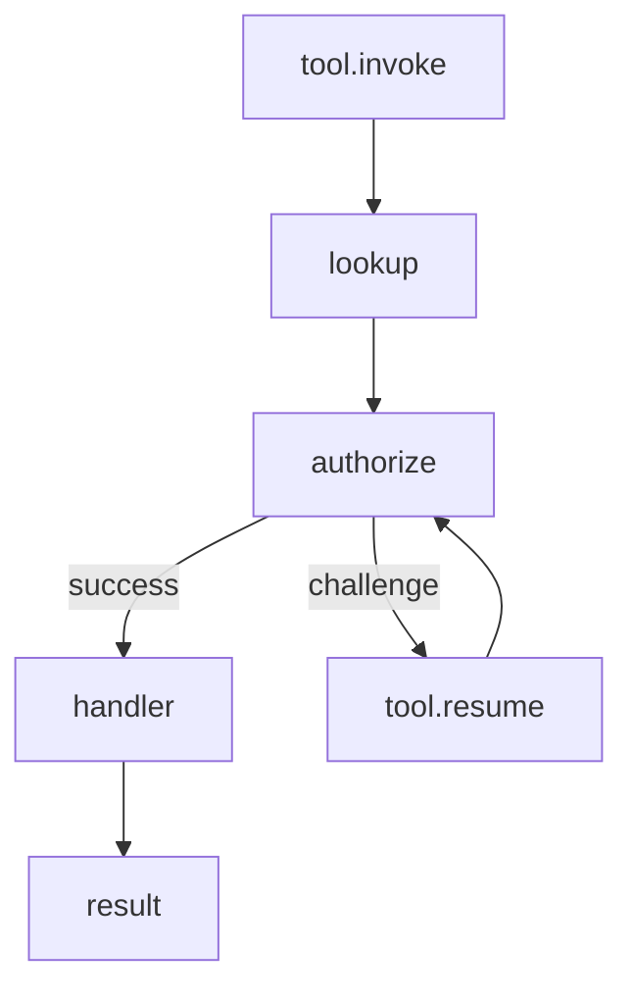

## Framework lifecycle
1. new Qefro
2. optional middleware
3. customer provider
4. tool registration
5. listen

## Request lifecycle

## Deployment
Expose POST /qefro behind HTTPS with stable secret management.
