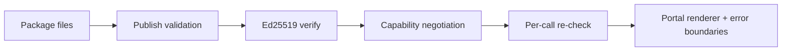

import {
  RelatedTopics,
  FaqAccordion,
  WorkflowCard,
} from '@site/src/components';

# Application security

This page covers **how untrusted models and third-party packages are constrained**: signed platform → app calls, signed Marketplace packages, capability gates, and agent threat reduction.

App-builder contract: [Developer security](/docs/developer/security). Package rules: [Solution security](/docs/solutions/security). Agent threat model: [AI Agent Security](/docs/concepts/ai-agent-security).

## Short definition (citation-ready)

> Qefro authenticates platform invokes to `/qefro` with HMAC-SHA256 over timestamp and raw body, verifies Marketplace packages with Ed25519, rejects arbitrary JavaScript in solution packages, and mediates host capabilities on every call. Prompt injection is not “solved”; blast radius is limited with isolation, least-privilege tools, SSRF controls, and logs.

## HMAC `/qefro` protocol

Platform → application calls (external SDK Connection and managed apps) use a shared signing secret:

```text
payload   = "v1:" + unix_timestamp + ":" + raw_request_body
signature = "v1=" + hex( HMAC_SHA256(signing_secret, payload) )
```

Headers: `X-Qefro-Signature`, `X-Qefro-Timestamp`, `X-Qefro-Protocol`. Default maximum timestamp skew is **300 seconds**. Failed verification returns HTTP **401** `invalid_signature`.

The end user never holds this secret. Details: [Authentication](/docs/developer/authentication).

Tenancy headers and `platform.*` bindings are injected by Qefro. Applications must not trust client-supplied tenant ids over platform context.

## Marketplace supply chain

| Control | Enforcement |
| --- | --- |
| No arbitrary JavaScript | Packages are YAML, JSON, and images; `script` / `js` kinds rejected at publish |
| No iframe / DOM runtime in the package | Portal components render UI; no package-side browser VM |
| Signing | Ed25519 over `id\|version\|checksum`; registry verifies on store; installer re-verifies |
| Immutability | Published versions do not change |
| Capability mediation | Declared at install; re-checked on every gated call |
| Catalog writes | Restricted to platform admins (`QEFRO_PLATFORM_ADMIN_IDS`) |



## Business Tools vs SDK apps

| Path | Trust | Your job |
| --- | --- | --- |
| REST / OpenAPI tool | Qefro holds the service credential; model supplies arguments | Validate arguments on your API; least privilege; `identify()` |
| External `/qefro` app | Privileged peer — tool outputs are trusted by the assistant | Protect the webhook URL; rotate HMAC secret; no SSRF from *your* outbound calls |
| Managed Marketplace app | Same protocol; platform injects secrets and storage scope | Least capabilities; no cross-tenant in-memory state |

Treat the model as **untrusted input** to the tool layer in all three cases.

## Prompt injection

No vendor can honestly claim to prevent all prompt injection. Qefro reduces impact by:

- Workspace-scoped retrieval (hostile docs cannot search another workspace’s index)
- Tool allowlists and auth levels (`public` / `verified_channel` / `organization_challenge`)
- SSRF-blocked egress
- Encrypted, non-prompt-resident secrets
- Execution and identity logs

Assume uploaded documents and user messages are hostile when write tools are enabled.

## Workflow

<WorkflowCard
  title="Ship an app without widening the blast radius"
  steps={[
    {title: 'Declare minimum capabilities', description: 'Install wizard shows tenants exactly what you asked for.'},
    {title: 'Keep secrets out of the package', description: 'Packages are global and signed; no tenant URLs or keys in YAML.'},
    {title: 'Validate tool arguments', description: 'Schema + server-side checks; never trust LLM JSON alone.'},
    {title: 'Major-version permission changes', description: 'Adding customer.read or new connectors is a breaking trust event.'},
    {title: 'Review tool logs after install', description: 'Unexpected invokes are incidents.'},
  ]}
/>

## FAQ

<FaqAccordion
  items={[
    {
      question: 'Is tool permissions: string[] the same as Marketplace capabilities?',
      answer:
        'No. SDK tool permissions are advertised metadata (default empty). Install permission grants are enforced by the solution service. Do not confuse the two.',
    },
    {
      question: 'Can a Marketplace app run SQL on the platform database?',
      answer:
        'No. Solutions have no database or Redis handles. Persistence is ctx.storage and other mediated APIs only.',
    },
    {
      question: 'Should I use Ed25519 for /qefro signing?',
      answer:
        'No. /qefro uses a shared HMAC secret, not an Ed25519 keypair. Ed25519 is for Marketplace package signatures.',
    },
  ]}
/>

## Related topics

<RelatedTopics
  topics={[
    {label: 'Security Overview', to: '/docs/security/overview'},
    {label: 'Developer security', to: '/docs/developer/security'},
    {label: 'Solution security', to: '/docs/solutions/security'},
    {label: 'HMAC authentication', to: '/docs/developer/authentication'},
    {label: 'Network & egress', to: '/docs/security/network-and-egress'},
    {label: 'AI Agent Security', to: '/docs/concepts/ai-agent-security'},
    {label: 'Secure Business Actions', to: '/docs/guides/secure-business-actions'},
    {label: 'Packaging', to: '/docs/solutions/packaging'},
  ]}
/>
