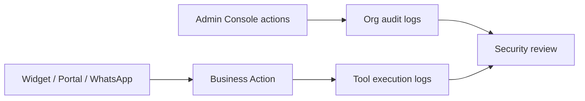

import {
  InfoBox,
  RelatedTopics,
  FaqAccordion,
  WorkflowCard,
  ApiEndpointCard,
} from '@site/src/components';

# Audit Logs

**Audit logs** record security-relevant activity in a Qefro organization. Separately, **tool execution logs** record each Business Action — which tool ran, when, and with what outcome. Together they answer “who changed configuration?” and “what did the assistant call?”

## Short definition (citation-ready)

> Qefro exposes organization audit logs for administrative and security events, and per-tool execution logs for Business Actions, so teams can investigate configuration changes and AI-initiated API traffic.

## Two log streams

| Stream | Answers | Typical consumers |
| --- | --- | --- |
| **Org audit logs** | Who invited users, changed RBAC, updated integrations? | Security, Admins |
| **Tool execution logs** | Which Business Tool ran during chat? Success or error? | Engineering, Support leads |

## Architecture



## API surfaces

<ApiEndpointCard
  method="GET"
  path="/api/v1/org/audit-logs"
  description="List organization audit events for the authenticated tenant (Owner/Admin)."
/>

<ApiEndpointCard
  method="GET"
  path="/api/v1/tools/:tool_id/logs"
  description="List recent execution attempts for a specific Business Tool."
/>

```bash
curl -sS -H "Authorization: Bearer $USER_JWT" \
  https://api.qefro.com/api/v1/org/audit-logs

curl -sS -H "Authorization: Bearer $USER_JWT" \
  https://api.qefro.com/api/v1/tools/$TOOL_ID/logs
```

Exact fields evolve with the product; use the Admin Console views during pilots and the API for automation.

## Investigation workflow

<WorkflowCard
  title="Investigate an unexpected tool call"
  steps={[
    {title: 'Identify the workspace and channel', description: 'Widget, portal, or WhatsApp?'},
    {title: 'Pull tool execution logs', description: 'Confirm time, tool id, and error/success.'},
    {title: 'Check who configured the tool', description: 'Org audit logs for credential or OpenAPI changes.'},
    {title: 'Review RBAC', description: 'Could a Member have changed something they should not?'},
    {title: 'Contain', description: 'Disable write tools, rotate secrets, split workspaces if needed.'},
  ]}
/>

## What to log on your side

Qefro logs the action attempt. Your API should still log:

- Authenticated end-user id (from forwarded identity headers)
- Resource ids touched
- Authorization allow/deny decisions

That dual trail is what incident response needs.

## Best practices

- Review tool logs weekly during the first month of any new Business Action
- Alert on bursts of failures (often bad credentials or SSRF blocks)
- Retain exports according to your compliance policy — do not assume infinite retention
- Treat conversation transcripts as potentially sensitive if tools return PII

## FAQ

<FaqAccordion
  items={[
    {
      question: 'Are prompts fully stored in audit logs?',
      answer:
        'Audit and tool logs focus on administrative and execution metadata. Conversation content is handled in the conversation subsystem — review retention with your security team.',
    },
    {
      question: 'Can Members read org audit logs?',
      answer:
        'Audit APIs are intended for Owner/Admin roles. Members use granted workspaces for Employee AI chat.',
    },
    {
      question: 'Do WhatsApp messages appear in tool logs?',
      answer:
        'Only if a Business Action runs. Channel messages are conversations; tool logs appear when tools execute.',
    },
  ]}
/>

## Related topics

<RelatedTopics
  topics={[
    {label: 'Security Overview', to: '/docs/security/overview'},
    {label: 'Secrets', to: '/docs/security/secrets'},
    {label: 'Business Actions', to: '/docs/concepts/business-actions'},
    {label: 'Secure Business Actions', to: '/docs/guides/secure-business-actions'},
    {label: 'Webhooks', to: '/docs/api/webhooks'},
    {label: 'Compliance', to: '/docs/security/compliance'},
  ]}
/>
