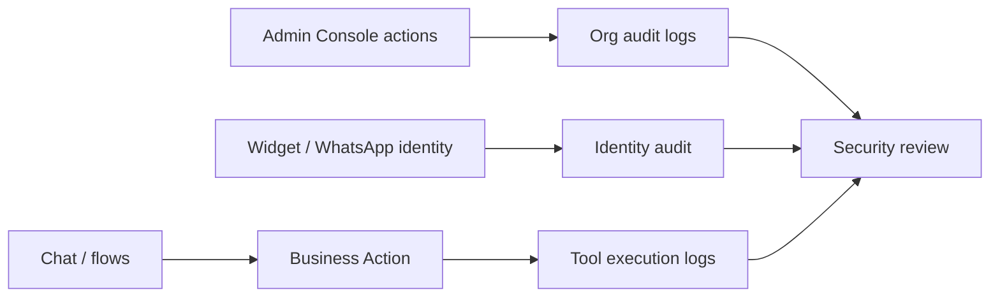

import {
  RelatedTopics,
  FaqAccordion,
  WorkflowCard,
  ApiEndpointCard,
} from '@site/src/components';

# Audit Logs

**Audit logs** record security-relevant activity in a Qefro organization. **Identity audit** records channel identity resolution and Customer Access Service challenges without storing OTP codes or JWTs. **Tool execution logs** record each Business Action — which tool ran, when, and with what outcome.

Together they answer “who changed configuration?”, “how was this customer authenticated?”, and “what did the assistant call?”

## Short definition (citation-ready)

> Qefro exposes organization audit logs for administrative events, identity audit for channel/auth decisions (with secrets stripped), and per-tool execution logs for Business Actions, so teams can investigate configuration changes, identity challenges, and AI-initiated API traffic.

## Three log streams

| Stream | Answers | Typical consumers |
| --- | --- | --- |
| **Org audit logs** | Who invited users, changed RBAC, updated org settings, revoked sessions? | Security, Admins |
| **Identity audit** | Was identity resolved? Did a challenge start/succeed/fail? Was a tool blocked for auth level? | Security, Support leads |
| **Tool execution logs** | Which Business Tool ran during chat? Success or error? | Engineering, Support leads |

## Org audit actions (implemented)

These action names are written to `org_audit_logs` (tenant-scoped):

| Action | Typical resource |
| --- | --- |
| `create_team` / `update_team` / `delete_team` | Team |
| `set_team_members` / `set_team_member_write` | Team membership |
| `set_team_workspaces` / `set_workspace_teams` | Workspace grants |
| `invite_member` / `accept_invitation` / `revoke_invitation` | Invitation |
| `remove_member` / `change_member_role` | Member |
| `suspend_member` / `reactivate_member` | Member status |
| `transfer_ownership` | Organization |
| `update_org_settings` | Organization |
| `revoke_session` | Session |

Entries include actor user id when known, resource type/id, JSON details, and optional client IP / User-Agent from `X-Forwarded-For` / `User-Agent`.

## Identity audit (no secrets)

Identity audit events include `identity_resolved`, `challenge_started`, `verification_success`, `verification_failure`, `session_created`, and `tool_auth_blocked`.

The logger **removes** these keys from detail payloads before persist: `otp`, `code`, `token`, `jwt`, `password`, `secret`, `authorization`. Emails are stored as hints/masks, not as full OTP delivery.

## Architecture


```mermaid
flowchart LR
  Admin[Admin Console actions] --> AL[Org audit logs]
  Chan[Widget / WhatsApp identity] --> IA[Identity audit]
  Chat[Chat / flows] --> BA[Business Action]
  BA --> TL[Tool execution logs]
  AL --> Review[Security review]
  IA --> Review
  TL --> Review
```

## API surfaces

<ApiEndpointCard
  method="GET"
  path="/api/v1/org/audit-logs"
  description="List organization audit events for the authenticated tenant (Owner/Admin)."
/>

<ApiEndpointCard
  method="GET"
  path="/api/v1/tools/:tool_id/logs"
  description="List recent execution attempts for a specific Business Tool."
/>

```bash
curl -sS -H "Authorization: Bearer $USER_JWT" \
  https://api.qefro.com/api/v1/org/audit-logs

curl -sS -H "Authorization: Bearer $USER_JWT" \
  https://api.qefro.com/api/v1/tools/$TOOL_ID/logs
```

Exact fields evolve with the product; use the Admin Console views during pilots and the API for automation.

## Investigation workflow

<WorkflowCard
  title="Investigate an unexpected tool call"
  steps={[
    {title: 'Identify the workspace and channel', description: 'Widget, portal, or WhatsApp?'},
    {title: 'Pull tool execution logs', description: 'Confirm time, tool id, and error/success.'},
    {title: 'Check identity audit', description: 'Was the caller verified_channel or challenged?'},
    {title: 'Check who configured the tool', description: 'Org audit logs for credential, RBAC, or SDK UI changes.'},
    {title: 'Contain', description: 'Disable write tools, rotate secrets, split workspaces if needed.'},
  ]}
/>

## What to log on your side

Qefro logs the action attempt. Your API should still log:

- Authenticated end-user id (from forwarded identity headers or your Access Service)
- Resource ids touched
- Authorization allow/deny decisions

That dual trail is what incident response needs.

## Best practices

- Review tool logs weekly during the first month of any new Business Action
- Alert on bursts of failures (often bad credentials or SSRF blocks)
- Retain exports according to your compliance policy — do not assume infinite retention
- Treat conversation transcripts as potentially sensitive if tools return PII

## FAQ

<FaqAccordion
  items={[
    {
      question: 'Are prompts fully stored in audit logs?',
      answer:
        'Audit and tool logs focus on administrative and execution metadata. Conversation content is handled in the conversation subsystem — review retention with your security team. See Data handling.',
    },
    {
      question: 'Can Members read org audit logs?',
      answer:
        'Audit APIs are intended for Owner/Admin roles. Members use granted workspaces for Employee AI chat.',
    },
    {
      question: 'Do WhatsApp messages appear in tool logs?',
      answer:
        'Only if a Business Action runs. Channel messages are conversations; tool logs appear when tools execute. Identity audit may record verification events for that conversation.',
    },
    {
      question: 'Does identity audit store OTP codes?',
      answer:
        'No. OTP, JWT, and password fields are stripped. Qefro forwards challenge replies to your Customer Access Service; your service verifies them.',
    },
  ]}
/>

## Related topics

<RelatedTopics
  topics={[
    {label: 'Security Overview', to: '/docs/security/overview'},
    {label: 'Authentication & access', to: '/docs/security/authentication-and-access'},
    {label: 'Secrets', to: '/docs/security/secrets'},
    {label: 'Data handling', to: '/docs/security/data-handling'},
    {label: 'Business Actions', to: '/docs/concepts/business-actions'},
    {label: 'Secure Business Actions', to: '/docs/guides/secure-business-actions'},
    {label: 'Webhooks', to: '/docs/api/webhooks'},
    {label: 'Compliance', to: '/docs/security/compliance'},
  ]}
/>
