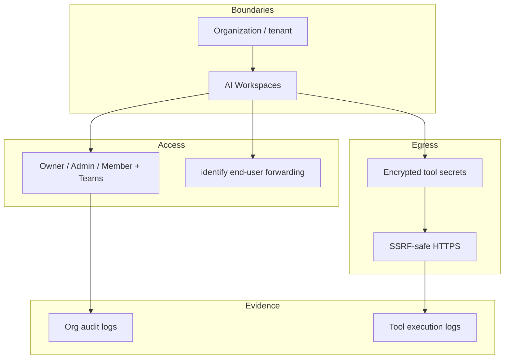

import {
  InfoBox,
  Warning,
  RelatedTopics,
  FaqAccordion,
  WorkflowCard,
} from '@site/src/components';

# Security Overview

Qefro security is built around **tenant isolation**, **workspace boundaries**, **least-privilege access**, and **auditable Business Actions**. This page summarizes controls that exist in the running product on `app.qefro.com` / `api.qefro.com` — not aspirational marketing claims.

## Short definition (citation-ready)

> Qefro isolates each organization (tenant) and further scopes knowledge, tools, and conversations to AI Workspaces, with encrypted tool secrets, SSRF-aware egress, optional end-user identity forwarding, and organization plus tool execution logs.

## Control map

| Control | What it protects | Docs |
| --- | --- | --- |
| Tenant isolation | Cross-customer data leakage | [Tenant Isolation](/docs/security/tenant-isolation) |
| Workspace isolation | Cross-team knowledge/tool leakage | [AI Workspaces](/docs/platform/ai-workspaces) |
| RBAC + Teams | Who can configure vs chat internally | [RBAC](/docs/platform/rbac) |
| Encrypted secrets | API keys for Business Tools | [Secrets](/docs/security/secrets) |
| SSRF-aware egress | Unsafe tool / webhook destinations | [Business Actions](/docs/concepts/business-actions) |
| Identity forwarding | Confused-deputy tool calls | [Identity Forwarding](/docs/platform/identity-forwarding) |
| Audit + tool logs | Who changed what; which tools ran | [Audit Logs](/docs/security/audit-logs) |
| Auth rate limits | Credential stuffing / abuse | [API Authentication](/docs/api/authentication) |
| Webhook signatures | Forged billing / channel events | [Webhooks](/docs/api/webhooks) |
| Compliance posture | Questionnaires, DPA, roadmap | [Compliance](/docs/security/compliance) |

## Architecture



## Threats we design for

| Threat | Mitigation in Qefro |
| --- | --- |
| Org A reads Org B knowledge | Tenant-scoped APIs and indexes |
| Public widget reads HR PDFs | Separate Customer vs Employee workspaces |
| Chat triggers privileged refunds | Least-privilege tools; avoid write tools on public workspaces |
| Tool URL hits cloud metadata | SSRF / DNS controls on egress |
| Keys in browser or prompts | Server-side encrypted secrets |
| Unaudited model writes | Tool execution logs + org audit logs |

Deeper agent threat model: [AI Agent Security](/docs/concepts/ai-agent-security).

## Security review workflow

<WorkflowCard
  title="Run a security review before production"
  steps={[
    {title: 'Classify data', description: 'Which docs and tool responses are public vs internal vs regulated?'},
    {title: 'Split workspaces', description: 'Customer Support vs HR/IT — never one mega-index.'},
    {title: 'Lock RBAC', description: 'Owners/Admins configure; Members only see granted workspaces.'},
    {title: 'Scope tools', description: 'Read-only first; encrypt secrets; enable identify() where needed.'},
    {title: 'Prove with logs', description: 'Sample org audit logs and tool executions during pilot.'},
  ]}
/>

## What is implemented vs roadmap

| Area | Status |
| --- | --- |
| Multi-tenant + workspace isolation | Implemented |
| Encrypted Business Tool credentials | Implemented |
| SSRF-aware tool / webhook egress | Implemented |
| Widget `identify()` identity forwarding | Implemented |
| Org audit logs + tool logs | Implemented |
| Auth abuse rate limits | Implemented |
| Razorpay webhook signature verify | Implemented |
| SOC 2 Type II | Roadmap — ask Sales for timeline |
| SSO / SAML | Roadmap — Enterprise discussions |

<Warning>
Do not treat roadmap items as shipped controls in vendor questionnaires. Use this page and [Compliance](/docs/security/compliance) for accurate answers.
</Warning>

## Practical API checks

```bash
# Organization audit trail (Admin/Owner JWT)
curl -sS -H "Authorization: Bearer $USER_JWT" \
  https://api.qefro.com/api/v1/org/audit-logs

# Tool execution history for a Business Tool
curl -sS -H "Authorization: Bearer $USER_JWT" \
  https://api.qefro.com/api/v1/tools/$TOOL_ID/logs
```

## Best practices

- Separate staging and production organizations when feasible
- Prefer read-only Business Tools until citation quality is proven
- Re-review OpenAPI imports for overly broad write operations
- Treat uploaded documents as untrusted input when tools are enabled (prompt injection)

## FAQ

<FaqAccordion
  items={[
    {
      question: 'Is Qefro SOC 2 certified today?',
      answer:
        'SOC 2 is on the roadmap. Contact Sales for the current timeline and interim questionnaire support.',
    },
    {
      question: 'Where should a security review start?',
      answer:
        'Tenant/workspace isolation, then tool scopes and secrets, then identity forwarding, then logs.',
    },
    {
      question: 'Does Qefro store my CRM data?',
      answer:
        'Your CRM remains the system of record. Tool responses may appear in conversation transcripts — design retention with your security team.',
    },
  ]}
/>

## Related topics

<RelatedTopics
  topics={[
    {label: 'Tenant Isolation', to: '/docs/security/tenant-isolation'},
    {label: 'Secrets', to: '/docs/security/secrets'},
    {label: 'Audit Logs', to: '/docs/security/audit-logs'},
    {label: 'Compliance', to: '/docs/security/compliance'},
    {label: 'AI Agent Security', to: '/docs/concepts/ai-agent-security'},
    {label: 'Secure Business Actions', to: '/docs/guides/secure-business-actions'},
    {label: 'RBAC', to: '/docs/platform/rbac'},
  ]}
/>
