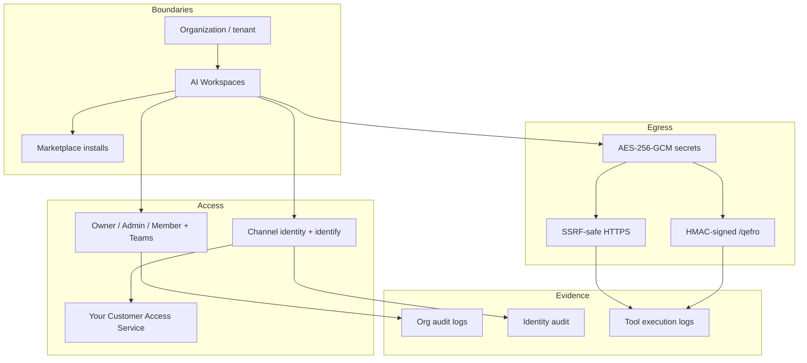

import {
  Warning,
  RelatedTopics,
  FaqAccordion,
  WorkflowCard,
  FeatureCard,
  FeatureCardGrid,
} from '@site/src/components';

# Security Overview

Qefro security is built around **tenant isolation**, **workspace boundaries**, **least-privilege access**, and **auditable Business Actions**. This section documents controls that exist in the running product on `app.qefro.com` / `api.qefro.com` — not aspirational marketing claims.

Use these pages for vendor questionnaires, internal security review, and production hardening. For Marketplace / SDK app builders, also read [Solution security](/docs/solutions/security) and [Application security (SDK)](/docs/developer/security).

## Short definition (citation-ready)

> Qefro isolates each organization (tenant) and further scopes knowledge, tools, conversations, and Marketplace installs to AI Workspaces. Tool and SDK credentials are encrypted at rest; platform-to-app calls are HMAC-signed; HTTPS egress is SSRF-aware; optional end-user identity is forwarded rather than stored as a customer IdP; organization, identity, and tool execution events are logged.

## Control map

<FeatureCardGrid>
  <FeatureCard
    title="Tenant isolation"
    description="Organizations cannot read each other’s knowledge, tools, people, or billing. Workspaces add a second boundary inside the tenant."
    href="/docs/security/tenant-isolation"
  />
  <FeatureCard
    title="Authentication & access"
    description="User JWTs, widget tokens, RBAC, session revocation, and customer identity that stays with your Access Service."
    href="/docs/security/authentication-and-access"
  />
  <FeatureCard
    title="Encryption"
    description="TLS in transit, AES-256-GCM for secrets at rest, bcrypt for org passwords, HS256 session JWTs."
    href="/docs/security/encryption"
  />
  <FeatureCard
    title="Secrets"
    description="Where credentials live, what is publishable, and how to rotate without leaking keys into prompts or HTML."
    href="/docs/security/secrets"
  />
  <FeatureCard
    title="Network & egress"
    description="HTTPS-only tool calls, SSRF / DNS pinning, webhook signatures, and CORS that never sends cookies to embeds."
    href="/docs/security/network-and-egress"
  />
  <FeatureCard
    title="Data handling"
    description="What Qefro stores, what stays in your ERP, PII masking limits, deletion, and LLM training posture."
    href="/docs/security/data-handling"
  />
  <FeatureCard
    title="Application & SDK security"
    description="HMAC v1 /qefro protocol, Marketplace Ed25519 packages, capability mediation, prompt-injection blast radius."
    href="/docs/security/application-security"
  />
  <FeatureCard
    title="Audit logs"
    description="Org admin events, identity audit (no OTP/JWT), and Business Tool execution history."
    href="/docs/security/audit-logs"
  />
  <FeatureCard
    title="Vulnerability disclosure"
    description="How to report a security issue to Qefro."
    href="/docs/security/vulnerability-disclosure"
  />
  <FeatureCard
    title="Compliance"
    description="Shipped controls vs roadmap. SOC 2, SSO, and hosting regions — confirm current status with Sales."
    href="/docs/security/compliance"
  />
</FeatureCardGrid>

## Architecture


```mermaid
flowchart TB
  subgraph Boundaries
    Org[Organization / tenant]
    WS[AI Workspaces]
    Install[Marketplace installs]
  end
  subgraph Access
    RBAC[Owner / Admin / Member + Teams]
    ID[Channel identity + identify]
    CAS[Your Customer Access Service]
  end
  subgraph Egress
    Enc[AES-256-GCM secrets]
    HMAC[HMAC-signed /qefro]
    SSRF[SSRF-safe HTTPS]
  end
  subgraph Evidence
    AL[Org audit logs]
    IA[Identity audit]
    TL[Tool execution logs]
  end
  Org --> WS
  WS --> Install
  WS --> RBAC
  WS --> ID
  ID --> CAS
  WS --> Enc
  Enc --> HMAC
  Enc --> SSRF
  RBAC --> AL
  ID --> IA
  SSRF --> TL
  HMAC --> TL
```

## Threats we design for

| Threat | Mitigation in Qefro |
| --- | --- |
| Org A reads Org B knowledge | Tenant-scoped APIs, indexes, storage, and connections |
| Public widget reads HR PDFs | Separate Customer vs Employee workspaces + channel binding |
| Chat triggers privileged refunds | Least-privilege tools; auth levels; no write tools on public workspaces by default |
| Tool URL hits cloud metadata | SSRF / DNS pinning; HTTPS only |
| Keys in browser or prompts | Server-side encrypted secrets; widget token is intentionally public |
| Forged platform → app calls | HMAC-SHA256 `v1=` over timestamp + raw body; skew window |
| Malicious Marketplace package | YAML/JSON/images only; Ed25519 signature; no arbitrary JS |
| Confused deputy | Identity forwarding (`identify()`); your API authorizes the end user |
| Unaudited model writes | Tool execution logs + org audit logs + identity audit |
| Stolen admin session | Session list/revoke; HttpOnly refresh cookie; RBAC |

Deeper agent threat model: [AI Agent Security](/docs/concepts/ai-agent-security). Hardening checklist: [Secure Business Actions](/docs/guides/secure-business-actions).

## Security review workflow

<WorkflowCard
  title="Run a security review before production"
  steps={[
    {title: 'Classify data', description: 'Which docs and tool responses are public vs internal vs regulated?'},
    {title: 'Split workspaces', description: 'Customer Support vs HR/IT — never one mega-index.'},
    {title: 'Lock RBAC', description: 'Owners/Admins configure; Members only see granted workspaces.'},
    {title: 'Scope tools and apps', description: 'Read-only first; encrypt secrets; declare the fewest Marketplace capabilities.'},
    {title: 'Prove with logs', description: 'Sample org audit, identity audit, and tool executions during pilot.'},
  ]}
/>

## What is implemented vs roadmap

| Area | Status |
| --- | --- |
| Multi-tenant + workspace isolation | Implemented |
| Encrypted tool / SDK / channel credentials (AES-256-GCM) | Implemented |
| HMAC-signed `/qefro` SDK protocol | Implemented |
| Marketplace package signing (Ed25519) + no arbitrary JS | Implemented |
| SSRF-aware tool / webhook egress with DNS pinning | Implemented |
| Widget `identify()` identity forwarding | Implemented |
| Customer Access Service (org-owned OTP / login) | Implemented |
| Org audit logs + identity audit + tool logs | Implemented |
| Auth abuse rate limits | Implemented |
| Razorpay and Meta webhook signature verification | Implemented |
| Session list / revoke | Implemented |
| SOC 2 Type II | Roadmap — ask Sales for timeline |
| SSO / SAML for Admin Console | Roadmap — Enterprise discussions |

<Warning>
Do not treat roadmap items as shipped controls in vendor questionnaires. Use this page and [Compliance](/docs/security/compliance) for accurate answers.
</Warning>

## Practical API checks

```bash
# Organization audit trail (Admin/Owner JWT)
curl -sS -H "Authorization: Bearer $USER_JWT" \
  https://api.qefro.com/api/v1/org/audit-logs

# Tool execution history for a Business Tool
curl -sS -H "Authorization: Bearer $USER_JWT" \
  https://api.qefro.com/api/v1/tools/$TOOL_ID/logs
```

## Best practices

- Separate staging and production organizations when feasible
- Prefer read-only Business Tools until citation quality is proven
- Re-review OpenAPI imports for overly broad write operations
- Treat uploaded documents as untrusted input when tools are enabled (prompt injection)
- Rotate SDK signing secrets and tool credentials on staffing changes
- Bind public channels only to customer-safe workspaces

## FAQ

<FaqAccordion
  items={[
    {
      question: 'Is Qefro SOC 2 certified today?',
      answer:
        'SOC 2 is on the roadmap. Contact Sales for the current timeline and interim questionnaire support.',
    },
    {
      question: 'Where should a security review start?',
      answer:
        'Tenant/workspace isolation, then authentication and tool scopes, then secrets and egress, then identity forwarding, then logs.',
    },
    {
      question: 'Does Qefro store my CRM data?',
      answer:
        'Your CRM remains the system of record. Tool responses may appear in conversation transcripts — design retention with your security team. See Data handling.',
    },
    {
      question: 'Who should read which security page?',
      answer:
        'Buyers and InfoSec: this overview, isolation, compliance. Operators: authentication, secrets, audit. App builders: application security plus the developer security page.',
    },
  ]}
/>

## Related topics

<RelatedTopics
  topics={[
    {label: 'Tenant Isolation', to: '/docs/security/tenant-isolation'},
    {label: 'Authentication & access', to: '/docs/security/authentication-and-access'},
    {label: 'Encryption', to: '/docs/security/encryption'},
    {label: 'Secrets', to: '/docs/security/secrets'},
    {label: 'Network & egress', to: '/docs/security/network-and-egress'},
    {label: 'Data handling', to: '/docs/security/data-handling'},
    {label: 'Application security', to: '/docs/security/application-security'},
    {label: 'Audit Logs', to: '/docs/security/audit-logs'},
    {label: 'Vulnerability disclosure', to: '/docs/security/vulnerability-disclosure'},
    {label: 'Compliance', to: '/docs/security/compliance'},
    {label: 'AI Agent Security', to: '/docs/concepts/ai-agent-security'},
    {label: 'Secure Business Actions', to: '/docs/guides/secure-business-actions'},
  ]}
/>
