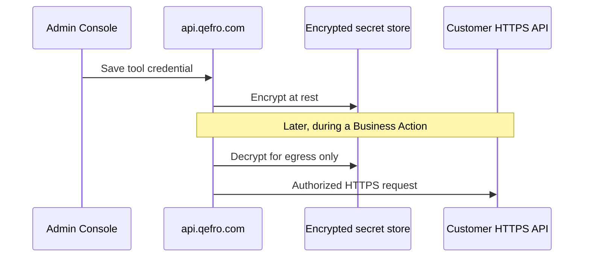

import {
  InfoBox,
  Warning,
  RelatedTopics,
  FaqAccordion,
  WorkflowCard,
} from '@site/src/components';

# Secrets

**Secrets** in Qefro are credentials used by Business Tools and channel integrations — API keys, bearer tokens, and similar material. They must stay **server-side**, **encrypted at rest**, and **rotated** when people or vendors change.

## Short definition (citation-ready)

> Qefro stores Business Tool and integration credentials encrypted in the tenant’s configuration. Publishable widget tokens are intentionally public channel keys; they are not substitutes for end-user or admin secrets.

## What counts as a secret

| Material | Where it lives | Public? |
| --- | --- | --- |
| Business Tool API keys / tokens | Encrypted tool credentials | No |
| Channel / Meta credentials | Admin Console integration config | No |
| User passwords / session JWTs | Auth subsystem | No |
| Widget token | Admin Console + browser embed | Yes (publishable) |
| End-user JWT via `identify()` | Passed per session to tools | Short-lived; your app issues it |

## Architecture

## Rules of thumb

1. **Never** put long-lived admin or CRM keys in website JavaScript.
2. **Never** paste production secrets into prompts, tickets, or chat transcripts.
3. Prefer **scoped** vendor keys (read-only order lookup ≠ full admin API).
4. Rotate secrets on staffing changes and after OpenAPI reimports that change auth.
5. Use [`identify()`](/docs/platform/identity-forwarding) so *your* API can authorize the end user separately from the tool’s service credential.

<Warning>
A widget token in HTML is expected. A Stripe/CRM secret in HTML is an incident. If a Business Action needs privileged access, keep that credential on the server-side tool configuration only.
</Warning>

## Workflow

<WorkflowCard
  title="Add a tool secret safely"
  steps={[
    {title: 'Create a least-privilege key', description: 'In your system of record, scope to the minimum paths/methods.'},
    {title: 'Store in Admin Console', description: 'Attach the credential to the Business Tool — do not commit it to git.'},
    {title: 'Test in console', description: 'Verify success and failure paths before enabling chat.'},
    {title: 'Enable for assistants', description: 'Monitor tool logs for unexpected calls.'},
    {title: 'Rotate on change', description: 'Revoke old keys when people leave or vendors rotate.'},
  ]}
/>

## Related product surfaces

- [Business Tools](/docs/platform/business-tools)
- [What are Business Actions?](/docs/concepts/business-actions)
- [Secure Business Actions](/docs/guides/secure-business-actions)
- [Website Widget](/docs/platform/website-widget) (publishable token)

## FAQ

<FaqAccordion
  items={[
    {
      question: 'Can Qefro staff read my tool secrets?',
      answer:
        'Operational access is restricted; treat Qefro like any SaaS processor and complete a DPA/security review for regulated workloads. Ask Sales for the current questionnaire pack.',
    },
    {
      question: 'Are secrets visible in tool logs?',
      answer:
        'Design assumes credentials are not echoed back. Still avoid putting secrets in URL query strings your APIs might log.',
    },
    {
      question: 'What about environment variables on Enterprise private deploy?',
      answer:
        'Private deployments follow your secret manager. See Deployment docs and talk to Sales for Enterprise packaging.',
    },
  ]}
/>

## Related topics

<RelatedTopics
  topics={[
    {label: 'Security Overview', to: '/docs/security/overview'},
    {label: 'Business Tools', to: '/docs/platform/business-tools'},
    {label: 'Identity Forwarding', to: '/docs/platform/identity-forwarding'},
    {label: 'AI Agent Security', to: '/docs/concepts/ai-agent-security'},
    {label: 'Audit Logs', to: '/docs/security/audit-logs'},
    {label: 'Compliance', to: '/docs/security/compliance'},
  ]}
/>
