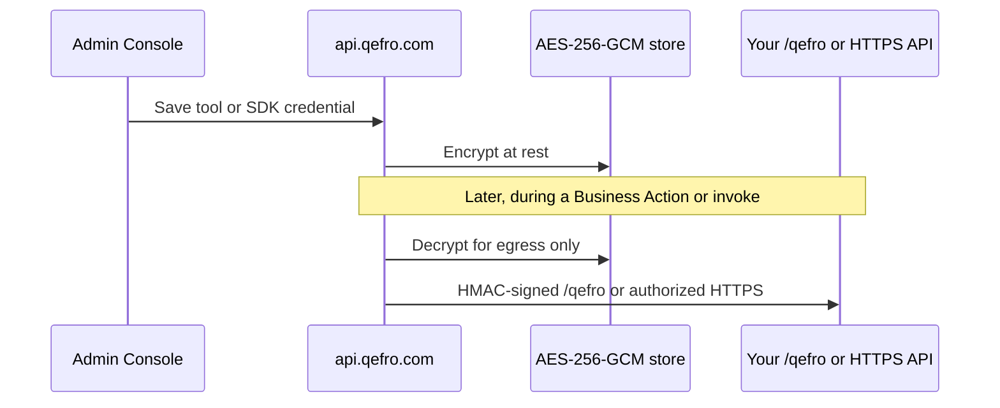

import {
  Warning,
  RelatedTopics,
  FaqAccordion,
  WorkflowCard,
} from '@site/src/components';

# Secrets

**Secrets** in Qefro are credentials used by Business Tools, SDK connections, and channel integrations — API keys, bearer tokens, HMAC signing secrets, and similar material. They must stay **server-side**, **encrypted at rest**, and **rotated** when people or vendors change.

Cryptographic details: [Encryption](/docs/security/encryption).

## Short definition (citation-ready)

> Qefro stores Business Tool, SDK signing, and integration credentials encrypted with AES-256-GCM in the tenant’s configuration. Publishable widget tokens are intentionally public channel keys; they are not substitutes for end-user or admin secrets.

## What counts as a secret

| Material | Where it lives | Public? |
| --- | --- | --- |
| Business Tool API keys / tokens | Encrypted tool credentials | No |
| External SDK signing secret | Encrypted on ACS (`encrypted_signing_secret`); plaintext in your process env | No |
| Managed app signing secret | Platform-injected env (`QEFRO_SIGNING_SECRET`) | No |
| Channel / Meta credentials | Encrypted Admin Console integration config | No |
| Customer Access Service API auth | Encrypted org auth settings | No |
| User passwords | bcrypt hashes only | No |
| Session JWTs / refresh tokens | Auth subsystem (refresh is HttpOnly cookie) | No |
| Widget token | Admin Console + browser embed | Yes (publishable) |
| End-user JWT via `identify()` | Passed per session to tools | Short-lived; your app issues it |

## Architecture

```mermaid
sequenceDiagram
  participant Admin as Admin Console
  participant API as api.qefro.com
  participant Store as AES-256-GCM store
  participant App as Your /qefro or HTTPS API
  Admin->>API: Save tool or SDK credential
  API->>Store: Encrypt at rest
  Note over API,App: Later, during a Business Action or invoke
  API->>Store: Decrypt for egress only
  API->>App: HMAC-signed /qefro or authorized HTTPS
```

## External vs managed

| Secret | External SDK Connection | Managed Marketplace app |
| --- | --- | --- |
| `/qefro` signing secret | Your env + ACS encrypted copy | Platform-injected env |
| ERP / CRM credentials | Your secret store | Prefer install settings / platform secrets — never git |
| Storage bearer | Omitted unless install/solution scope exists | `platform.storage.token` when storage is configured |

Never commit real secrets. Docs and demos use placeholders such as `dev-secret`.

## Rules of thumb

1. **Never** put long-lived admin or CRM keys in website JavaScript.
2. **Never** paste production secrets into prompts, tickets, or chat transcripts.
3. Prefer **scoped** vendor keys (read-only order lookup ≠ full admin API).
4. Rotate secrets on staffing changes, after OpenAPI reimports that change auth, and after suspected leakage.
5. Use [`identify()`](/docs/platform/identity-forwarding) so *your* API can authorize the end user separately from the tool’s service credential.
6. Rotate SDK signing secrets via `PATCH /api/v1/org/sdk-connections/{id}` and redeploy the app before/when cutting over.

<Warning>
A widget token in HTML is expected. A Stripe/CRM secret in HTML is an incident. If a Business Action needs privileged access, keep that credential on the server-side tool configuration only.
</Warning>

## Workflow

<WorkflowCard
  title="Add a tool secret safely"
  steps={[
    {title: 'Create a least-privilege key', description: 'In your system of record, scope to the minimum paths/methods.'},
    {title: 'Store in Admin Console', description: 'Attach the credential to the Business Tool or SDK Connection — do not commit it to git.'},
    {title: 'Test in console', description: 'Verify success and failure paths before enabling chat.'},
    {title: 'Enable for assistants', description: 'Monitor tool logs for unexpected calls.'},
    {title: 'Rotate on change', description: 'Revoke old keys when people leave or vendors rotate.'},
  ]}
/>

## Related product surfaces

- [Business Tools](/docs/platform/business-tools)
- [HMAC authentication](/docs/developer/authentication)
- [What are Business Actions?](/docs/concepts/business-actions)
- [Secure Business Actions](/docs/guides/secure-business-actions)
- [Website Widget](/docs/platform/website-widget) (publishable token)

## FAQ

<FaqAccordion
  items={[
    {
      question: 'Can Qefro staff read my tool secrets?',
      answer:
        'Operational access is restricted; treat Qefro like any SaaS processor and complete a DPA/security review for regulated workloads. Ask Sales for the current questionnaire pack.',
    },
    {
      question: 'Are secrets visible in tool logs?',
      answer:
        'URLs in logs are redacted for credentials in query strings where possible. Identity audit strips otp, token, jwt, password, and secret keys. Still avoid putting secrets in URL query strings your APIs might log.',
    },
    {
      question: 'What about environment variables on Enterprise private deploy?',
      answer:
        'Private deployments follow your secret manager. See Deployment docs and talk to Sales for Enterprise packaging.',
    },
  ]}
/>

## Related topics

<RelatedTopics
  topics={[
    {label: 'Security Overview', to: '/docs/security/overview'},
    {label: 'Encryption', to: '/docs/security/encryption'},
    {label: 'Developer HMAC auth', to: '/docs/developer/authentication'},
    {label: 'Business Tools', to: '/docs/platform/business-tools'},
    {label: 'Identity Forwarding', to: '/docs/platform/identity-forwarding'},
    {label: 'AI Agent Security', to: '/docs/concepts/ai-agent-security'},
    {label: 'Audit Logs', to: '/docs/security/audit-logs'},
    {label: 'Compliance', to: '/docs/security/compliance'},
  ]}
/>
