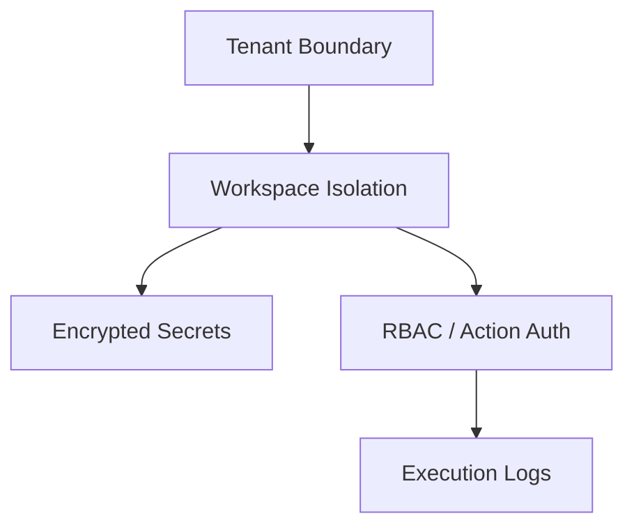

import {
  InfoBox,
  Warning,
  RelatedTopics,
  FaqAccordion,
  WorkflowCard,
} from '@site/src/components';

# Tenant Isolation

**Tenant Isolation** — How organizations and workspaces are isolated.

## Introduction

How organizations and workspaces are isolated. This page explains controls, responsibilities, and how they map to Customer AI and Employee AI deployments.

## Why it exists

Security documentation must be precise so buyers and builders can evaluate trust boundaries without marketing language.

## Concepts

- Tenant / workspace isolation
- Encrypted secrets
- Identity forwarding
- Execution logs for Business Actions

## Architecture

Defense in depth across authn, authz, network egress controls for tools, and auditability.



## Workflow

<WorkflowCard
  title="Security review checklist"
  steps={[
    {title: 'Map data', description: 'Classify knowledge and tool payloads.'},
    {title: 'Least privilege', description: 'Tighten RBAC and tool scopes.'},
    {title: 'Verify isolation', description: 'Cross-workspace retrieval tests.'},
    {title: 'Audit', description: 'Confirm logs for sensitive actions.'},
  ]}
/>

## Code examples

```json
{
  "security_controls": [
    "multi_tenant_isolation",
    "workspace_isolation",
    "encrypted_tool_secrets",
    "identity_forwarding",
    "execution_logs"
  ]
}
```

## Best practices

- Separate staging and production organizations when possible
- Review OpenAPI imports for overly broad operations
- Disable unused Business Tools

## Security notes

<InfoBox>
SOC 2 compliance is on the roadmap — contact Sales for timeline. SSO/SAML is on the Enterprise roadmap.
</InfoBox>

## FAQ

<FaqAccordion items={[
  {
    "question": "Is Qefro SOC 2 certified today?",
    "answer": "SOC 2 is on the roadmap; ask Sales for the current timeline."
  },
  {
    "question": "Who can see execution logs?",
    "answer": "Organization Owners/Admins with appropriate console access."
  }
]} />

## Related topics

<RelatedTopics topics={[
  {
    "label": "RBAC",
    "to": "/docs/platform/rbac"
  },
  {
    "label": "Business Actions",
    "to": "/docs/platform/business-actions"
  },
  {
    "label": "Identity Forwarding",
    "to": "/docs/platform/identity-forwarding"
  },
  {
    "label": "Secure Business Actions guide",
    "to": "/docs/guides/secure-business-actions"
  }
]} />

