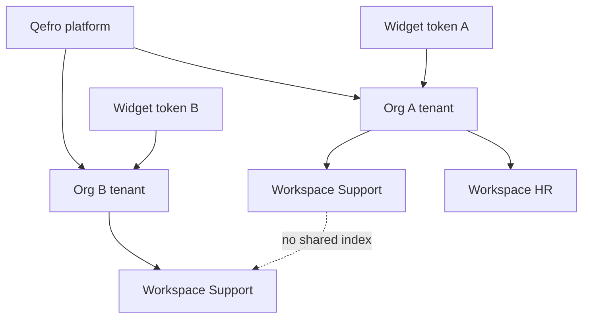

import {
  InfoBox,
  Warning,
  RelatedTopics,
  FaqAccordion,
  WorkflowCard,
} from '@site/src/components';

# Tenant Isolation

**Tenant isolation** is the guarantee that one Qefro organization cannot read another organization’s knowledge, tools, conversations, members, or billing data. Inside a tenant, **workspaces** provide a second isolation layer for teams and audiences.

## Short definition (citation-ready)

> In Qefro, every authenticated API request resolves an organization (tenant). Knowledge indexes, Business Tools, conversations, and Admin Console configuration are scoped to that tenant — and further to AI Workspaces within it.

## Two boundaries

| Boundary | Unit | Isolates |
| --- | --- | --- |
| **Tenant** | Organization created at signup | Customers from each other |
| **Workspace** | AI Workspace (Support, HR, IT, …) | Teams / audiences inside a customer |

Concept deep dive: [Multi-tenant AI Architecture](/docs/concepts/multi-tenant-ai-architecture).

## Architecture

## How requests are scoped

1. Authenticate (user JWT, widget token, or channel webhook).
2. Resolve **tenant** from the credential / host.
3. Resolve **workspace** from channel binding or portal selection.
4. Retrieve only from that workspace’s knowledge index.
5. Allow only that workspace’s Business Tools.
6. Attribute logs to tenant + workspace (+ actor when known).

Cross-tenant access requires platform Super Admin capabilities — not a tenant Admin role.

## What stays inside the tenant

- Members, Teams, RBAC grants
- Workspaces and their documents
- Business Tool definitions and encrypted secrets
- Conversations and feedbacks
- Branding, custom domains, billing

## Workspace isolation still matters

Tenant isolation does **not** mean one shared index for the whole company is safe. A public Customer AI channel bound to a workspace that also holds HR PDFs is still a disclosure risk — inside the same tenant.

See [Customer AI vs Employee AI](/docs/concepts/customer-ai-vs-employee-ai) and [What is an AI Workspace?](/docs/concepts/what-is-an-ai-workspace).

## Verification workflow

<WorkflowCard
  title="Prove isolation before go-live"
  steps={[
    {title: 'Create two workspaces', description: 'Support (customer-safe) and HR (internal).'},
    {title: 'Ingest different corpora', description: 'Put a unique canary phrase only in HR.'},
    {title: 'Bind the widget to Support', description: 'Ask for the HR canary via the widget.'},
    {title: 'Expect refusal / miss', description: 'If the widget cites HR, isolation or binding is wrong.'},
    {title: 'Repeat for tools', description: 'Ensure privileged tools are not attached to the public workspace.'},
  ]}
/>

## Best practices

- One legal entity / billing customer → one organization
- Never share Admin Console logins across customers “for convenience”
- Use separate staging and production organizations when feasible
- Custom portal domains still map to a single tenant — treat hostname setup as a security change

<Warning>
Widget tokens are publishable by design (they ship in browser HTML). They authenticate the *channel*, not an end user. Pair with workspace binding and `identify()` for user-scoped tools.
</Warning>

## FAQ

<FaqAccordion
  items={[
    {
      question: 'Is a workspace a tenant?',
      answer:
        'No. The organization is the tenant. Workspaces are sub-scopes for knowledge and tools inside that tenant.',
    },
    {
      question: 'Can two organizations share knowledge?',
      answer:
        'Not by default. Sharing requires deliberate export/import of content into each org.',
    },
    {
      question: 'Does Hybrid RAG search across tenants?',
      answer:
        'No. Retrieval runs inside the resolved workspace index for the authenticated tenant.',
    },
  ]}
/>

## Related topics

<RelatedTopics
  topics={[
    {label: 'Security Overview', to: '/docs/security/overview'},
    {label: 'Multi-tenant AI Architecture', to: '/docs/concepts/multi-tenant-ai-architecture'},
    {label: 'Organizations', to: '/docs/platform/organizations'},
    {label: 'AI Workspaces', to: '/docs/platform/ai-workspaces'},
    {label: 'RBAC', to: '/docs/platform/rbac'},
    {label: 'Compliance', to: '/docs/security/compliance'},
  ]}
/>
