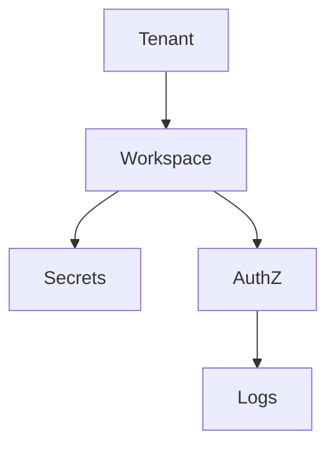

import {
  InfoBox,
  Warning,
  RelatedTopics,
  FaqAccordion,
  WorkflowCard,
} from '@site/src/components';

# Tenant Isolation

**Tenant Isolation** — How organizations and workspaces isolate data.

## Introduction

Every request resolves a tenant. Workspaces further isolate knowledge and tools. Cross-tenant access requires platform Super Admin capabilities — not tenant Admin roles.

## Why it exists

Security documentation must reflect implemented controls, not aspirational marketing.

## Concepts

See [Security Overview](/docs/security/overview) for the control list.

## Architecture



## Workflow

<WorkflowCard title="Security review" steps={[
  {title: 'Map data', description: 'Knowledge + tool payloads.'},
  {title: 'Least privilege', description: 'RBAC + tool scopes.'},
  {title: 'Verify isolation', description: 'Cross-workspace tests.'},
  {title: 'Audit', description: 'Org + tool logs.'},
]} />

## Code examples

```bash
curl -sS -H "Authorization: Bearer $USER_JWT" \
  https://api.qefro.com/api/v1/org/audit-logs
```

## Best practices

- Separate staging and production organizations when feasible
- Review OpenAPI imports for overly broad operations

## Security notes

<InfoBox>
Contact Sales for Enterprise compliance questionnaires and DPA process.
</InfoBox>

## FAQ

<FaqAccordion items={[
  {question: 'Is Qefro SOC 2 certified today?', answer: 'SOC 2 is on the roadmap; ask Sales for the current timeline.'},
]} />

## Related topics

<RelatedTopics topics={[
  {label: 'Security Overview', to: '/docs/security/overview'},
  {label: 'RBAC', to: '/docs/platform/rbac'},
  {label: 'Secure Business Actions', to: '/docs/guides/secure-business-actions'},
]} />

