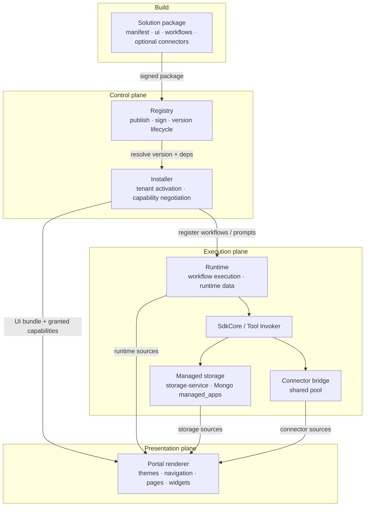
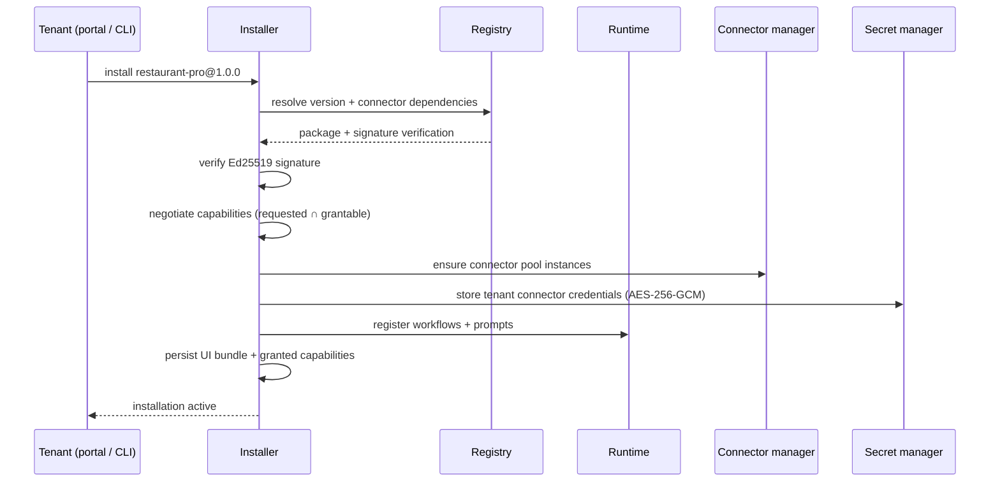
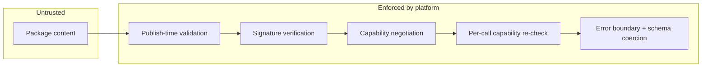

# Architecture

A solution never runs by itself. It is declarative data that platform
stages validate, store, install, execute, mediate and render. This page
describes each stage and the contracts between them.

## The pipeline



| Stage | Component | Tenant-scoped | Page |
| --- | --- | --- | --- |
| Solution package | Your source directory | n/a | [Manifest](/docs/solutions/manifest) |
| Registry | Global signed catalog | No | [Publishing](/docs/solutions/publishing) |
| Installer | Tenant activation pipeline | Yes | [Installation](/docs/solutions/installation) |
| Runtime | Flow engine + event bus | Yes | [Workflows](/docs/solutions/workflows) |
| Managed storage | Document plane (`storage/*`) | Yes (per op) | [Managed storage](/docs/solutions/managed-storage) |
| Connector bridge | Shared connector pool + router | Pool is shared; calls carry tenant context | [Connectors](/docs/solutions/connectors) |
| Portal renderer | Native widget registry | Yes | [Pages](/docs/solutions/pages) |


## Registry

The registry is the **global catalog** of published solutions and
connectors. It is not tenant-scoped: every tenant resolves against the same
signed catalog.

Responsibilities:

- Accept signed packages (`manifest`, `components`, `signature`,
  `signature_kid`, `publisher_id`).
- Verify the Ed25519 signature over `id|version|checksum` before storing.
- Track version lifecycle: `draft → published → deprecated → yanked`.
- Resolve dependency constraints (connector versions) at install time.

Packages are immutable once published: a new version is a new package. See
[Publishing](/docs/solutions/publishing).

## Installer

The installer turns a published version into a **tenant installation**.
Installing a solution registers flows and prompts with the runtime — the
solution itself never executes anything.



Key properties:

- **Capability negotiation**: the granted set is the intersection of the
  capabilities requested by the package and what the installation grants.
  It is computed at install time, stored with the bundle, and re-checked on
  every host call. See [Capabilities](/docs/solutions/capabilities).
- **Activation plan**: the install pipeline executes explicit steps —
  enable tenant connectors, register flows, ensure connector pool, store
  secrets, register the UI bundle. The wizard shows requested vs granted
  capabilities before activation.

## Runtime

The runtime is the single execution engine of the platform. For solutions
it provides:

- **Workflow execution** — installed workflow definitions run on the
  runtime's flow engine (`ask`, `tool`, `condition`, `delay`, `approval`,
  `challenge`, `complete` steps). See [Runtime concept](/docs/developer/concepts/runtime).
- **Runtime data sources** — `metrics`, `executions` and `workflows`
  targets serve the tenant's own runtime data to solution UIs
  (capability `runtime.query`).
- **Event bus** — `ui.*` lifecycle events and business events ride the
  existing bus unchanged. See [Events](/docs/solutions/events).

:::info
A solution never executes workflows itself. Installation *registers*
definitions; the runtime *owns* execution.
:::

## Managed storage

Solution-owned documents (reservations, orders, drafts, …) go through
platform `storage/*` tools — never through the connector pool and never
via a Mongo connection string in the package.

```text
workflow / UI source
  → SdkCore → PlatformStorage
  → storage-service /v1/internal/storage/*
  → MongoDB `managed_apps`  ({solution_slug}__{logical})
```

Isolation, reserved metadata, soft delete, and audit are enforced by
storage-service. See [Managed storage](/docs/solutions/managed-storage).

## Connector bridge

`connector` data sources that target **declared external connectors**
never call a connector directly. They are forwarded through the connector
bridge, which:

- routes `POST /v1/route` calls to a **shared, stateless connector pool**
  (containers named `qefro-connector-{name}-{version}-{id}` — never
  per-tenant),
- attaches the tenant context to every call,
- enforces that the calling solution holds `connector.invoke` and declared
  the connector in its manifest.

Sources whose `target` is `storage/*` bypass this bridge and use managed
storage instead (gated on `storage.read`).

See [Connectors](/docs/solutions/connectors) and the
[connector reference](/docs/reference/connector-reference).

## Portal renderer

The portal renders solution UIs **natively** at
`/app/solutions/ui/:name/:pageId?` using its own component registry:

| Engine | Role |
| --- | --- |
| Solution UI host | Loads the tenant bundle, scoped theme container, page tabs, lifecycle events |
| Theme engine | `theme.yaml` → CSS custom properties on the solution container only |
| Navigation engine | Bundle navigation under **Managed solution** in the portal sidebar |
| Widget registry | Closed widget-kind list rendered with platform UI primitives |
| Layout engine | Responsive grid (1 column on mobile, `columns` at ≥ 1024 px) |
| Data sources | Capability-gated fetches from runtime, storage, or connector bridge |
| Capabilities | The `ui.*` host API, implemented in-process |
| UI boundary | Error boundary + schema coercion — broken definitions degrade to a scoped error card |

Nothing from a package ever executes: no iframes, no `postMessage`, no
injected scripts. See [Security](/docs/solutions/security).

## Data ownership

| Data | Owner | Tenant-scoped |
| --- | --- | --- |
| Published packages (manifest, UI, workflows) | Registry / solution-service | No — global catalog |
| Installations, settings, granted capabilities | Installer / solution-service | Yes |
| Workflow executions | Runtime | Yes |
| Solution application documents | storage-service → Mongo `managed_apps` | Yes (per op) |
| Running connector containers | Connector manager | No — shared pool |
| Connector credentials | Secret manager | Yes |
| UI event log (`ui_events`) | Runtime | Yes |

## Trust boundaries



1. **Validation** rejects unknown widget kinds, unknown capabilities,
   icons outside the closed set, non-grid layouts and executable assets —
   see [Validation](/docs/solutions/validation).
2. **Signing** binds every package to `id|version|checksum` with Ed25519.
3. **Negotiation** caps capabilities at install time.
4. **Re-check** gates every host call and every data-source fetch at
   runtime.
5. **Boundaries** ensure a malformed definition degrades to a scoped error
   card — the portal itself never crashes.

## Related topics

- [Solution Development overview](/docs/solutions/overview)
- [Installation](/docs/solutions/installation)
- [Security model](/docs/solutions/security)
- [Platform architecture](/docs/architecture/overview)
