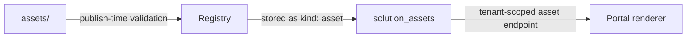

# Assets

The `assets/` directory carries the visual identity of a solution — logo,
icon and any imagery referenced by the manifest. Assets are strictly
limited to images: **no executable content of any kind ever ships in a
package**.

## Allowed types

| Extension | Format |
| --- | --- |
| `.png` | PNG raster |
| `.jpg` / `.jpeg` | JPEG raster |
| `.svg` | SVG vector (sanitized) |
| `.webp` | WebP raster |

Everything else is rejected at publish time. In particular:

- `script`, `iframe` and `js` file kinds never pass validation,
- fonts, binaries, archives and stylesheets are refused,
- file names and paths are checked against the allow-list, so renaming a
  file to a permitted extension does not fool validation.

This is the asset-level enforcement of the platform rules:
[no arbitrary JavaScript, no iframe execution](/docs/solutions/security).

## Referencing assets

Assets are referenced package-relative from the manifest's `ui:` block:

```yaml title="manifest.yaml (excerpt)"
ui:
  name: Restaurant Pro
  logo: assets/logo.svg
  icon: assets/icon.svg
```

Rules for references:

- Paths must resolve to files that exist in the package — dangling
  references fail validation.
- References must stay inside the package root (no `..` traversal).
- Logo and icon render at portal chrome sizes; supply square artwork
  (icon) and a horizontal lockup (logo).

## Storage and delivery



- At publish time, validated images are stored with kind `asset`,
  attributed to the solution version.
- At render time, the portal fetches them through the platform's asset
  endpoint — solutions never embed base64 blobs in definitions, and the
  browser never talks to a solution-owned origin.
- Uninstall and rollback remove the version's assets with it.

## Restaurant Pro assets

```text
restaurant-pro/assets/
├── logo.svg     # horizontal lockup, referenced as ui.logo
└── icon.svg     # square mark, referenced as ui.icon
```

Both are SVG so they render crisply in the portal sidebar and the
marketplace cards.

## Guidelines

- Keep the logo under ~20 KB and the icon under ~8 KB; they load on every
  portal render of the solution.
- Prefer SVG for flat brand marks; use WebP for photography.
- Do not bake text into raster logos — the portal renders the solution
  name from `ui.name` next to the mark.
- Theme colors belong in [`theme.yaml`](/docs/solutions/themes), not in
  asset files; a hard-coded brand color inside an SVG will not follow a
  tenant's re-theme.

## Related topics

- [Manifest](/docs/solutions/manifest) — the `ui:` block that references assets
- [Validation](/docs/solutions/validation) — the full publish-time checklist
- [Security](/docs/solutions/security)
