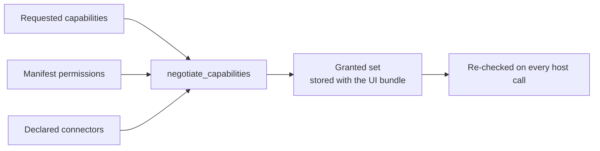
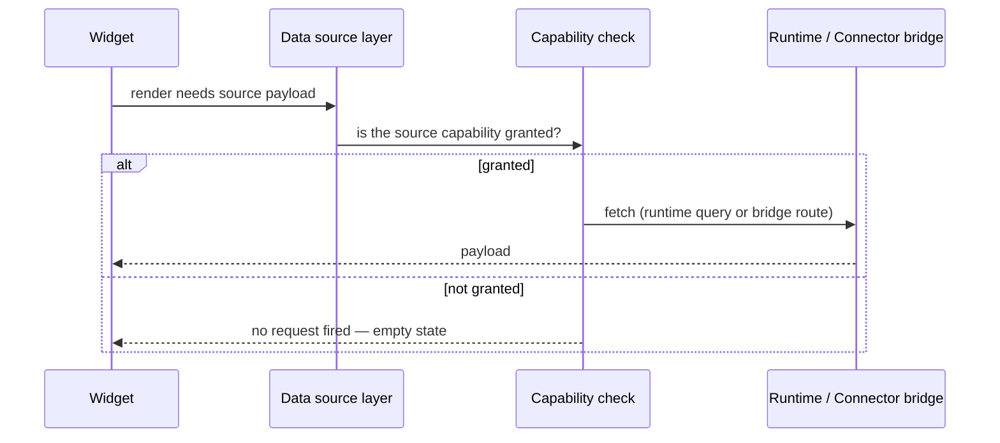

# Capabilities

Capability mediation is **mandatory**: every interaction between a
solution and the host platform passes through the capability registry. A
solution has no side door — no direct database, Redis or network access —
and the capability layer is the single gate.

## Host capabilities

Capabilities a solution UI may request in the manifest's `capabilities`
list:

| Capability | Meaning | Grant condition |
| --- | --- | --- |
| `theme.get` | Read host/solution theme tokens | Always granted |
| `user.get` | Read current user profile | Always granted |
| `tenant.get` | Read tenant metadata | Always granted |
| `runtime.query` | Query own runtime data (metrics / executions / workflows) | Always granted |
| `workflow.trigger` | Trigger this solution's workflows | Requires manifest permission `workflow.execute` |
| `customer.query` | Query customer-hub data | Requires manifest permission `customer.read` |
| `connector.invoke` | Invoke declared connectors through the bridge | Requires ≥ 1 declared connector |

Unknown capability names are rejected at publish time.

## Requesting capabilities

Requested capabilities are declared in `manifest.yaml`:

```yaml title="manifest.yaml (excerpt)"
capabilities:
  - theme.get
  - user.get
  - tenant.get
  - runtime.query
  - connector.invoke
  - workflow.trigger
```

The install wizard shows this requested set next to the granted set before
activation — tenants always see what they are approving.

## Negotiation

The **granted set is the intersection** of what the package requests and
what the installation can grant:



- Computed **at install time** and stored with the tenant bundle.
- **Re-checked on every invocation** — a granted set is not cached trust.
- Recomputed on upgrade; the wizard surfaces any change.

Example: `restaurant-pro` requests `workflow.trigger` and `connector.invoke`,
declares `permissions: [workflow.execute]` and one connector — both are
granted. Removing the connector from the manifest would drop
`connector.invoke` at the next negotiation.

## The `ui.*` host API

The portal implements the host API in-process; every call is checked
against the granted set:

| Call | Effect |
| --- | --- |
| `ui.register` | Register the UI with the host (idempotent; returns granted capabilities) |
| `ui.navigate` | Navigate to a declared page (validated against the bundle) |
| `ui.emit` | Emit a `ui.*` lifecycle event onto the event bus |
| `ui.subscribe` | Subscribe to capability-gated host signals |
| `ui.capabilities` | Report the granted capability set |

Solution authors never call these directly — widgets, forms and navigation
entries map onto them through the declarative definitions. The calls are
documented so capability failures are diagnosable.

## Capability-gated data

Every data-source fetch is gated the same way:



A widget whose capability is not granted **never fires a request**. This
is why a missing permission renders as a calm empty state rather than a
permission error.

## Restaurant Pro granted set

| Requested | Granted? | Why |
| --- | --- | --- |
| `theme.get`, `user.get`, `tenant.get`, `runtime.query` | Yes | Always granted |
| `connector.invoke` | Yes | `restaurant-pos` declared in manifest |
| `workflow.trigger` | Yes | `workflow.execute` permission declared |

## Related topics

- [Events](/docs/solutions/events) — what `ui.emit` puts on the bus
- [Sources](/docs/solutions/sources) — capability-gated data fetching
- [Security](/docs/solutions/security) — why mediation is mandatory
- [Installation](/docs/solutions/installation) — when negotiation happens
