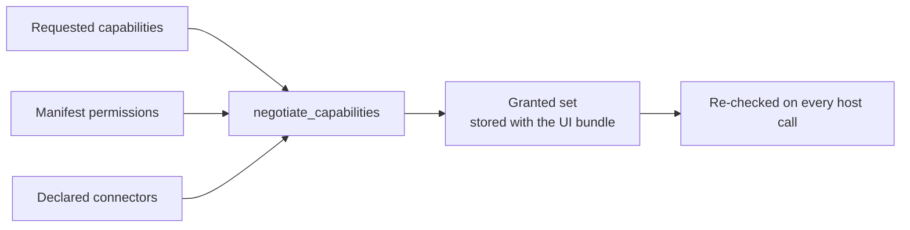
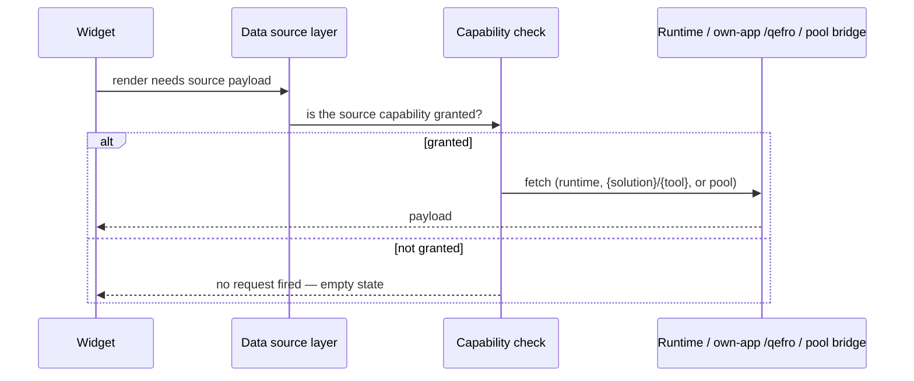

# Capabilities

Capability mediation is **mandatory**: every interaction between a
solution and the host platform passes through the capability registry. A
solution has no side door — no direct database, Redis or network access —
and the capability layer is the single gate.

## Host capabilities

Capabilities a solution UI may request in the manifest's `capabilities`
list:

| Capability | Meaning | Grant condition |
| --- | --- | --- |
| `theme.get` | Read host/solution theme tokens | Always granted |
| `user.get` | Read current user profile | Always granted |
| `tenant.get` | Read tenant metadata | Always granted |
| `runtime.query` | Query own runtime data (metrics / executions / workflows) | Always granted |
| `workflow.trigger` | Trigger this solution's workflows | Requires manifest permission `workflow.execute` |
| `customer.query` | Query customer-hub data | Requires manifest permission `customer.read` |
| `connector.invoke` | Invoke declared connectors through the bridge | Requires ≥ 1 declared connector |
| `storage.read` | SDK may read documents via `ctx.storage` | Requires `storage.read` permission |
| `storage.write` | SDK may insert via `ctx.storage` | Requires `storage.write` permission |
| `storage.update` | SDK may patch via `ctx.storage` | Requires `storage.update` permission |
| `storage.delete` | SDK may soft-delete via `ctx.storage` | Requires `storage.delete` permission |

Unknown capability names are rejected at publish time. Reserved SDK
namespaces (`storage`, `vector`, …) cannot be registered as connectors —
see [Managed storage](/docs/solutions/managed-storage).

## Requesting capabilities

Requested capabilities are declared in `manifest.yaml`:

```yaml title="manifest.yaml (excerpt)"
capabilities:
  - theme.get
  - user.get
  - tenant.get
  - runtime.query
  - workflow.trigger
  - storage.read
  - storage.write
  - storage.update
  - storage.delete
```

The install wizard shows this requested set next to the granted set before
activation — tenants always see what they are approving.

## Negotiation

The **granted set is the intersection** of what the package requests and
what the installation can grant:



- Computed **at install time** and stored with the tenant bundle.
- **Re-checked on every invocation** — a granted set is not cached trust.
- Recomputed on upgrade; the wizard surfaces any change.

Example: `restaurant-pro@1.7.0` requests `workflow.trigger` and
`storage.*`, declares matching `permissions`, and sets `connectors: []` —
storage capabilities authorize the SDK’s `ctx.storage`; `connector.invoke`
is not granted. UI sources target `restaurant-pro/restaurant.*` and gate on
`runtime.query`. An older package that declared a POS connector would also
negotiate `connector.invoke` for bridge-backed sources.

## The `ui.*` host API

The portal implements the host API in-process; every call is checked
against the granted set:

| Call | Effect |
| --- | --- |
| `ui.register` | Register the UI with the host (idempotent; returns granted capabilities) |
| `ui.navigate` | Navigate to a declared page (validated against the bundle) |
| `ui.emit` | Emit a `ui.*` lifecycle event onto the event bus |
| `ui.subscribe` | Subscribe to capability-gated host signals |
| `ui.capabilities` | Report the granted capability set |

Solution authors never call these directly — widgets, forms and navigation
entries map onto them through the declarative definitions. The calls are
documented so capability failures are diagnosable.

## Capability-gated data

Every data-source fetch is gated the same way:



A widget whose capability is not granted **never fires a request**. This
is why a missing permission renders as a calm empty state rather than a
permission error.

## Restaurant Pro granted set (1.7.0)

| Requested | Granted? | Why |
| --- | --- | --- |
| `theme.get`, `user.get`, `tenant.get`, `runtime.query` | Yes | Always granted |
| `workflow.trigger` | Yes | `workflow.execute` permission declared |
| `storage.read` / `write` / `update` / `delete` | Yes | SDK `ctx.storage` — matching permissions |
| `connector.invoke` | No | `connectors: []` — not requested |

## Related topics

- [Managed storage](/docs/solutions/managed-storage) — document plane capabilities
- [Events](/docs/solutions/events) — what `ui.emit` puts on the bus
- [Sources](/docs/solutions/sources) — capability-gated data fetching
- [Security](/docs/solutions/security) — why mediation is mandatory
- [Installation](/docs/solutions/installation) — when negotiation happens
