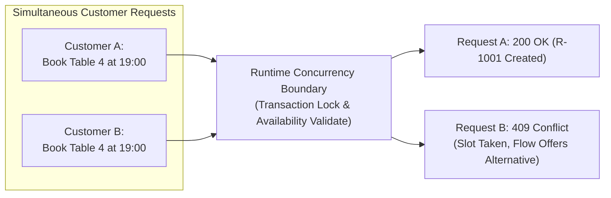
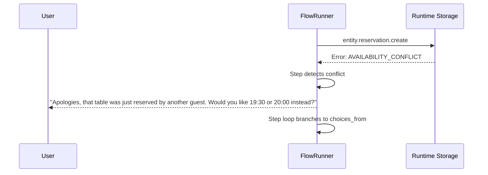

# Concurrency, Booking & Atomic Integrity

Business applications handling appointments, reservations, table bookings, tickets, and inventory allocation are subject to race conditions.

A core principle in Qefro is:

> **Validation at the UI or LLM reasoning layer is not a safety boundary.**

Showing an available slot in a WhatsApp Flow or Website Widget does not guarantee that the slot is still free when the user submits their choice. The runtime must enforce atomic and concurrent correctness at the storage boundary.



---

## 1. Declaring Availability in Entity Metadata

Entities that represent scheduled resources (tables, medical staff, properties, vehicles, stylists) declare availability metadata:

```yaml title="entities/reservation.yaml (excerpt)"
id: reservation
name: Reservation

concurrency: optimistic          # Tracks version integer for atomic updates

availability:
  booking:
    datetime_field: scheduled_at # Field holding the booking UTC timestamp
    duration_minutes: 60        # Length of each booking block
    capacity:
      mode: exclusive           # "exclusive" (single booking per resource) or "unlimited"
      resource:
        field: table_id         # Entity relation field that is locked
```

### Responsibility Split: Package vs. Workspace Settings

| Layer | Responsibility | Config Keys |
|---|---|---|
| **Entity Metadata (Package)** | Structural definition (what fields define time, duration, and locked resource). Stable across all workspaces. | `booking.datetime_field`, `capacity.mode`, `capacity.resource.field` |
| **Workspace Settings (Tenant)** | Operating values (when is the business open, lead times, holidays). Overridden per workspace. | `working_hours`, `timezone`, `closed_days`, `advance_notice_hours`, `max_lookahead_days` |

---

## 2. The `entity.<id>.availability` Runtime Capability

Marketplace Apps do not implement custom slot computation algorithms. The runtime exposes a native tool:

```text
entity.<entity_name>.availability (execution: runtime)
```

Dispatched by `kind`:

### `kind: dates`

Calculates bookable dates across the lookahead window:

```yaml
- id: check_dates
  type: tool
  tool: entity.reservation.availability
  execution: runtime
  input_map:
    kind: "$literal:dates"
```

Returns an array of valid dates taking into account working hours, closed days, and holidays.

### `kind: slots`

Calculates unreserved time slots for a specific date and resource:

```yaml
- id: check_slots
  type: tool
  tool: entity.reservation.availability
  execution: runtime
  input_map:
    kind: "$literal:slots"
    date: selected_date
    resource: selected_table_id
```

The runtime queries existing active bookings (`status != cancelled`) and subtracts overlapping windows, returning only unbooked slots.

### `kind: validate`

Atomically verifies whether a proposed window is still free before commit:

```yaml
- id: validate_slot
  type: tool
  tool: entity.reservation.availability
  execution: runtime
  input_map:
    kind: "$literal:validate"
    datetime: proposed_time
    resource: selected_table_id
```

---

## 3. Atomic Insertion & Optimistic Locking

### Double-Booking Prevention

When an `entity.<name>.create` step executes:
1. The storage engine opens an isolated database transaction.
2. If the entity defines `availability.capacity.mode: exclusive`, the storage engine executes a collision query asserting that no active booking overlaps `[scheduled_at, scheduled_at + duration_minutes)` for that `resource`.
3. If a collision is detected, the transaction aborts with `AVAILABILITY_CONFLICT`.
4. The record is inserted only if the slot is completely unreserved.

### Optimistic Concurrency Control (`concurrency: optimistic`)

For updates to existing records (rescheduling, status transitions, inventory decrements):
1. The client or flow presents the expected `version` integer.
2. The mutation executes conditionally:

   ```sql
   UPDATE entity_records
   SET data = $data, version = version + 1
   WHERE id = $id AND version = $expected_version;
   ```

3. If the row was modified by another request in the interim, the update affects 0 rows, triggering `CONCURRENCY_CONFLICT`.

---

## 4. FlowRunner Handling of Concurrency Conflicts

When a conflict occurs during booking, FlowRunner does not crash or leave inconsistent data:



1. The transaction is rolled back cleanly.
2. FlowRunner catches the `AVAILABILITY_CONFLICT` outcome.
3. The flow loops back to the `select_slot` step, refreshing dynamic choices via `entity.reservation.availability` so the user is immediately presented with currently available alternatives.

---

## 5. Security & Isolation Rules

- **Resource IDs must belong to the workspace:** When specifying `resource: table_id`, the runtime asserts that `table_id` exists in the current `(tenant_id, workspace_id, installation_id)` scope.
- **Client parameters cannot bypass exclusivity:** Even if a user crafts a direct API request omitting the `table_id`, the entity schema marks the resource field as required.
- **Audit Logging:** Every conflict, reservation creation, and rescheduling action generates an immutable audit record in the workspace audit log.

---

## Related Documentation

- [Entity Schemas & Availability](/docs/solutions/entity-schema)
- [Runtime Execution Architecture](/docs/solutions/runtime-execution)
- [Define Business Flows](/docs/guides/define-business-flows)
- [Multi-Tenant Isolation](/docs/concepts/multi-tenant-ai-architecture)
