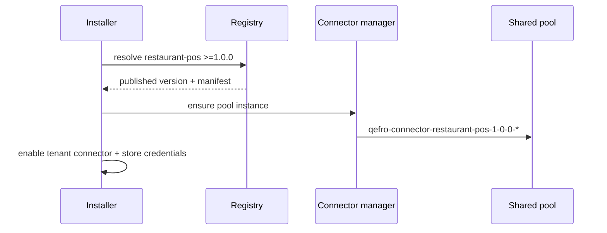
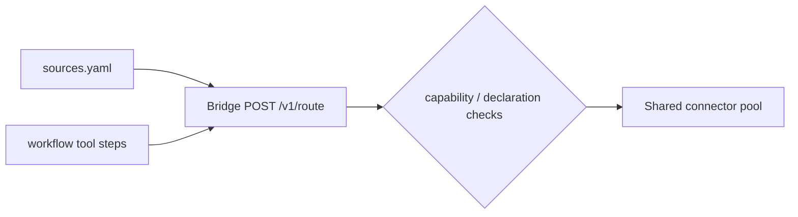

# Connectors

Connectors are how a solution reaches the **outside world** — payment
gateways, property management systems, legacy POS APIs. A solution
never talks to them directly: it declares dependencies, and the platform
resolves, provisions and mediates every call.

For **solution-owned application documents** (reservations, menus, products,
orders), declare entities in a Marketplace App and persist through Runtime
entity tools. The Shopify Marketplace App
([`shopify-runtime`](/docs/solutions/examples/shopify-runtime)) is metadata
executed by Qefro Runtime — it does **not** use a Shopify connector or the
Qefro SDK. Customer vs staff order tools, Hub email OTP, and ownership:
[HTTP tools](/docs/solutions/http-tools). Collection:
[qefro-marketplace-apps](https://github.com/qefro-ai/qefro-marketplace-apps).
A future Shopify Admin API connector under `qefro-connectors`
would stay independent of that Marketplace App.

Pool connectors (Medusa, a future Shopify API adapter, …) are for
**external** systems, not for Marketplace-owned data.

:::danger Deprecated
Do not call platform `storage/*` from workflows or UI sources. That model
is superseded by ADR-003.
:::

## Reserved names

These roots are platform SDK namespaces and **cannot** be declared as
connectors: `storage`, `vector`, `object`, `cache`, `queue`, `secret`,
`state`. Manifest validation rejects them.

## Two declaration layers

### 1. Manifest dependencies

`manifest.yaml` lists the connectors the solution requires, with optional
semver constraints:

```yaml title="manifest.yaml (excerpt)"
connectors:
  - name: shopify
    version: ">=1.0.0"
```

At install time the registry resolves each dependency against published
connector versions. An unsatisfiable constraint fails the installation
before anything is activated.

### 2. The `connectors/` directory

The package's `connectors/` directory documents the connector contracts
the solution relies on — the operations each source and workflow step
uses:

```yaml title="connectors/shopify.yaml"
name: shopify
operations:
  - orders.list
  - products.list
auth:
  type: oauth2
```

These declarations are validated against the published connector's tool
list at publish time: referencing an operation the connector does not
expose is rejected. This keeps `sources.yaml` and `workflows/` honest
before a tenant ever installs the solution.

Omit `connectors/` entirely when the solution uses only its own SDK tools
(and runtime sources) — no external pool dependencies.

## Resolution and provisioning



The **shared pool invariant**: connector containers serve all tenants and
are named `qefro-connector-{name}-{version}-{id}` — never per-tenant.
Connectors are stateless; tenant state lives in the platform, and every
routed call carries the tenant context. See
[Connectors concept](/docs/developer/concepts/connectors).

## Calling connectors: the bridge

Data sources and workflow tool steps reach connectors only through the
connector bridge:



Checks on every routed call:

1. The solution holds `connector.invoke` (UI sources) or the workflow was
   registered by the same installation (tool steps).
2. The connector is declared in the manifest.
3. Tenant context is attached; credentials are fetched from the secret
   manager, never stored in the package.

There is **no direct network access** from a solution — the bridge is the
only path. See [Sources](/docs/solutions/sources).

## Credentials

Connector credentials are tenant data:

- Collected at install time for connectors that declare `auth`.
- Stored AES-256-GCM encrypted by the secret manager; cache keys are
  tenant-prefixed; plaintext is never logged.
- Injected into pool calls by the platform — packages and workflows never
  see them.

See [Secrets](/docs/security/secrets).

## Restaurant Pro

From **1.7.0**, `restaurant-pro` declares `connectors: []` and ships a
required `/qefro` SDK app. Application state uses
[managed storage](/docs/solutions/managed-storage) via `ctx.storage`.
UI/workflows call `restaurant-pro/restaurant.*` tools. Older packages that
depended on `restaurant-pos` or called `storage/*` from YAML are superseded.

## Guidelines

- Prefer an SDK app + managed storage for solution-owned documents; add
  pool connectors only for external systems of record.
- Prefer one well-chosen connector over several overlapping ones; every
  connector adds an install-time credential for the tenant.
- Constrain versions (`>=1.0.0`) when your sources depend on specific
  operation payloads; leave unconstrained for stable, widely deployed
  connectors.
- Publish the connector first — a solution that references an unpublished
  connector cannot install. See the
  [connector reference](/docs/reference/connector-reference).
- Never name a connector after a reserved SDK namespace (`storage`, …).

## Related topics

- [Managed storage](/docs/solutions/managed-storage)
- [Sources](/docs/solutions/sources) — capability-gated reads
- [Capabilities](/docs/solutions/capabilities)
- [Workflows](/docs/solutions/workflows) — connector / storage tool steps
- [Installation](/docs/solutions/installation) — resolution + credentials
- [restaurant-pro example](/docs/solutions/examples/restaurant-pro)
- [Connectors concept](/docs/developer/concepts/connectors)
