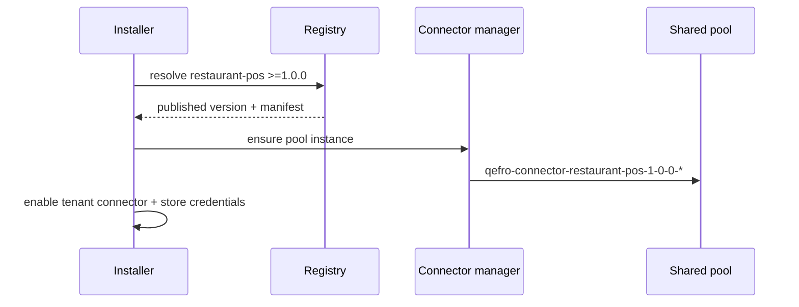
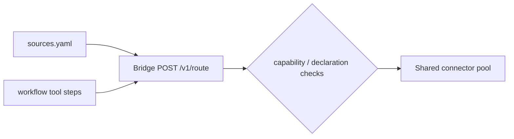

# Connectors

Connectors are how a solution reaches the outside world — POS systems,
payment gateways, property management systems. A solution never talks to
them directly: it declares dependencies, and the platform resolves,
provisions and mediates every call.

## Two declaration layers

### 1. Manifest dependencies

`manifest.yaml` lists the connectors the solution requires, with optional
semver constraints:

```yaml title="manifest.yaml (excerpt)"
connectors:
  - name: restaurant-pos
    version: ">=1.0.0"
```

At install time the registry resolves each dependency against published
connector versions. An unsatisfiable constraint fails the installation
before anything is activated.

### 2. The `connectors/` directory

The package's `connectors/` directory documents the connector contracts
the solution relies on — the operations each source and workflow step
uses:

```yaml title="connectors/restaurant-pos.yaml"
name: restaurant-pos
operations:
  - orders.list
  - reservations.list
  - reservations.create
  - tables.list
  - kitchen.tickets
  - payments.summary
  - revenue.series
  - notify
auth:
  type: api_key
```

These declarations are validated against the published connector's tool
list at publish time: referencing an operation the connector does not
expose is rejected. This keeps `sources.yaml` and `workflows/` honest
before a tenant ever installs the solution.

## Resolution and provisioning



The **shared pool invariant**: connector containers serve all tenants and
are named `qefro-connector-{name}-{version}-{id}` — never per-tenant.
Connectors are stateless; tenant state lives in the platform, and every
routed call carries the tenant context. See
[Connectors concept](/docs/developer/concepts/connectors).

## Calling connectors: the bridge

Data sources and workflow tool steps reach connectors only through the
connector bridge:



Checks on every routed call:

1. The solution holds `connector.invoke` (UI sources) or the workflow was
   registered by the same installation (tool steps).
2. The connector is declared in the manifest.
3. Tenant context is attached; credentials are fetched from the secret
   manager, never stored in the package.

There is **no direct network access** from a solution — the bridge is the
only path. See [Sources](/docs/solutions/sources).

## Credentials

Connector credentials are tenant data:

- Collected at install time for connectors that declare `auth`.
- Stored AES-256-GCM encrypted by the secret manager; cache keys are
  tenant-prefixed; plaintext is never logged.
- Injected into pool calls by the platform — packages and workflows never
  see them.

See [Secrets](/docs/security/secrets).

## Restaurant Pro

| Declared | Version | Operations used |
| --- | --- | --- |
| `restaurant-pos` | `>=1.0.0` | `orders.list`, `reservations.list`, `reservations.create`, `tables.list`, `kitchen.tickets`, `payments.summary`, `revenue.series`, `notify` |

All seven UI sources and the `reservation-reminder` workflow's `notify`
step resolve against this single connector.

## Guidelines

- Prefer one well-chosen connector over several overlapping ones; every
  connector adds an install-time credential for the tenant.
- Constrain versions (`>=1.0.0`) when your sources depend on specific
  operation payloads; leave unconstrained for stable, widely deployed
  connectors.
- Publish the connector first — a solution that references an unpublished
  connector cannot install. See the
  [connector reference](/docs/reference/connector-reference).

## Related topics

- [Sources](/docs/solutions/sources) — capability-gated reads
- [Workflows](/docs/solutions/workflows) — connector tool steps
- [Installation](/docs/solutions/installation) — resolution + credentials
- [Connectors concept](/docs/developer/concepts/connectors)
