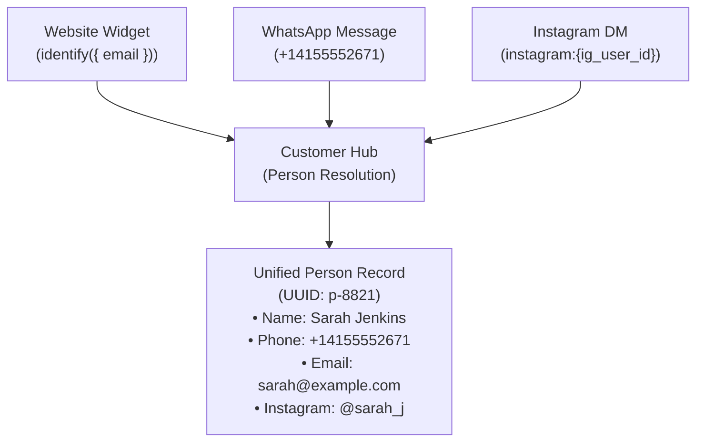

# Customer Hub & Identity Platform

**Customer Hub** is Qefro's tenant-wide identity repository. It provides unified human profiles (**Person** records) across channels (Website Widget, WhatsApp, Instagram) and binds customer identity to Marketplace App entities without requiring each app to build its own customer database.

Qefro is **not an all-in-one replacement for existing enterprise CRMs** (such as Salesforce or HubSpot). Instead, Qefro serves as the **AI reasoning and business execution layer**, linking conversational channels, domain applications, and external CRM systems.

---

## 1. Terminology Hierarchy

The platform strictly differentiates identity and organizational boundaries:

| Entity | Scope | Description |
|---|---|---|
| **Organization (Tenant)** | Top-Level | The company account boundary. Encapsulates teams, billing, and global Customer Hub People. |
| **Workspace** | Operational | Sub-boundary within an organization. Owns dedicated knowledge collections, channels, and app installations. |
| **Person** | Tenant-Wide | A real human contact in the Customer Hub. Identifiable via phone, email, WhatsApp, or Instagram ID. |
| **Customer** | Business Relationship | A Person who has conducted business (made bookings, placed orders, requested quotes) with the organization. |
| **Conversation** | Session-Scoped | An active or archived interaction thread between a Person and Qefro over a specific channel. |
| **Customer Hub** | Platform Service | The internal identity plane managing Person records, timeline activities, tags, and contact metadata. |
| **Business Application** | Domain-Scoped | A native Marketplace App (e.g. Restaurant Pro, Clinic Pro) managing domain entities (tables, appointments). |
| **External CRM** | External System | Third-party customer systems (HubSpot, Zoho, Salesforce) integrated via connectors or SDK. |

---

## 2. Omnichannel Person Resolution

When messages arrive across different channels, Customer Hub resolves the identity into a unified `Person`:



### Identity Priority
When matching or enriching identities, Customer Hub uses deterministic channel priority:
1. Verified Email (from OTP verification or authenticated Widget `identify()`).
2. Verified E.164 Phone Number (from WhatsApp sender ID or SMS OTP).
3. Instagram Profile ID (`instagram:{ig_user_id}`).
4. Anonymous Visitor Cookie (promoted upon identification).

---

## 3. How Marketplace Apps Use Customer Data

Marketplace Apps do not implement custom customer tables. They bind to the Customer Hub using the native `type: person` field:

```yaml title="entities/reservation.yaml (excerpt)"
fields:
  - name: guest_name
    type: string
    required: true

  - name: covers
    type: integer
    required: true

  - name: scheduled_at
    type: datetime
    required: true

  - name: person_id
    type: person
    required: false
    description: "Server-side binding to Customer Hub Person"
```

### Server-Side Identity Injection
When a customer interacts with FlowRunner over WhatsApp, Instagram, or the Widget:
1. The user's verified `person_id` is automatically injected into the `person_id` parameter by `RuntimeAdapter`.
2. The user or LLM **cannot spoof or override** `person_id` — authority stripping silently removes client-supplied identity values.
3. If an action requires an email or phone that is not yet known, FlowRunner triggers a verification challenge (such as an email OTP flow) before completing the action.

---

## 4. Timeline Events & CRM Automations

When Marketplace Apps mutate entities (e.g., creating a reservation or completing an appointment), the runtime emits business events onto the event bus:

```json
{
  "event": "reservation.created",
  "person_id": "9b1deb4d-3b7d-4bad-9bdd-2b0d7b3dcb6d",
  "workspace_id": "ws-1001",
  "data": {
    "code": "R-1001",
    "covers": 4,
    "scheduled_at": "2026-10-12T19:00:00Z"
  }
}
```

Customer Hub automatically:
- Appends the event to the Person's activity timeline in the Admin Console.
- Triggers active CRM automations (such as sending a WhatsApp confirmation or adding a VIP tag).

---

## Related Documentation

- [People Management in Admin Console](/docs/user/people/overview)
- [Entity Schemas & Types](/docs/solutions/entity-schema)
- [Event-Driven Automations](/docs/guides/event-driven-triggers)
- [Runtime Action Authority](/docs/developer/concepts/runtime)
