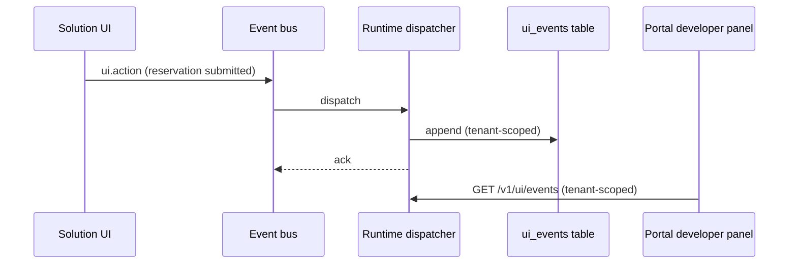

# Events

Event-driven communication is **mandatory**: solutions observe the
platform event bus and emit their own lifecycle events onto it. There is
no out-of-band signaling between a solution and the host.

## The `ui.*` lifecycle events

Solution UIs emit five lifecycle events; they ride the existing bus as
ordinary `event_type` values — the event model is unchanged:

| Event | Emitted when |
| --- | --- |
| `ui.loaded` | The solution UI bundle finished loading for a user |
| `ui.closed` | The user left / closed the solution UI |
| `ui.action` | A user performed a declared action (e.g. form submit) |
| `ui.error` | A scoped render or data error surfaced to the user |
| `ui.navigate` | The user navigated between declared pages |



## Bus semantics for UI events

- **Appended and acked.** The runtime dispatcher appends `ui.*` events to
  the `ui_events` table and acks.
- **Never dead-lettered.** UI events cannot fail a pipeline; they are
  observational.
- **Never trigger workflows.** `ui.*` events do not match workflow
  triggers. Business automation must start from business events or direct
  workflow triggers — see below.

## Reading events back

Tenants read their own UI events through a tenant-scoped endpoint:

```http
GET /v1/ui/events?limit=50
```

The portal's Developer mode shows them in a **Solution UI events** panel,
which is the fastest way to debug "did the UI actually emit that?".

## Business events vs UI events

| Concern | UI events (`ui.*`) | Business events |
| --- | --- | --- |
| Purpose | Observation, audit, UX signals | State changes, automation |
| Triggers workflows | Never | Yes — via workflow `trigger:` definitions |
| Emission | Portal on behalf of the UI | Runtime, connectors, API |
| Example | `ui.action` reservation form submitted | `reservation.confirmed` |

`restaurant-pro` emits `ui.action` for audit when a payment fails to
settle, while the automation itself starts from the business event
`reservation.confirmed`, which triggers the `reservation-reminder`
workflow. See [Workflows](/docs/solutions/workflows).

## Emitting events declaratively

Solutions never construct events manually:

- [Form widgets](/docs/solutions/widgets/form) declare
  `action.emit: <event name>` to put an event on the bus at submit.
- Navigation emits `ui.navigate` automatically.
- Load/close telemetry (`ui.loaded` / `ui.closed`) is emitted by the
  portal's solution UI host.

Emission reuses the platform's standard event ingestion
(`POST /api/v1/runtime/events`), so every event carries tenant identity,
solution attribution and a server-side timestamp.

## Design rules

1. Emit for **audit and observation**; trigger workflows for action.
2. Name business events `<domain>.<past-tense>` —
   `reservation.confirmed`, `payment.settlement_failed`.
3. Keep payloads small and non-sensitive; events are readable by tenant
   users with developer access.
4. Never encode secrets or credentials in event payloads.

## Related topics

- [Platform events concept](/docs/developer/concepts/events)
- [Event reference](/docs/reference/event-reference)
- [Workflows](/docs/solutions/workflows)
- [Capabilities](/docs/solutions/capabilities) — `ui.emit` is capability-mediated
