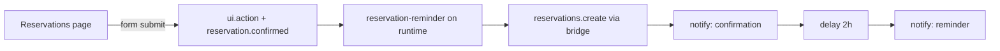

# Example: restaurant-pro

`restaurant-pro` is the canonical reference solution: reservations,
kitchen ops, orders and payments for restaurants, packaged as a single
declarative bundle. This page lists the complete package and walks it
through the pipeline.

## Package layout

```text
restaurant-pro/
├── manifest.yaml
├── assets/
│   ├── logo.svg
│   └── icon.svg
├── workflows/
│   └── reservation-reminder.yaml
├── connectors/
│   └── restaurant-pos.yaml
├── ui/
│   ├── theme.yaml
│   ├── navigation.yaml
│   ├── pages.yaml
│   ├── layouts.yaml
│   ├── widgets.yaml
│   └── sources.yaml
└── README.md
```

## manifest.yaml

```yaml title="manifest.yaml"
id: restaurant-pro
name: Restaurant Pro
version: 1.0.0
description: Reservations, kitchen ops, orders and payments for restaurants
category: hospitality
tags:
  - restaurant
  - pos
  - reservations
connectors:
  - name: restaurant-pos
    version: ">=1.0.0"
channels:
  - widget
  - whatsapp
flows:
  - reservation-reminder
permissions:
  - workflow.execute
capabilities:
  - theme.get
  - user.get
  - tenant.get
  - runtime.query
  - connector.invoke
  - workflow.trigger
settings:
  - key: reservation_lead_time
    type: number
    required: false
    default: 120
    description: Minutes before arrival when the reminder is sent
ui:
  name: Restaurant Pro
  logo: assets/logo.svg
  icon: assets/icon.svg
```

## ui/theme.yaml

```yaml title="ui/theme.yaml"
primary: "#ea580c"
secondary: "#1c1917"
accent: "#f59e0b"
background: "#fffbf5"
surface: "#ffffff"
text: "#1c1917"
font_family: "'Inter', system-ui, sans-serif"
font_size_base: 14
radius: 14px
spacing:
  xs: 4px
  sm: 8px
  md: 16px
  lg: 24px
  xl: 40px
```

## ui/navigation.yaml

```yaml title="ui/navigation.yaml"
- id: dashboard
  page: dashboard
  title: Dashboard
  icon: home
- id: reservations
  page: reservations
  title: Reservations
  icon: calendar
- id: tables
  page: tables
  title: Tables
  icon: users
- id: kitchen
  page: kitchen
  title: Kitchen
  icon: chef-hat
- id: orders
  page: orders
  title: Orders
  icon: receipt
- id: payments
  page: payments
  title: Payments
  icon: credit-card
- id: reports
  page: reports
  title: Reports
  icon: report
```

## ui/layouts.yaml

```yaml title="ui/layouts.yaml"
- id: dashboard-grid
  type: grid
  columns: 12

- id: split-grid
  type: grid
  columns: 12
```

## ui/sources.yaml

```yaml title="ui/sources.yaml"
- id: runtime_metrics
  type: runtime
  target: metrics
- id: orders
  type: connector
  target: orders.list
  params:
    limit: 25
- id: reservations
  type: connector
  target: reservations.list
- id: tables
  type: connector
  target: tables.list
- id: kitchen
  type: connector
  target: kitchen.tickets
- id: payments
  type: connector
  target: payments.summary
- id: revenue
  type: connector
  target: revenue.series
```

## ui/widgets.yaml

```yaml title="ui/widgets.yaml"
- id: active_orders
  type: metric
  title: Active orders
  source: runtime_metrics
  options:
    value_path: executions.active
    label: currently running workflows

- id: order_table
  type: table
  title: Orders
  source: orders
  options:
    rows_path: items
    limit: 25
    columns:
      - { key: id, header: Order }
      - { key: table, header: Table }
      - { key: items, header: Items }
      - { key: status, header: Status }
      - { key: total, header: Total }
      - { key: created_at, header: Placed }

- id: revenue_chart
  type: chart
  title: Revenue trend
  source: revenue
  options:
    rows_path: items
    kind: line
    x_key: day
    y_key: total

- id: payments_chart
  type: chart
  title: Revenue this week
  source: payments
  options:
    rows_path: items
    kind: bar
    x_key: day
    y_key: total

- id: orders_timeline
  type: timeline
  title: Recent order activity
  source: orders
  options:
    rows_path: items
    time_field: created_at
    title_field: id
    desc_field: status

- id: reservation_form
  type: form
  title: New reservation
  options:
    fields:
      - { name: guest_name, label: Guest name, type: text, required: true }
      - { name: covers, label: Covers, type: number, required: true }
      - { name: date, label: Date, type: date, required: true }
      - { name: time, label: Time, type: time, required: true }
      - name: occasion
        label: Occasion
        type: select
        options: [birthday, anniversary, business, other]
    submit_label: Reserve table
    action:
      trigger: reservation-reminder
      emit: reservation.confirmed

- id: reservations_calendar
  type: calendar
  title: Reservations
  source: reservations
  options:
    rows_path: items
    date_field: starts_at
    title_field: guest_name

- id: tables_map
  type: map
  title: Floor plan
  source: tables
  options:
    rows_path: items
    label_field: name
    lat_field: lat
    lng_field: lng

- id: tables_status
  type: status
  title: Table status
  source: tables
  options:
    rows_path: items
    label_field: name
    status_field: status

- id: kitchen_kanban
  type: kanban
  title: Kitchen tickets
  source: kitchen
  options:
    rows_path: items
    column_field: stage
    title_field: dish
    columns:
      - { id: queued, title: Queued }
      - { id: cooking, title: Cooking }
      - { id: pass, title: At pass }
      - { id: served, title: Served }

- id: reports_markdown
  type: markdown
  title: Reporting notes
  options:
    content: |
      ## How reports work

      Revenue is reconciled nightly against the POS connector. Payments
      that fail to settle are surfaced on the **Payments** page and emit
      a `ui.action` event for audit.

      - **Executions** reflect workflow runs on the solution runtime.
      - **Revenue** is grouped per day by the `payments` data source.
      - All queries are capability-gated (`runtime.query` / `connector.invoke`).
```

## ui/pages.yaml

```yaml title="ui/pages.yaml"
- id: dashboard
  title: Dashboard
  layout: dashboard-grid
  widgets:
    - { widget: active_orders, span: 3 }
    - { widget: revenue_chart, span: 9 }
    - { widget: order_table, span: 12 }

- id: reservations
  title: Reservations
  layout: split-grid
  widgets:
    - { widget: reservation_form, span: 5 }
    - { widget: reservations_calendar, span: 7 }

- id: tables
  title: Tables
  layout: split-grid
  widgets:
    - { widget: tables_map, span: 6 }
    - { widget: tables_status, span: 6 }

- id: kitchen
  title: Kitchen
  layout: dashboard-grid
  widgets:
    - { widget: kitchen_kanban, span: 12 }

- id: orders
  title: Orders
  layout: split-grid
  widgets:
    - { widget: order_table, span: 8 }
    - { widget: orders_timeline, span: 4 }

- id: payments
  title: Payments
  layout: dashboard-grid
  widgets:
    - { widget: payments_chart, span: 12 }

- id: reports
  title: Reports
  layout: split-grid
  widgets:
    - { widget: revenue_chart, span: 8 }
    - { widget: reports_markdown, span: 4 }
```

## connectors/restaurant-pos.yaml

```yaml title="connectors/restaurant-pos.yaml"
name: restaurant-pos
operations:
  - orders.list
  - reservations.list
  - reservations.create
  - tables.list
  - kitchen.tickets
  - payments.summary
  - revenue.series
  - notify
auth:
  type: api_key
```

## workflows/reservation-reminder.yaml

```yaml title="workflows/reservation-reminder.yaml"
id: reservation-reminder
name: Reservation reminder
trigger:
  event: reservation.confirmed
steps:
  - type: tool
    tool: restaurant-pos/reservations.create
    params:
      guest: "{{ event.payload.guest_name }}"
      covers: "{{ event.payload.covers }}"
      date: "{{ event.payload.date }}"
      time: "{{ event.payload.time }}"
  - type: tool
    tool: restaurant-pos/notify
    params:
      message: "Your table is confirmed — see you soon!"
  - type: delay
    duration: 2h
  - type: tool
    tool: restaurant-pos/notify
    params:
      message: "Reminder: your table is ready in 2 hours."
  - type: complete
```

## README.md

```markdown title="README.md"
# Restaurant Pro

Reservations, kitchen ops, orders and payments for restaurants.

- Requires the `restaurant-pos` connector (>= 1.0.0) with an API key.
- Declares one workflow: `reservation-reminder`.
- Requests `workflow.execute` and the standard UI capability set.

Pages: Dashboard, Reservations, Tables, Kitchen, Orders, Payments, Reports.
```

## End-to-end walkthrough

### 1. Build

```bash
cd restaurant-pro
qefro solution build .
```

Validation runs the full [checklist](/docs/solutions/validation): widget
kinds, grid columns, icon set, asset extensions, connector operation
references and capability names. Then the package is canonicalized,
checksummed and signed into `dist/package.json`.

### 2. Publish

```bash
qefro solution publish
```

The registry verifies the Ed25519 signature over
`restaurant-pro|1.0.0|<checksum>` and stores the version as `published`.
See [Publishing](/docs/solutions/publishing).

### 3. Install

```bash
qefro solution install restaurant-pro
```

The installer:

1. Resolves `restaurant-pos >= 1.0.0` and ensures the shared pool
   instance.
2. Collects the POS API key into the secret manager (AES-256-GCM).
3. Registers `reservation-reminder` with the runtime.
4. Negotiates capabilities — granted set:

| Capability | Granted because |
| --- | --- |
| `theme.get`, `user.get`, `tenant.get`, `runtime.query` | Always granted |
| `connector.invoke` | `restaurant-pos` declared |
| `workflow.trigger` | `workflow.execute` permission |

Finally, it persists the UI bundle for the tenant.

### 4. Use

Portal route pattern: `/app/solutions/ui/restaurant-pro/{page}`.



- **Dashboard** — `active_orders` metric from runtime metrics, revenue
  trend from `revenue.series`, full order table.
- **Reservations** — submit the form; the confirmation arrives through
  the POS connector, the reminder follows the configured lead time.
- **Kitchen** — tickets flow Queued → Cooking → At pass → Served.
- **Reports** — revenue trend beside the markdown reporting notes.

Every fetch on every page is capability-gated; every lifecycle step emits
`ui.*` events visible in Developer mode. See [Events](/docs/solutions/events).

## Adapting the example to other domains

| Domain | Pages to swap | Sources to rewire |
| --- | --- | --- |
| Hospital management | Appointments (`calendar`), Wards (`status`), Duty roster (`table`) | HMS connector operations |
| CRM | Pipeline (`kanban`), Contacts (`table`), Activity (`timeline`) | CRM hub operations |
| Hotel management | Rooms (`map`), Bookings (`calendar`), Housekeeping (`kanban`) | PMS connector operations |
| School management | Classes (`table`), Attendance (`metric`), Fees (`chart`) | SIS connector operations |
| Inventory management | Stock levels (`metric`), Transfers (`timeline`), Purchase orders (`table`) | WMS connector operations |

The structure — manifest, theme, navigation, layouts, sources, widgets,
pages, connectors, workflows — stays identical; only the domain nouns
change.

## Related topics

- [Quickstart](/docs/solutions/quickstart) — minimal version of this loop
- [Architecture](/docs/solutions/architecture) — the pipeline in depth
- [Security](/docs/solutions/security) — the rules this package obeys
