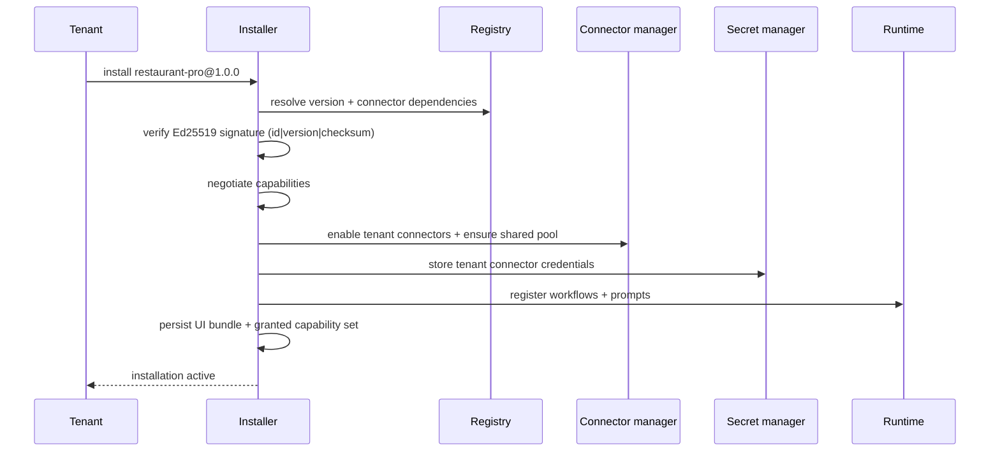
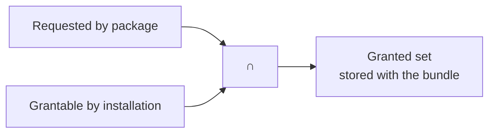

# Installation

Installation is the tenant-side half of the pipeline: it turns a published,
signed version into an active installation with negotiated capabilities,
registered workflows and a renderable UI bundle.

## Install paths

Two equivalent paths exist:

- **Portal wizard** — Solutions → Marketplace → *Install*. The wizard shows
  the manifest, requested vs granted capabilities, required connectors and
  settings before activation.
- **CLI** — for automation and testing:

```bash
qefro solution install restaurant-pro
```

The CLI sends the tenant and organization context headers with the install
request, mirroring the portal's identity.

## The activation pipeline



Each step fails the whole installation atomically — a partially installed
solution is never exposed to the tenant.

| Step | What happens | Failure mode |
| --- | --- | --- |
| Resolve | Registry resolves the exact version and connector constraints | Unknown version / unresolvable connector version |
| Verify | Signature over `id\|version\|checksum` is re-verified | Tampered or unsigned package |
| Negotiate | Granted set = requested capabilities ∩ grantable permissions | Capability requires a missing manifest permission |
| Connectors | Tenant connectors enabled; shared pool instances ensured | Connector not published / pool unhealthy |
| Secrets | Tenant credentials stored AES-256-GCM encrypted | Missing required credential |
| Register | Workflows and prompts registered with the runtime | Invalid workflow definition |
| UI bundle | Parsed UI stored per version; `register ui` activation step | Publish-time validation already covers this |

## Capability negotiation

The manifest's `permissions` and the UI's requested capabilities are
intersected with what the installation grants:



For `restaurant-pro`, requesting `workflow.trigger` and `connector.invoke`
with the manifest permission `workflow.execute` and one declared connector
grants both. The granted set is **re-checked on every host call** — it is
not a one-time handshake. Reference: [Capabilities](/docs/solutions/capabilities).

## Settings

Manifest `settings` declare tenant-configurable values (see
[Manifest](/docs/solutions/manifest)). At install time the tenant provides
values for required settings; defaults apply otherwise. Settings are stored
tenant-scoped and are merged on upgrade — see below.

:::caution
Settings updates merge; keys are not removed automatically. Design setting
keys to be stable across versions.
:::

## Upgrade

```bash
qefro solution install restaurant-pro   # resolves the latest published version
```

Upgrading replaces the installed version's workflows, prompts and UI bundle
with the new version's. Version data is persisted per version, so uninstall
and rollback drop exactly what the version introduced.

Notes:

- Published versions are immutable — an upgrade always moves forward to a
  new version.
- Connector constraints are re-resolved; a constraint the registry can no
  longer satisfy blocks the upgrade.
- Capabilities are re-negotiated for the new version; the wizard displays
  any change to the granted set.

## Uninstall

Uninstalling a solution:

- deregisters its workflows and prompts from the runtime,
- drops the UI bundle and version-scoped definitions,
- disables tenant connectors that no other installation needs,
- leaves the shared connector pool running for other tenants.

Connector credentials are removed from the secret manager when no
installation references them.

## Verifying an installation

```bash
qefro solution list
```

lists installed solutions with version and status for the tenant context.
In the portal, the installation card shows the granted capabilities,
declared connectors and active version.

## Related topics

- [Publishing](/docs/solutions/publishing) — how versions reach the registry
- [Capabilities](/docs/solutions/capabilities) — the negotiation model in detail
- [Connectors](/docs/solutions/connectors) — dependency resolution and the bridge
- [Troubleshooting](/docs/solutions/troubleshooting) — install failures
