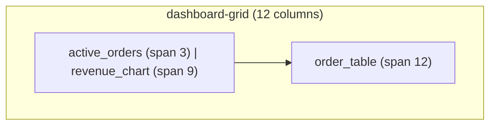

# Layouts

`ui/layouts.yaml` declares the grid layout presets that pages reference.
Layouts are the only structural primitive a solution ships: every page is a
grid of widget placements, rendered by the portal's layout engine.

## Layout presets

```yaml title="ui/layouts.yaml"
- id: dashboard-grid
  type: grid
  columns: 12

- id: split-grid
  type: grid
  columns: 12
```

| Field | Type | Required | Description |
| --- | --- | --- | --- |
| `id` | string | Yes | Preset id referenced by `pages.yaml` (`layout:` field). |
| `type` | string | Yes | Must be `grid` — the only supported layout type. |
| `columns` | number | Yes | Column count, 1–12. |

## Rules

- **`type` must be `grid`.** Free-form, absolute and flex layouts are not
  part of the contract — the portal owns arrangement.
- **Columns are bounded.** Valid range is 1–12; out-of-range values fail
  publish-time [validation](/docs/solutions/validation).
- **Spans are bounded too.** A placement `span` must fit within the
  layout's column count; spans are validated at publish and defensively
  clamped at render.
- **No code, no custom CSS.** Layouts describe structure only; styling
  comes from the [theme](/docs/solutions/themes).

## Grid semantics

Placements flow left-to-right and wrap to the next row when the remaining
columns cannot fit the next span:



A span that would exceed the row's remaining space starts a new row. A
placement without `span` defaults to full width.

## Responsive contract

| Viewport | Behavior |
| --- | --- |
| < 1024 px | Single column; placements stack in declaration order |
| ≥ 1024 px | `repeat(columns)` grid; spans honored |

The layout engine applies this automatically — solutions never declare
breakpoints.

## Restaurant Pro layouts

```yaml title="ui/layouts.yaml"
- id: dashboard-grid
  type: grid
  columns: 12

- id: split-grid
  type: grid
  columns: 12
```

- `dashboard-grid` — dashboards and full-width operational pages
  (Dashboard, Kitchen, Payments).
- `split-grid` — two-pane pages: a primary widget at span 6–8 with a
  companion at span 4–6 (Reservations, Tables, Orders, Reports).

## Guidelines

- Define 2–3 presets and reuse them; a page list with a unique layout per
  page is a sign the pages should be restructured.
- 12 columns gives the most placement flexibility (halves, thirds,
  quarters all fit).
- When a page feels cramped, reduce placements or shrink spans before
  adding columns — narrow columns hurt table legibility.

## Related topics

- [Pages](/docs/solutions/pages) — placements that use layouts
- [Widgets](/docs/solutions/widgets/table) — content rendered inside spans
- [restaurant-pro example](/docs/solutions/examples/restaurant-pro)
