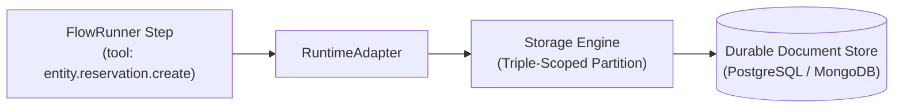

# Managed Runtime Storage

Marketplace Apps require durable application state (reservations, appointments, property listings, orders, menu items) without direct database connections or custom database migrations.

**Managed storage** is the platform's multi-tenant document plane. Applications declare entity schemas in `entities/*.yaml`, and **Qefro Runtime** manages persistence, validation, isolation, and indexing.



---

## 1. Triple-Scoped Isolation

Every piece of data stored by a Marketplace App is strictly triple-scoped:

```text
Partition = (tenant_id, workspace_id, installation_id)
```

```text
StorageContext
├── tenant_id        # Resolves Organization ownership
├── workspace_id     # Resolves AI Workspace operational boundary
├── installation_id  # Resolves specific Marketplace App install
├── solution_id      # Identifies the application package
└── identity_id      # Optional authenticated Person ID
```

### Absolute Isolation Guarantees
- Two workspaces within the same organization have isolated database partitions.
- Uninstalling an application purges or archives its installation partition without affecting other workspace data.
- Tenants can never query across installation boundaries.

---

## 2. Generic Entity Dialect

Marketplace Apps interact with storage exclusively through runtime entity operations:

```text
entity.<entity_name>.<operation>
```

| Operation | Storage Action | Capability Required | Description |
|---|---|---|---|
| `entity.<name>.create` | Insert document | `storage.write` | Validates schema, allocates code, and persists document. |
| `entity.<name>.get` | Read single document | `storage.read` | Fetches record by unique code or UUID. |
| `entity.<name>.list` | Query collection | `storage.read` | Queries records matching filter criteria, with sorting and limits. |
| `entity.<name>.update` | Mutate document | `storage.update` | Validates and updates fields; asserts optimistic version if enabled. |
| `entity.<name>.delete` | Soft delete | `storage.delete` | Sets `is_deleted = true` and records cancellation event. |
| `entity.<name>.availability` | Slot check | `runtime` | Computes free time windows against exclusive bookings. |

---

## 3. Automatic Code Allocation (`allocate_code`)

Business records often require human-readable reference codes (e.g., `ORD-10001`, `R-1001`, `APT-5002`) instead of raw UUIDs.

Entities declare code allocation in metadata:

```yaml title="entities/reservation.yaml (excerpt)"
id: reservation
name: Reservation
allocate_code:
  prefix: R-
  start: 1001
```

The storage engine atomically allocates sequential identifiers within the installation partition. Both UUIDs and allocated codes are indexed for instant `get` and `update` lookups.

---

## 4. Automatic System & Audit Fields

Every stored entity document automatically receives platform-managed system fields:

| Field | Type | Description |
|---|---|---|
| `id` | string (UUID) | Immutable primary document identifier. |
| `code` | string | Human-readable allocated code (if `allocate_code` is declared). |
| `tenant_id` | string (UUID) | Owning Organization. |
| `workspace_id` | string (UUID) | Owning Workspace. |
| `installation_id` | string (UUID) | Owning Marketplace App installation. |
| `is_deleted` | boolean | Soft-delete flag (default `false`). |
| `created_at` | datetime | ISO 8601 UTC timestamp of insertion. |
| `updated_at` | datetime | ISO 8601 UTC timestamp of last modification. |
| `version` | integer | Incremented on every update for optimistic concurrency. |

:::warning Authority Fields Protected
Callers, LLMs, and flows cannot manually supply or override `id`, `tenant_id`, `workspace_id`, `installation_id`, `created_at`, or `version`. The runtime unconditionally strips these fields from mutation parameters.
:::

---

## 5. Relationships & Customer Hub Person Binding

Entities declare relationships through the `relation` and `person` types:

```yaml
fields:
  - name: table_id
    type: relation
    ref_entity: table
    required: true

  - name: person_id
    type: person
    required: false
    description: "Links reservation to Customer Hub Person"
```

- **`type: relation`**: Links records within the same installation partition (e.g. reservation to table).
- **`type: person`**: Binds the record to a universal Customer Hub Person record across the tenant. `person_id` is automatically injected from the verified session.

---

## Related Documentation

- [Entity Schema Specification](/docs/solutions/entity-schema)
- [Runtime Execution Architecture](/docs/solutions/runtime-execution)
- [Concurrency & Booking Integrity](/docs/solutions/concurrency-and-booking)
- [Customer Hub Overview](/docs/solutions/customer-hub)
