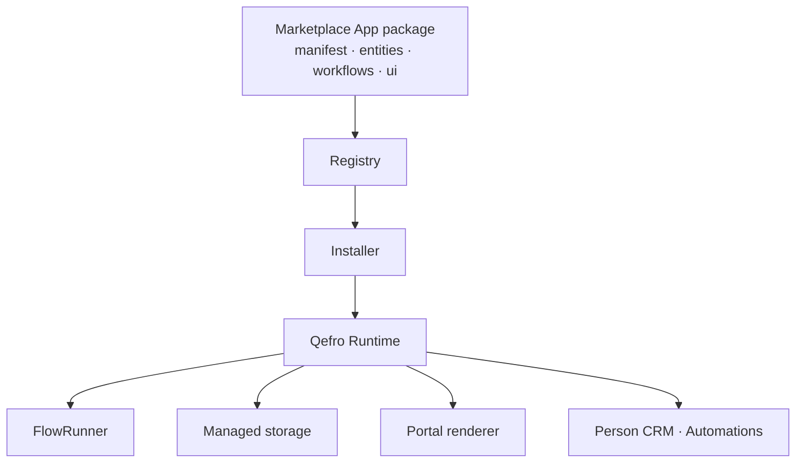

# Solution Development

**Solution Development** is how you build complete, branded business
applications on Qefro: a restaurant manager, a clinic front desk, a real
estate CRM, a booking product — shipped as a single **installable
package**.

A **Qefro Marketplace App** is a **declarative package**, not an SDK
server. Developers do **not** need a backend to create Restaurant, Clinic,
Real Estate, Booking, or CRM apps. Qefro Runtime executes the metadata:
UI, entities, storage, Business Flows, Business Events, CRM, and
Automation.

**Default developer story:**

```text
Developer → Create App Metadata → Validate → Package → Publish
  → Install into Workspace → Qefro Runtime
```

```bash
qefro app init restaurant-pro
qefro app validate restaurant-pro
qefro app package restaurant-pro
qefro app install restaurant-pro
```

**Start here:** [Build your first app](/docs/solutions/build-your-first-app)
using [`restaurant-pro-runtime`](/docs/solutions/examples/restaurant-pro-runtime).

:::info Runtime vs SDK
**Build a Qefro Marketplace App with metadata.** Use the SDK only to
connect an external ERP, POS, or CRM. See [Runtime vs SDK](/docs/solutions/runtime-vs-sdk).
:::

## What is a Qefro Marketplace App?

An installable YAML package with `hosting: runtime`. Identity, entities,
workflows, events, UI, and permissions live in the package. After install,
Qefro Runtime:

- renders dashboards, tables, forms, detail pages, navigation, and widgets
- persists entities in [managed storage](/docs/solutions/managed-storage) (no direct DB)
- compiles `workflows/` into the same **BusinessFlow / FlowRunner** as every other flow
- emits business events that CRM Automation can consume
- hosts Contacts (`host: contacts`) and Automations (`host: automations`)

You never run `npm run dev` on a `/qefro` process for this path.

## What you can build

Any business domain that fits entities + flows + UI:

| Domain | Typical pages | Data plane |
| --- | --- | --- |
| Restaurant | Dashboard, reservations, tables, menu | Runtime entities + managed storage |
| Clinic | Appointments, patients, schedule | Runtime entities + managed storage |
| Real estate | Properties, leads, viewings | Runtime entities + managed storage |
| Commerce | Products, customers, orders | Runtime entities + managed storage |
| CRM / booking | Pipeline, contacts, bookings | Runtime entities + Person CRM |

Canonical references:

| Package | App id | Role |
| --- | --- | --- |
| [restaurant-pro-runtime](/docs/solutions/examples/restaurant-pro-runtime) | `restaurant-pro-runtime` | Hospitality metadata app |
| [real-estate-runtime](/docs/solutions/examples/real-estate-runtime) | `real-estate-runtime` | Same model, different nouns |
| [shopify-runtime](/docs/solutions/examples/shopify-runtime) | `shopify-runtime` | Commerce metadata + generic Runtime HTTP |

SDK-hosted Marketplace examples (`restaurant-pro`, `clinic-pro`,
`salon-pro`) were **removed**. Build those products as metadata, or
connect a real external system with the SDK.

## Core principles

1. **Metadata is the application.** `hosting: runtime` packages ship
   `manifest.yaml`, `entities/`, `workflows/`, and `ui/`. No SDK process.
2. **UI is declarative data.** Theme, nav, pages, and widgets are YAML —
   no package JS in the portal UI (no iframes, no injected scripts).
3. **Storage is Qefro-managed.** Entity tools such as
   `entity.reservation.create` persist documents. No Mongo connection, no
   direct `storage/*` from YAML.
4. **Flows compile to FlowRunner.** `ask` → `tool` → `condition` →
   `approval` / `challenge` → `complete` on the same engine as every
   Business Flow.
5. **Capability mediation is mandatory.** Host interactions pass through
   the capability registry.
6. **Event-driven communication is mandatory.** Business events drive
   automation; `ui.*` events are observational.

### Platform rules

These rules are enforced at publish time and at render time. Packages that
violate them are rejected:

| # | Rule |
| --- | --- |
| 1 | No arbitrary JavaScript |
| 2 | No direct DOM access |
| 3 | No iframe execution |
| 4 | No direct database access |
| 5 | No direct Redis access |
| 6 | No direct network access |
| 7 | Capability mediation is mandatory |
| 8 | Event-driven communication is mandatory |

See [Security model](/docs/solutions/security) for how each rule is enforced.

## The delivery pipeline



| Stage | Responsibility | Details |
| --- | --- | --- |
| App package | Metadata: manifest, entities, workflows, UI | [Package structure](#package-structure) |
| Registry | Signed global catalog (platform-admin publish only) | [Publishing](/docs/solutions/publishing) |
| Installer | Activation, capabilities, workspace install | [Installation](/docs/solutions/installation) |
| Qefro Runtime | UI, entity tools, FlowRunner, events | [Architecture](/docs/solutions/architecture) |
| Managed storage | Documents for declared entities | [Managed storage](/docs/solutions/managed-storage) |
| Portal renderer | Dashboards, tables, forms, widgets | [Pages](/docs/solutions/pages) |

External ERP / POS / CRM integrations take a **separate** path: SDK →
`/qefro` → Runtime. See [Runtime vs SDK](/docs/solutions/runtime-vs-sdk).

## Package structure

Prefer `qefro app init <id>`. The implemented tree
(from `restaurant-pro-runtime` / `qefro app init`) is:

```text
my-app/
├── manifest.yaml        # identity, hosting: runtime, entities, flows, events, UI, permissions
├── entities/            # domain schemas (required for hosting: runtime)
│   └── record.yaml
├── workflows/           # Business Flows → FlowRunner
│   └── create-record.yaml
└── ui/                  # Runtime-rendered staff UI
    ├── theme.yaml
    ├── navigation.yaml
    ├── pages.yaml
    ├── layouts.yaml
    ├── widgets.yaml
    └── sources.yaml     # type: entity | runtime
```

There is no `src/`, no `events/` directory, and no `automations/`
directory. Events are declared on the manifest (`events:`). Automations
are a portal host page (`host: automations`), not package files.

YAML is assembled into a canonical JSON package, checksummed and signed —
see [Packaging](/docs/solutions/packaging).

## Documentation map

| Topic | Page |
| --- | --- |
| **Runtime vs SDK (read this)** | [Runtime vs SDK](/docs/solutions/runtime-vs-sdk) |
| Build your first Marketplace App | [Build your first app](/docs/solutions/build-your-first-app) |
| Platform architecture | [Architecture](/docs/solutions/architecture) |
| Tenant-side activation | [Installation](/docs/solutions/installation) |
| `manifest.yaml` reference | [Manifest](/docs/solutions/manifest) |
| Branding | [Themes](/docs/solutions/themes) |
| Sidebar + routes | [Navigation](/docs/solutions/navigation) |
| Pages & layouts | [Pages](/docs/solutions/pages) · [Layouts](/docs/solutions/layouts) |
| Widgets | [Metric](/docs/solutions/widgets/metric) · [Table](/docs/solutions/widgets/table) · [Chart](/docs/solutions/widgets/chart) · [Markdown](/docs/solutions/widgets/markdown) · [Form](/docs/solutions/widgets/form) · [Timeline](/docs/solutions/widgets/timeline) |
| Host capabilities | [Capabilities](/docs/solutions/capabilities) |
| Event model | [Events](/docs/solutions/events) |
| Data sources | [Sources](/docs/solutions/sources) |
| Managed document storage | [Managed storage](/docs/solutions/managed-storage) |
| Images & branding files | [Assets](/docs/solutions/assets) |
| Connector dependencies | [Connectors](/docs/solutions/connectors) |
| Workflow definitions | [Workflows](/docs/solutions/workflows) |
| Publish-time checks | [Validation](/docs/solutions/validation) |
| Building a signed package | [Packaging](/docs/solutions/packaging) |
| Publishing to the registry | [Publishing](/docs/solutions/publishing) |
| Security model & rules | [Security](/docs/solutions/security) |
| Fixing common failures | [Troubleshooting](/docs/solutions/troubleshooting) |
| Canonical metadata app | [restaurant-pro-runtime](/docs/solutions/examples/restaurant-pro-runtime) |
| Second vertical | [real-estate-runtime](/docs/solutions/examples/real-estate-runtime) |
| Commerce metadata app | [shopify-runtime](/docs/solutions/examples/shopify-runtime) |
| SDK-hosted packages (not default) | [Managed apps](/docs/solutions/managed-apps) |

## How this differs from playbooks

[Solution playbooks](/docs/solutions/playbooks) are outcome-oriented guides
that compose *existing* platform features (customer support, order tracking,
refunds). Solution Development produces **new installable packages** with
their own manifest, entities, UI, and workflows.

## Related platform concepts

- [Runtime](/docs/developer/concepts/runtime) — the execution engine that runs installed workflows.
- [Events](/docs/developer/concepts/events) — the platform event bus that solutions ride.
- [Managed storage](/docs/solutions/managed-storage) — document plane for declared entities.
- [Connectors](/docs/developer/concepts/connectors) — stateless integration containers behind the bridge.
- [Business Flows](/docs/developer/concepts/flows) — the flow model workflows compile to.
- [External SDK Connection](/docs/developer/external-sdk-connection) — ERP / POS / CRM → SDK → `/qefro`.
