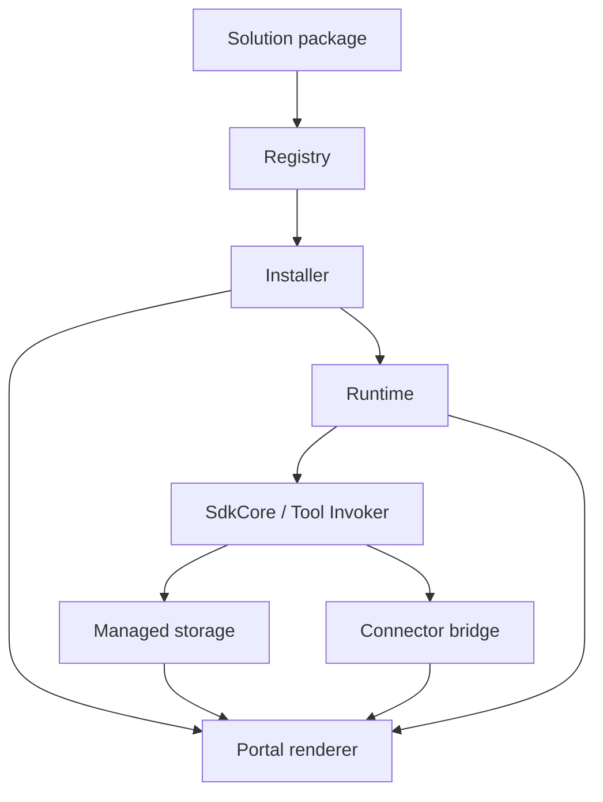

# Solution Development

**Solution Development** is how you build complete, branded business
applications on Qefro: a restaurant manager, a hospital front desk, a CRM, a
hotel property system, a school administration portal, or an inventory
back office — all shipped as a single declarative **solution package**.

A solution is **data, never code**. You describe the manifest, UI, workflows
and (optionally) connector requirements in YAML; the Qefro platform
validates, signs, installs, executes and renders everything on your behalf.
Solution-owned documents persist via [managed storage](/docs/solutions/managed-storage);
external systems of record stay behind connectors.

## What you can build

Any business domain that fits the Qefro model — entities, workflows, events,
a storage- and/or connector-backed data plane, and a portal-rendered UI —
can be packaged as a solution:

| Domain | Typical pages | Typical data plane |
| --- | --- | --- |
| Restaurant management | Dashboard, reservations, tables, kitchen, orders, payments | Managed storage (+ optional POS) |
| Hospital management | Appointments, wards, billing, duty roster | Managed storage + HMS connectors |
| CRM | Pipeline, contacts, activities, reports | Managed storage + CRM hub |
| Hotel management | Rooms, bookings, housekeeping, folios | Managed storage + PMS |
| School management | Classes, attendance, fees, timetables | Managed storage + SIS |
| Inventory management | Stock levels, transfers, purchase orders | Managed storage + WMS |

Throughout this section, [`restaurant-pro`](/docs/solutions/examples/restaurant-pro)
is the canonical reference solution. Every concept page uses it as the
running example.

## Core principles

1. **Solutions ship data, never code.** Every file in a package is YAML,
   JSON or an image. Nothing from a package ever executes.
2. **Capability mediation is mandatory.** Every interaction between a
   solution and the host platform passes through the capability registry;
   calls are negotiated at install and re-checked on every invocation.
3. **Event-driven communication is mandatory.** Solutions react to the
   platform event bus and emit `ui.*` lifecycle events onto it — there is
   no out-of-band signaling.
4. **The portal renders natively.** Solution UIs are rendered inside the
   portal by the platform's own widget registry — no iframes, no injected
   scripts.

### Platform rules

These rules are enforced at publish time and at render time. Packages that
violate them are rejected:

| # | Rule |
| --- | --- |
| 1 | No arbitrary JavaScript |
| 2 | No direct DOM access |
| 3 | No iframe execution |
| 4 | No direct database access |
| 5 | No direct Redis access |
| 6 | No direct network access |
| 7 | Capability mediation is mandatory |
| 8 | Event-driven communication is mandatory |

See [Security model](/docs/solutions/security) for how each rule is enforced.

## The delivery pipeline

A solution travels a fixed pipeline from your editor to a tenant's portal:



| Stage | Responsibility | Details |
| --- | --- | --- |
| Solution package | Manifest, UI, workflows, optional connectors, assets | [Package structure](#package-structure) |
| Registry | Signed global catalog, version lifecycle | [Publishing](/docs/solutions/publishing) |
| Installer | Tenant-scoped activation + capability negotiation | [Installation](/docs/solutions/installation) |
| Runtime | Executes workflows, serves runtime data sources | [Workflows](/docs/solutions/workflows) |
| Managed storage | Solution documents in Mongo via `storage/*` | [Managed storage](/docs/solutions/managed-storage) |
| Connector bridge | Routes capability-gated calls to external connectors | [Connectors](/docs/solutions/connectors) |
| Portal renderer | Renders pages, widgets and themes natively | [Pages](/docs/solutions/pages) |

The full architecture is covered in [Architecture](/docs/solutions/architecture).

## Package structure

Every solution is a directory with this layout:

```text
restaurant-pro/
├── manifest.yaml        # identity, permissions, settings (connectors optional)
├── assets/              # images only (png/jpg/jpeg/svg/webp)
├── workflows/           # declarative workflow definitions
├── connectors/          # optional — only when depending on external connectors
├── ui/
│   ├── theme.yaml       # brand tokens (scoped to the solution container)
│   ├── navigation.yaml  # sidebar entries + icons
│   ├── pages.yaml       # page definitions
│   ├── layouts.yaml     # grid layout presets
│   ├── widgets.yaml     # widget definitions
│   └── sources.yaml     # capability-gated data sources (runtime / storage / connector)
└── README.md            # publisher-facing documentation
```

YAML sources are assembled into a canonical JSON package, checksummed and
signed at build time — see [Packaging](/docs/solutions/packaging).

## Documentation map

| Topic | Page |
| --- | --- |
| **Managed apps (start here)** | [Managed apps](/docs/solutions/managed-apps) |
| Platform architecture | [Architecture](/docs/solutions/architecture) |
| Build your first solution | [Quickstart](/docs/solutions/quickstart) |
| Tenant-side activation | [Installation](/docs/solutions/installation) |
| `manifest.yaml` reference | [Manifest](/docs/solutions/manifest) |
| Branding | [Themes](/docs/solutions/themes) |
| Sidebar + routes | [Navigation](/docs/solutions/navigation) |
| Pages & layouts | [Pages](/docs/solutions/pages) · [Layouts](/docs/solutions/layouts) |
| Widgets | [Metric](/docs/solutions/widgets/metric) · [Table](/docs/solutions/widgets/table) · [Chart](/docs/solutions/widgets/chart) · [Markdown](/docs/solutions/widgets/markdown) · [Form](/docs/solutions/widgets/form) · [Timeline](/docs/solutions/widgets/timeline) |
| Host capabilities | [Capabilities](/docs/solutions/capabilities) |
| Event model | [Events](/docs/solutions/events) |
| Data sources | [Sources](/docs/solutions/sources) |
| Managed document storage | [Managed storage](/docs/solutions/managed-storage) |
| Images & branding files | [Assets](/docs/solutions/assets) |
| Connector dependencies | [Connectors](/docs/solutions/connectors) |
| Workflow definitions | [Workflows](/docs/solutions/workflows) |
| Publish-time checks | [Validation](/docs/solutions/validation) |
| Building a signed package | [Packaging](/docs/solutions/packaging) |
| Publishing to the registry | [Publishing](/docs/solutions/publishing) |
| Security model & rules | [Security](/docs/solutions/security) |
| Fixing common failures | [Troubleshooting](/docs/solutions/troubleshooting) |
| Complete reference solution | [restaurant-pro](/docs/solutions/examples/restaurant-pro) |

## How this differs from playbooks

[Solution playbooks](/docs/solutions/playbooks) are outcome-oriented guides
that compose *existing* platform features (customer support, order tracking,
refunds). Solution Development produces **new installable packages** with
their own manifest, UI, workflows and data-plane requirements (managed
storage and/or connectors).

## Related platform concepts

- [Runtime](/docs/developer/concepts/runtime) — the execution engine that runs installed workflows.
- [Events](/docs/developer/concepts/events) — the platform event bus that solutions ride.
- [Managed storage](/docs/solutions/managed-storage) — solution document plane (`storage/*`).
- [Connectors](/docs/developer/concepts/connectors) — stateless integration containers behind the bridge.
- [Business Flows](/docs/developer/concepts/flows) — the flow model workflows compile to.
