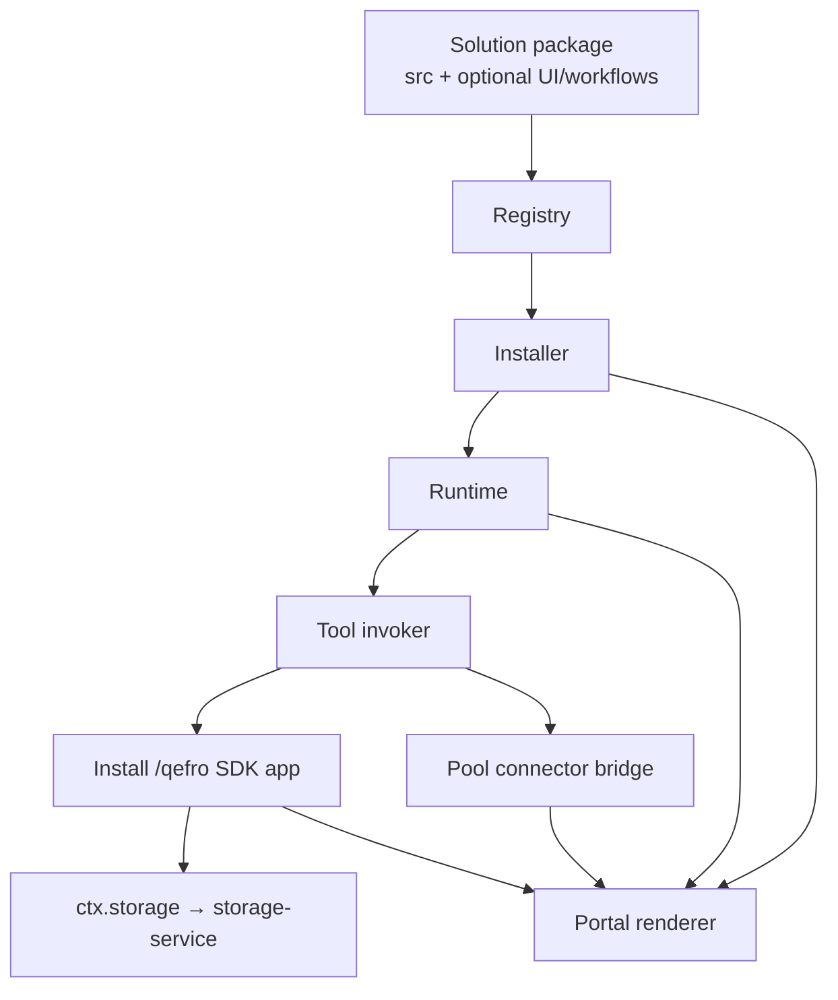

# Solution Development

**Solution Development** is how you build complete, branded business
applications on Qefro: a restaurant manager, a hospital front desk, a CRM, a
hotel property system, a school administration portal, or an inventory
back office — all shipped as a single **installable package**.

**The SDK process is the application** ([ADR-003](/docs/solutions/managed-apps)):
domain logic lives in required `src/` (Node / Rust / Python) on signed
`/qefro`. Optional YAML workflows, prompts, and UI only orchestrate and
present. Solution-owned documents persist via
[managed storage](/docs/solutions/managed-storage) **from inside the SDK**
(`ctx.storage`). External systems of record stay behind pool connectors.

:::danger Deprecated
YAML-only packages that call `storage/*` from workflows or UI sources are
incorrect. See [Managed apps](/docs/solutions/managed-apps).
:::

## What you can build

Any business domain that fits the Qefro model — an SDK app with tools,
optional workflows/events, managed storage and/or pool connectors, and an
optional portal-rendered UI — can be packaged as a solution:

| Domain | Typical pages | Typical data plane |
| --- | --- | --- |
| Restaurant management | Dashboard, reservations, tables, kitchen, orders, payments | SDK + managed storage (+ optional POS) |
| Hospital management | Appointments, wards, billing, duty roster | SDK + storage + HMS connectors |
| CRM | Pipeline, contacts, activities, reports | SDK + storage + CRM hub |
| Hotel management | Rooms, bookings, housekeeping, folios | SDK + storage + PMS |
| School management | Classes, attendance, fees, timetables | SDK + storage + SIS |
| Inventory management | Stock levels, transfers, purchase orders | SDK + storage + WMS |

Throughout this section, [`restaurant-pro`](/docs/solutions/examples/restaurant-pro)
is the canonical reference solution. Every concept page uses it as the
running example.

## Core principles

1. **The SDK process is required.** Business logic runs in `src/` on
   `/qefro`. The platform must not encode domain rules (reservation, menu, …).
2. **UI is declarative data.** Theme, nav, pages, and widgets are YAML —
   no package JS in the portal UI (no iframes, no injected scripts).
3. **Capability mediation is mandatory.** Host interactions pass through
   the capability registry; negotiated at install and re-checked on every call.
4. **Event-driven communication is mandatory.** Solutions react to the
   platform event bus and emit `ui.*` lifecycle events — no out-of-band
   signaling.
5. **Persist only via `ctx.storage`.** Workflows/UI call app tools
   (`{solution}/{tool}`), never `storage/*` directly.

### Platform rules

These rules are enforced at publish time and at render time. Packages that
violate them are rejected:

| # | Rule |
| --- | --- |
| 1 | No arbitrary JavaScript |
| 2 | No direct DOM access |
| 3 | No iframe execution |
| 4 | No direct database access |
| 5 | No direct Redis access |
| 6 | No direct network access |
| 7 | Capability mediation is mandatory |
| 8 | Event-driven communication is mandatory |

See [Security model](/docs/solutions/security) for how each rule is enforced.

## The delivery pipeline

A solution travels a fixed pipeline from your editor to a tenant's portal:



| Stage | Responsibility | Details |
| --- | --- | --- |
| Solution package | Required `src/` SDK + optional UI/workflows/connectors | [Package structure](#package-structure) |
| Registry | Signed global catalog, version lifecycle | [Publishing](/docs/solutions/publishing) |
| Installer | Activation, capabilities, installation binding | [Installation](/docs/solutions/installation) |
| Runtime | Executes workflows, serves runtime data sources | [Workflows](/docs/solutions/workflows) |
| SDK app | Domain tools on `/qefro` | [Managed apps](/docs/solutions/managed-apps) |
| Managed storage | Documents via `ctx.storage` → Mongo | [Managed storage](/docs/solutions/managed-storage) |
| Connector bridge | External pool connectors | [Connectors](/docs/solutions/connectors) |
| Portal renderer | Declarative pages/widgets/themes | [Pages](/docs/solutions/pages) |

The full architecture is covered in [Architecture](/docs/solutions/architecture).

## Package structure

Every solution is a directory with this layout:

```text
restaurant-pro/
├── manifest.yaml        # identity, hosting, endpoint, permissions, settings
├── src/                 # required — SDK application (/qefro)
├── package.json         # and/or Cargo.toml / pyproject.toml
├── Dockerfile           # required for hosting: managed
├── assets/              # images only (png/jpg/jpeg/svg/webp)
├── workflows/           # optional — tool steps → {solution}/{tool}
├── connectors/          # optional — external pool connector contracts
├── ui/                  # optional declarative staff UI
│   ├── theme.yaml
│   ├── navigation.yaml
│   ├── pages.yaml
│   ├── layouts.yaml
│   ├── widgets.yaml
│   └── sources.yaml     # runtime | {solution}/{tool} | pool connector
└── README.md
```

YAML sources are assembled into a canonical JSON package, checksummed and
signed at build time — see [Packaging](/docs/solutions/packaging).

## Documentation map

| Topic | Page |
| --- | --- |
| **Managed apps (start here)** | [Managed apps](/docs/solutions/managed-apps) |
| Platform architecture | [Architecture](/docs/solutions/architecture) |
| Build your first solution | [Quickstart](/docs/solutions/quickstart) |
| Tenant-side activation | [Installation](/docs/solutions/installation) |
| `manifest.yaml` reference | [Manifest](/docs/solutions/manifest) |
| Branding | [Themes](/docs/solutions/themes) |
| Sidebar + routes | [Navigation](/docs/solutions/navigation) |
| Pages & layouts | [Pages](/docs/solutions/pages) · [Layouts](/docs/solutions/layouts) |
| Widgets | [Metric](/docs/solutions/widgets/metric) · [Table](/docs/solutions/widgets/table) · [Chart](/docs/solutions/widgets/chart) · [Markdown](/docs/solutions/widgets/markdown) · [Form](/docs/solutions/widgets/form) · [Timeline](/docs/solutions/widgets/timeline) |
| Host capabilities | [Capabilities](/docs/solutions/capabilities) |
| Event model | [Events](/docs/solutions/events) |
| Data sources | [Sources](/docs/solutions/sources) |
| Managed document storage | [Managed storage](/docs/solutions/managed-storage) |
| Images & branding files | [Assets](/docs/solutions/assets) |
| Connector dependencies | [Connectors](/docs/solutions/connectors) |
| Workflow definitions | [Workflows](/docs/solutions/workflows) |
| Publish-time checks | [Validation](/docs/solutions/validation) |
| Building a signed package | [Packaging](/docs/solutions/packaging) |
| Publishing to the registry | [Publishing](/docs/solutions/publishing) |
| Security model & rules | [Security](/docs/solutions/security) |
| Fixing common failures | [Troubleshooting](/docs/solutions/troubleshooting) |
| Complete reference solution | [restaurant-pro](/docs/solutions/examples/restaurant-pro) |

## How this differs from playbooks

[Solution playbooks](/docs/solutions/playbooks) are outcome-oriented guides
that compose *existing* platform features (customer support, order tracking,
refunds). Solution Development produces **new installable packages** with
their own manifest, UI, workflows and data-plane requirements (managed
storage and/or connectors).

## Related platform concepts

- [Runtime](/docs/developer/concepts/runtime) — the execution engine that runs installed workflows.
- [Events](/docs/developer/concepts/events) — the platform event bus that solutions ride.
- [Managed storage](/docs/solutions/managed-storage) — document plane via `ctx.storage` (SDK-only).
- [Connectors](/docs/developer/concepts/connectors) — stateless integration containers behind the bridge.
- [Business Flows](/docs/developer/concepts/flows) — the flow model workflows compile to.
