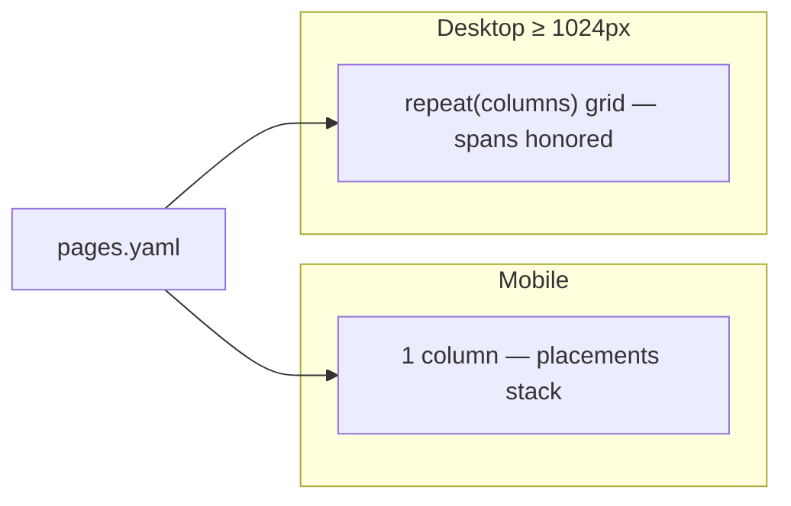

# Pages

`ui/pages.yaml` declares the pages of your solution UI. A page binds a
title, a layout and an ordered list of widget placements. The portal's
layout engine and widget registry render it — there is no page-level code.

## Page definitions

```yaml title="ui/pages.yaml"
- id: dashboard
  title: Dashboard
  layout: dashboard-grid
  widgets:
    - { widget: active_orders, span: 3 }
    - { widget: revenue_chart, span: 9 }
    - { widget: order_table, span: 12 }

- id: orders
  title: Orders
  layout: split-grid
  widgets:
    - { widget: order_table, span: 8 }
    - { widget: orders_timeline, span: 4 }
```

| Field | Type | Required | Description |
| --- | --- | --- | --- |
| `id` | string | Yes | Page id; referenced by navigation entries and routes. |
| `title` | string | Yes | Page header and tab label. |
| `layout` | string or object | Yes | Layout preset id from `layouts.yaml`, or an inline layout. |
| `widgets` | list | Yes | Ordered widget placements (at least one). |

### Widget placements

| Field | Type | Required | Description |
| --- | --- | --- | --- |
| `widget` | string | Yes | Widget id declared in `widgets.yaml`. |
| `span` | number | No | Grid columns occupied (1–12). Defaults to full width. |

Placements render in declaration order, wrapping left-to-right,
top-to-bottom. `restaurant-pro`'s dashboard places the `active_orders`
metric (3 columns) beside the `revenue_chart` line chart (9 columns), with
the full-width `order_table` underneath.

## Referencing layouts

Prefer named presets from [`layouts.yaml`](/docs/solutions/layouts):

```yaml
layout: dashboard-grid
```

Inline layouts are accepted for one-off pages:

```yaml
layout:
  type: grid
  columns: 12
```

Both forms enforce the same rules: the layout `type` must be `grid`, and
`columns` must be between 1 and 12.

## Validation and clamping

- **At publish time**: unknown widget ids, spans larger than the layout's
  column count, non-grid layouts and out-of-range column counts are
  rejected. See [Validation](/docs/solutions/validation).
- **At render time**: the layout engine defensively clamps spans into
  range and coerces shapes, so a degraded definition renders as a scoped
  error card instead of crashing the portal.

## Responsive behavior



On narrow screens every placement stacks into a single column in
declaration order; at ≥ 1024 px the grid uses the declared column count.
Design dashboards so the stacked order still tells a story (headline
metrics first, details last).

## Data wiring

Pages never fetch data. Every widget references a source from
[`sources.yaml`](/docs/solutions/sources), and each fetch is
capability-gated: a widget whose capability is not granted never fires a
request. The page itself renders immediately with loading states.

## Host pages (CRM and Automation)

Marketplace Apps can open **platform hosts** instead of a widget layout.
From `restaurant-pro-runtime` / `real-estate-runtime`:

```yaml
- id: contacts
  title: Contacts
  host: contacts
- id: automations
  title: Automations
  host: automations
```

| `host` | Surface |
| --- | --- |
| `contacts` | Person CRM (not an app-local contacts table) |
| `automations` | CRM Automation (e.g. `reservation.created` → Send WhatsApp) |

These are not package folders. See [Events](/docs/solutions/events).

## Guidelines

- One page per operational question ("what's happening now?", "what did we
  sell?") rather than per entity.
- Keep dashboards under 8 placements; split detail views into separate
  pages.
- Reuse widgets across pages — `restaurant-pro-runtime` uses the same
  `reservations_table` on Today and Reservations with different spans.
- Every page referenced by `navigation.yaml` must exist; every page
  should be reachable from navigation.

## Restaurant Pro Runtime page list

| Page | Layout | Placements |
| --- | --- | --- |
| Today | `dashboard-grid` | intro + reservations table |
| Reservations | `split-grid` | form + table |
| Tables / Menu | `split-grid` | entity tables |
| Contacts | host | Person CRM |
| Automations | host | CRM Automation |

The full definitions are in the
[restaurant-pro-runtime example](/docs/solutions/examples/restaurant-pro-runtime).
SDK takeaway pages remain in
[restaurant-pro](/docs/solutions/examples/restaurant-pro).

## Related topics

- [Layouts](/docs/solutions/layouts) — grid presets
- [Widgets](/docs/solutions/widgets/metric) — placement content
- [Sources](/docs/solutions/sources) — where widget data comes from
