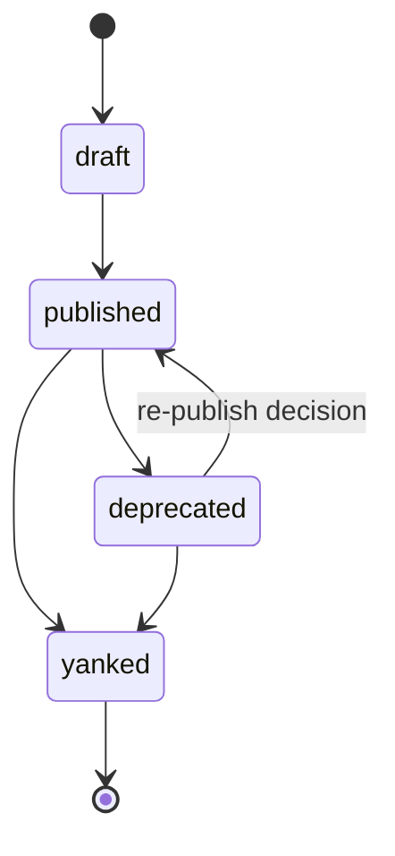

# Publishing

Publishing submits a signed package to the **registry** — the global,
tenant-agnostic catalog that every installation resolves against.
Publishing is a publisher action; installation is the tenant action.

## Publish command

```bash
qefro solution build .     # validate + assemble + sign
qefro solution publish     # POST the signed package to the registry
```

The CLI posts `dist/package.json` to the registry's publish endpoint with
the publisher identity header. The registry then:

1. **Verifies the Ed25519 signature** over `id|version|checksum` against
   the registry's trust anchors.
2. **Re-runs validation** — the full [checklist](/docs/solutions/validation).
3. **Stores the package** with its checksum, signature key id and
   publisher id, attributed to the version.

A failed signature check or validation rejects the publish atomically —
nothing is stored partially.

## Version lifecycle



| Status | Visible in marketplace | Installable |
| --- | --- | --- |
| `draft` | No | No |
| `published` | Yes | Yes |
| `deprecated` | Yes, flagged | New installs discouraged; existing installs keep working |
| `yanked` | No | No — resolution skips yanked versions |

- **Draft** — staged in the registry for review without marketplace
  exposure.
- **Published** — the normal state; tenants can install.
- **Deprecated** — superseded by a newer version; upgrades are
  encouraged, installs still resolve.
- **Yanked** — withdrawn (e.g. security issue); new installations and
  upgrades can no longer resolve the version.

## Immutability

Published versions are immutable:

- The checksum is stored at publish time; a republished version must use
  a new version number.
- Fixes ship forward: `1.0.1` after a broken `1.0.0` — never a silent
  replacement.
- Tenants choose when to upgrade; yanking is the only way to stop a
  version from resolving.

This is what makes signed versions trustworthy in perpetuity: a tenant's
installed bundle always matches the bytes the registry accepted.

## Listing published versions

```bash
qefro solution list
```

shows catalog entries (and, in a tenant context, installations) with
version and status.

## Publisher identity and trust

- Publishing requires registry credentials — the CLI sends the publisher
  identity with the request, and the signature binds the package to the
  publisher's key.
- The `signature_kid` records which registry key verified the package,
  supporting key rotation without breaking old versions.
- Treat publisher access like production credentials: least privilege,
  audited use.

## Release workflow for restaurant-pro

1. Bump `version` in `manifest.yaml` (semver, per the
   [manifest guidance](/docs/solutions/manifest#versioning-guidance)).
2. `qefro solution build .` — fix any validation errors locally.
3. `qefro solution publish`.
4. Watch the marketplace detail view: the registry detail endpoint
   exposes the manifest and the UI section for review.
5. Install into a staging tenant first; promote to production tenants
   after smoke-testing the UI pages.

## Related topics

- [Packaging](/docs/solutions/packaging) — producing the signed artifact
- [Installation](/docs/solutions/installation) — the tenant side
- [Security](/docs/solutions/security) — signing and trust
