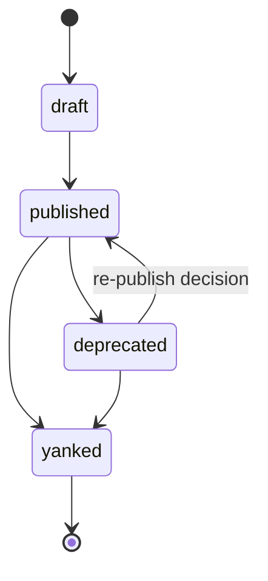

# Publishing

Publishing submits a signed package to the **global catalog** (solution-
service / registry). Publishing is a **platform admin** action; installation
is the tenant / workspace action.

:::danger Platform admin only
Tenant org admins and workspace operators **cannot** publish apps.
Only identities listed in `QEFRO_PLATFORM_ADMIN_IDS` on solution-service may
call publish, yank, or asset-upload APIs.
:::

## Who can publish

| Actor | Publish / yank | Install |
| --- | --- | --- |
| Platform admin (`QEFRO_PLATFORM_ADMIN_IDS`) | Yes | Yes (ops) |
| Tenant / workspace admin | No | Yes |
| End user | No | No |

Configure the allowlist on solution-service:

```bash
# Comma-separated UUIDs — must match CLI QEFRO_PUBLISHER_ID
QEFRO_PLATFORM_ADMIN_IDS=11111111-2222-3333-4444-555555555555
QEFRO_PUBLISH_OPEN=false   # never true in production
```

Local docker-compose defaults `QEFRO_PUBLISH_OPEN=true` when the allowlist
is empty so developers can iterate without ops credentials.

## Publish command

```bash
export QEFRO_SOLUTION_URL=https://…   # or http://127.0.0.1:8105
export QEFRO_PUBLISHER_ID=<platform-admin-uuid>
export QEFRO_SIGNING_KEY_HEX=<32-byte-hex>   # or QEFRO_KEYS_FILE
# When service auth is enforce:
export QEFRO_INTERNAL_BEARER=<token>

qefro solution build .     # validate + assemble + sign
qefro solution publish .   # POST the signed package
# alias: qefro publish .
```

The CLI posts `dist/package.json` to `POST /v1/solutions/publish` with:

- `x-qefro-admin-id: $QEFRO_PUBLISHER_ID`
- body `publisher_id` equal to that same UUID
- optional `Authorization: Bearer` when `QEFRO_INTERNAL_BEARER` is set

The service then:

1. **Authorizes** the caller as a platform admin.
2. **Verifies the Ed25519 signature** over `id|version|checksum` against
   the catalog trust anchors.
3. **Re-runs validation** — the full [checklist](/docs/solutions/validation).
4. **Stores the package** with checksum, signature key id, and publisher id.

A failed auth, signature check, or validation rejects the publish atomically —
nothing is stored partially. Non-admins receive `403` with
`platform admin required…` or `platform admin allowlist not configured…`.

## Version lifecycle



| Status | Visible in marketplace | Installable |
| --- | --- | --- |
| `draft` | No | No |
| `published` | Yes | Yes |
| `deprecated` | Yes, flagged | New installs discouraged; existing installs keep working |
| `yanked` | No | No — resolution skips yanked versions |

Yank also requires a platform admin (`DELETE /v1/solutions/:name/:version`
with `x-qefro-admin-id`).

## Immutability

Published versions are immutable:

- The checksum is stored at publish time; a republished version must use
  a new version number.
- Fixes ship forward: `1.0.1` after a broken `1.0.0` — never a silent
  replacement.
- Tenants choose when to upgrade; yanking is the only way to stop a
  version from resolving.

## Listing published versions

```bash
qefro solution list
```

shows catalog / install entries with version and status (tenant context for
installs).

## Trust

- Treat platform-admin publisher IDs and signing keys like production
  credentials: least privilege, audited use.
- `signature_kid` records which key verified the package (rotation-friendly).
- Service-to-service auth (`QEFRO_SERVICE_AUTH_MODE=enforce` + bearer) is
  orthogonal — still required when the control plane enforces it.

## Release workflow

1. Scaffold or bump `version` in `manifest.yaml` — see
   [App scaffold](/docs/solutions/scaffold) and
   [manifest versioning](/docs/solutions/manifest#versioning-guidance).
2. `qefro solution build .` — fix validation locally.
3. Platform admin: `qefro solution publish .`.
4. Review marketplace detail (manifest + UI section).
5. Install into a staging workspace; promote after smoke tests.

## Related topics

- [Build your first app](/docs/solutions/build-your-first-app) — create-app → install
- [Marketplace](/docs/solutions/marketplace) — how tenants discover listings
- [App scaffold](/docs/solutions/scaffold) — create-app layout
- [Packaging](/docs/solutions/packaging) — producing the signed artifact
- [Installation](/docs/solutions/installation) — the tenant side
- [Security](/docs/solutions/security) — signing and trust

:::note Partner publishers
Third-party self-serve publish is not open yet. Until it is, Qefro provisions
a publisher UUID + signing key for approved partners. The CLI path above is
identical once those credentials exist — that is the maturity bar.
:::
