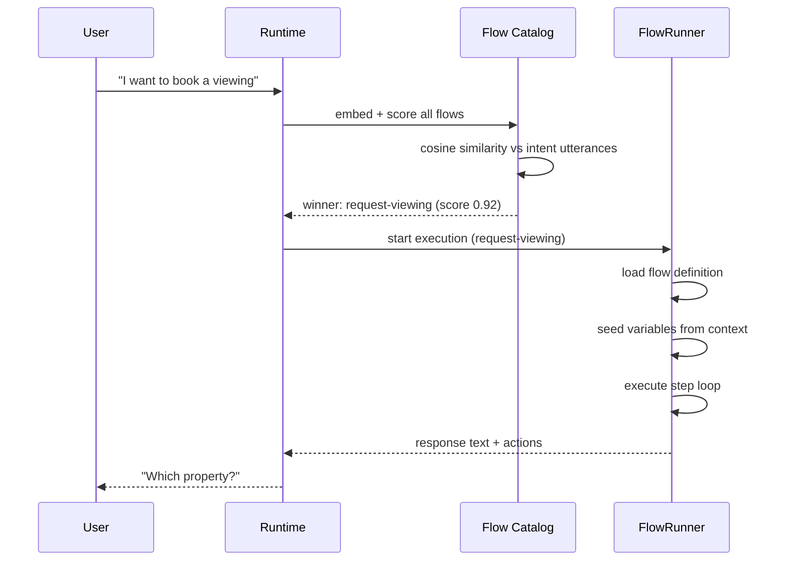

# Runtime Execution

Qefro Runtime is the execution engine for all Marketplace App flows. It
interprets declarative YAML — entities, workflows, triggers — and
executes them through a unified flow engine. Apps define **what** the
business logic is; the Runtime defines **how** it runs.

```text
Marketplace App (metadata)
    │
    ├── manifest.yaml
    ├── entities/
    ├── workflows/
    └── ui/
          │
          ▼
      Qefro Runtime
          │
    ┌─────┼──────┐
    ▼     ▼      ▼
 FlowRunner  EntityService  Event Bus
```

## Architecture principle

> Marketplace Apps define **WHAT** the business application is.
> Qefro Runtime defines **HOW** the metadata is executed.

Apps contain no executable code. Every behavior — data validation,
storage, flow execution, event emission — is interpreted from metadata
by the runtime.

## Flow catalog

The flow catalog is the runtime's registry of all available flows in a
workspace. It merges flows from two sources:

1. **Installed Marketplace flows** — compiled from solution YAML at
   install time
2. **SDK-synced flows** — advertised by external SDK connectors

### Flow matching

When a user sends a message, the runtime:

1. Embeds the message via an embedding model
2. Scores all catalog flows using cosine similarity against each flow's
   declared intent utterances
3. Selects the single best match if its score exceeds the threshold
   (≥ 0.8)
4. Starts a new flow execution or resumes an existing one



### Intent utterances

Flows declare example utterances in the manifest's `triggers` block:

```yaml
triggers:
  - id: request_viewing
    workflow: request-viewing
    match:
      intents:
        - schedule a viewing
        - book a viewing
        - arrange a viewing
        - view the property
```

The runtime uses these utterances for semantic matching. More diverse
utterances improve matching accuracy.

## FlowRunner state machine

The FlowRunner executes one flow step at a time in a loop. Each step
produces an outcome that determines what happens next.

### Step outcomes

| Outcome | Meaning | Next action |
| --- | --- | --- |
| `Advance` | Step completed, move to next | Execute next step in sequence |
| `Goto(target)` | Conditional branch | Jump to named step |
| `WaitInput` | Awaiting user text | Suspend execution, send prompt |
| `WaitUpload` | Awaiting file upload | Suspend execution, send prompt |
| `WaitApproval` | Awaiting portal approval | Suspend execution |
| `WaitChallenge` | Awaiting identity verification | Suspend execution |
| `Pause(wake_at)` | Timed delay | Suspend until wake time |
| `Complete` | Terminal success | End execution |
| `Fail(reason)` | Terminal failure | End execution with error |

### Safety bound

The FlowRunner enforces a maximum of **50 steps per turn** to prevent
infinite loops. If a flow exceeds this limit, it fails with a clear
error message.

### Execution lifecycle

```text
User message
    ↓
Flow matching (catalog)
    ↓
Flow selected
    ↓
Variable seeding (context + memory)
    ↓
Step loop:
    ├── Load step definition
    ├── Emit StepStarted event
    ├── Execute step (enter_step)
    ├── Handle outcome
    │   ├── Advance → next step
    │   ├── WaitInput → suspend, send prompt
    │   ├── Complete → persist, emit events
    │   └── Fail → persist error
    └── Repeat until terminal
```

## Entity operation dialect

Marketplace App flows use a declarative dialect for entity operations.
The runtime translates these into storage operations via EntityService.

### Operation format

```text
entity.<entity_name>.<operation>
```

| Operation | Storage mapping | Description |
| --- | --- | --- |
| `entity.property.list` | `storage.find` | List records with optional filters |
| `entity.property.get` | `storage.get` | Get a single record by code or UUID |
| `entity.property.create` | `storage.insert` | Create a new record |
| `entity.property.update` | `storage.update` | Update an existing record |
| `entity.property.delete` | `storage.delete` | Soft-delete a record |

### Execution modes

| Mode | `execution:` value | Adapter | Description |
| --- | --- | --- | --- |
| Runtime | `runtime` | RuntimeAdapter | EntityService — metadata-only, no external calls |
| HTTP | `http` | ConnectorBridge | Proxied to external API via connection |

Marketplace Apps (`hosting: runtime`) always use `execution: runtime`.
SDK connectors use `execution: http` with tool names like
`search_products`.

### Reference resolution

For `get`, `update`, and `delete` operations, the runtime accepts either
a UUID or a human-readable code:

```yaml
# Both work:
input_map:
  id: id          # user provides "VW-1001" or a UUID
```

The runtime resolves codes to UUIDs by searching the entity's `code`
field. If zero or multiple records match, the operation fails.

## Variable seeding

When a flow starts, the runtime seeds its variable context from multiple
sources:

```text
1. Explicit user input (extracted from current message)
       ↓
2. Current flow state (active execution's variables)
       ↓
3. Conversation memory (values from earlier messages)
       ↓
4. Customer profile (person_id, phone, email from Customer Hub)
       ↓
5. Knowledge base (documents, FAQs — for RAG flows)
       ↓
6. Ask the user (only when every other source is empty)
```

### Conversation state

The runtime maintains a `ConversationState` for each conversation:

```text
ConversationState
├── conversation_id
├── person_id (Customer Hub Person UUID)
├── channel_subject (WhatsApp E.164, widget ID)
├── active_flow (currently executing flow id)
├── values (collected key-value pairs)
├── entities (tracked entity references)
├── customer (phone, email, preferences)
├── knowledge (documents, FAQs, policies)
├── authenticated (bool)
└── working (post-flow working context)
```

### Memory interaction

The runtime loads durable memory from Postgres at the start of each
turn. Memory includes:

- **Person identity**: Name, email, phone from Customer Hub
- **Collected values**: Variables from previous flows in this conversation
- **Entity mentions**: Records referenced in the conversation
- **Knowledge**: Retrieved documents and FAQs

Memory values seed the flow's variable context, allowing `ask` steps to
auto-skip when a value is already known.

### Ask step auto-skip

An `ask` step is skipped when:

1. The flow's variable context already has a usable value for the
   requested field, AND
2. The value was explicitly collected (not just inferred from memory)

This prevents the flow from re-asking for information the user already
provided, while still confirming ambiguous or inferred values.

## Runtime context

Every flow execution runs within a context that includes:

### Authenticated identity

| Field | Source | Trust |
| --- | --- | --- |
| `tenant_id` | Platform authentication | Trusted |
| `workspace_id` | Installation context | Trusted |
| `installation_id` | Solution installation | Trusted |
| `person_id` | Customer Hub Person | Trusted |
| `user_id` | Portal user (if applicable) | Trusted |
| `session_id` | Conversation session | Trusted |

### Channel context

| Field | Description |
| --- | --- |
| `identity_channel` | `Whatsapp`, `Widget`, `Portal`, or `Api` |
| `authentication_level` | Identity verification level |
| `has_end_user_identity` | Whether the caller has verified identity |

### Permission context

The runtime checks permissions before executing entity operations:

| Channel | RBAC enforced | Reason |
| --- | --- | --- |
| WhatsApp | No | Customer Hub + surfaces handle access |
| Widget | No | Customer Hub + surfaces handle access |
| Portal | Yes | Portal users have roles and permissions |
| API (with portal user) | Yes | Portal user RBAC applies |
| API (system/event) | No | Internal flows, no user context |

## Event emission

After every successful entity mutation, the runtime emits business
events:

| Operation | Events emitted |
| --- | --- |
| Create | `{entity}.created` |
| Update | `{entity}.updated` + status event (if status changed) |
| Delete | `{entity}.cancelled` |

### Event payload

Events include a CRM-compatible payload:

```json
{
  "data": { "id": "...", "code": "VW-1001", "property_title": "...", ... },
  "current": { ... },
  "previous": { ... },
  "source": { "type": "marketplace_app", "id": "real-estate-pro-runtime" },
  "workspace_id": "...",
  "solution_id": "real-estate-pro-runtime",
  "contact": { "id": "...", "name": "...", "phone": "...", "email": "..." },
  "person_id": "..."
}
```

### Idempotency

Events use idempotency keys to prevent duplicates:

```text
entity:{workspace_id}:{event_name}:{resource_id}
```

## Multi-step conversations

Flows can span multiple user messages. The runtime persists the flow's
variable context between turns, allowing conversations like:

```text
User: "I want to see properties"
Assistant: "What type of property?"        ← ask step
User: "Apartment"
Assistant: "Which city?"                   ← ask step
User: "Madurai"
Assistant: "Here are matching properties:" ← tool + message steps
  [property results]
```

### Flow state persistence

Between turns, the runtime stores:

- Current step id
- Collected variables
- Execution status (`WaitingForInput`)
- Associated conversation id

When the user replies, the runtime:

1. Loads the active execution from Redis/Postgres
2. Stores the user's reply in the variable context
3. Resumes the step loop from the waiting step

### Conversation context growth

As a conversation grows, the context accumulates messages from all
flows and general chat. This can dilute the semantic matching for new
flow starts. For best results:

- Use fresh conversations (different phone numbers) for testing
  different flows
- Keep flow intent utterances distinct from each other
- Use specific utterances rather than generic ones

## Trusted metadata vs user input

The runtime enforces a strict trust boundary:

### Trusted (cannot be overridden)

| Source | Examples |
| --- | --- |
| Runtime context | `tenant_id`, `workspace_id`, `installation_id` |
| Customer identity | `person_id` (from Customer Hub) |
| Flow constants | Values in `constants:` block |
| Signed metadata | Entity definitions, flow definitions |

### Untrusted (user/LLM input)

| Source | Examples |
| --- | --- |
| Ask steps | `property_title`, `date`, `amount` |
| Extracted entities | Names, dates, numbers from messages |
| Conversation memory | Previously collected values |

### Authority stripping

Before executing any entity operation, the runtime strips
authority-bearing fields from caller-supplied parameters:

- `workspace_id`
- `tenant_id`
- `installation_id`
- `organization_id`
- `customer_id`
- `person_id`
- `context`

Identity comes from the authenticated context only. Even if the LLM
generates a `person_id` value, it is discarded.

## Marketplace Apps vs SDK connectors

| Aspect | Marketplace App | SDK Connector |
| --- | --- | --- |
| Hosting | `runtime` | `external` |
| Execution | RuntimeAdapter (EntityService) | SDKAdapter (/qefro tools) |
| Storage | Platform-managed | App-managed (ctx.storage) |
| Tools | `entity.<name>.<op>` | HTTP tool names |
| Code | YAML only | Node.js / Python / Rust |
| Deployment | No server required | Self-hosted by developer |

Both use the same FlowRunner engine. The difference is the adapter that
executes tool steps.

## Related topics

- [Workflows](/docs/solutions/workflows) — flow YAML reference
- [Entity Schema](/docs/solutions/entity-schema) — entity field types
- [Flow Parameters](/docs/solutions/flow-parameters) — input_map and constants
- [Security](/docs/solutions/security) — trust boundaries
- [Events](/docs/solutions/events) — business event system
- [Customer Hub](/docs/developer/customer-hub) — Person identity API
