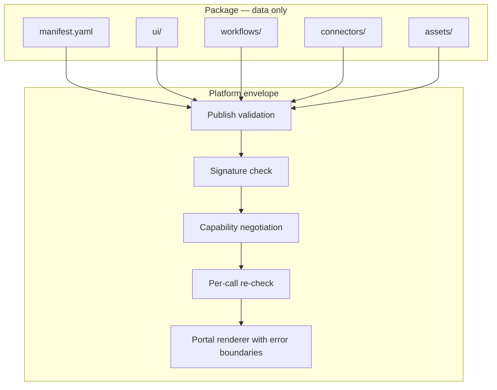

# Security

Solutions run inside a hard security envelope. The eight platform rules
are not guidelines — they are architectural properties enforced at
publish time, install time and render time.

## The rules and their enforcement

| Rule | Enforcement |
| --- | --- |
| No arbitrary JavaScript | Packages contain YAML, JSON and images only; `script`/`js` file kinds are rejected at publish; the portal never evaluates package content |
| No direct DOM access | There is no package-side runtime in the browser — the portal's own components render everything |
| No iframe execution | Solution UIs are rendered natively; the renderer contains no iframe host and iframe assets are rejected |
| No direct database access | Solutions have no database handles; persistence happens only through the runtime and connector bridge |
| No direct Redis access | Caching infrastructure is platform-internal; no capability exposes it |
| No direct network access | The only outbound paths are capability-gated source fetches and workflow tool calls, both mediated by the platform |
| Capability mediation is mandatory | Every host interaction is negotiated at install and re-checked on every call — see [Capabilities](/docs/solutions/capabilities) |
| Event-driven communication is mandatory | All signaling rides the platform event bus; there is no side channel — see [Events](/docs/solutions/events) |

## Supply chain

1. **Signing.** Every package is Ed25519-signed over
   `id|version|checksum`; the registry verifies the signature before
   storing, and the installer re-verifies before activating. See
   [Packaging](/docs/solutions/packaging).
2. **Immutability.** Published versions cannot change; tenants are never
   surprised by content drift. See [Publishing](/docs/solutions/publishing).
3. **Publisher attribution.** Packages carry `publisher_id` and
   `signature_kid`, so every installed version traces to a publisher and
   a verification key.

## Tenant isolation

- Installations, settings, granted capabilities, workflow executions and
  UI events are stored tenant-scoped; every query filters by tenant.
- Connector containers are a **shared pool**, but every routed call
  carries the tenant context and credentials are fetched per-tenant from
  the secret manager.
- UI bundles are served per installation; one tenant's bundle is never
  visible to another.

See [Tenant isolation](/docs/security/tenant-isolation).

## Secrets

- Connector credentials are collected at install time, encrypted with
  AES-256-GCM at rest, and cached with tenant-prefixed keys.
- Plaintext credentials are never logged or audited.
- Packages and workflows never see credentials — the platform injects
  them at the bridge.

See [Secrets](/docs/security/secrets).

## Render-time containment

Even a malformed definition cannot take down the portal:

- **Error boundaries** isolate every page and widget; failures degrade to
  a scoped error card and emit `ui.error`.
- **Schema coercion** normalizes degenerate shapes before render; spans
  and columns are clamped.
- **Capability gates** mean a widget missing its capability never fires a
  request at all.

## Design checklist for publishers

- Declare the **fewest** capabilities and permissions that work; the
  install wizard shows tenants exactly what you asked for.
- Keep sensitive business logic in connectors and workflows, not in
  widget payloads.
- Never encode tenant-specific values, URLs or credentials in package
  files — they are global, signed and public within the registry.
- Treat a permission escalation (adding `customer.read`, new connectors)
  as a major-version event and communicate it in your README.

## Related topics

- [Capabilities](/docs/solutions/capabilities)
- [Validation](/docs/solutions/validation)
- [Platform security overview](/docs/security/overview)
- [Audit logs](/docs/security/audit-logs)
