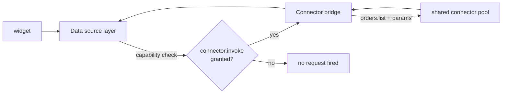

# Sources

`ui/sources.yaml` declares where widget data comes from. Solutions have
**no direct network access** — a source is the only data path.

In YAML there are two `type` values:

| `type` | Meaning |
| --- | --- |
| `runtime` | Tenant runtime plane (`metrics`, `executions`, `workflows`) |
| `connector` | Tool target — either a **declared connector** op or a **platform** tool such as `storage/find` |

Platform tools under reserved namespaces (`storage/*`, …) still use
`type: connector` in the schema today; routing and capability gates
differ from pool connectors. See [Managed storage](/docs/solutions/managed-storage).

## Definition

```yaml title="ui/sources.yaml"
- id: runtime_metrics
  type: runtime
  target: metrics

- id: reservations
  type: connector
  target: storage/find
  params:
    collection: reservations
    limit: 50

- id: orders
  type: connector
  target: storage/find
  params:
    collection: orders
    limit: 25
```

| Field | Type | Required | Description |
| --- | --- | --- | --- |
| `id` | string | Yes | Source id referenced by widget `source:` fields. |
| `type` | string | Yes | `runtime` or `connector`. |
| `target` | string | Yes | Runtime query name, connector operation, or platform tool (`storage/find`). |
| `params` | map | No | Static parameters sent with every query. |

## Runtime sources

`type: runtime` sources are served from the runtime plane:

| Target | Returns |
| --- | --- |
| `metrics` | Aggregate runtime metrics (e.g. `executions.active`) |
| `executions` | Workflow execution list for the tenant |
| `workflows` | Registered workflow definitions |

Runtime sources require the `runtime.query` capability (always granted).

## Managed storage sources

When `target` is a `storage/*` tool, the portal gates on **`storage.read`**
and calls storage-service (via the API / SdkCore path) — not the shared
connector pool:

```yaml title="storage source"
- id: reservations
  type: connector
  target: storage/find
  params:
    collection: reservations
    limit: 50
```

Guards:

1. `storage.read` must be granted.
2. The solution must declare storage permissions in the manifest.
3. Isolation filters (`tenant_id`, `workspace_id`, `installation_id`) are
   applied by storage-service — never trust client-supplied scope fields.

## External connector sources

For **declared** connectors (POS, Shopify, …), `type: connector` sources
are forwarded through the **connector bridge** and gated on
`connector.invoke`:



1. `connector.invoke` must be granted.
2. The connector must be listed in `manifest.connectors`.
3. Calls carry tenant context; connectors stay in the shared pool.

## Restaurant Pro source map (1.3.0)

| Source | Target | Gate | Feeds |
| --- | --- | --- | --- |
| `runtime_metrics` | `metrics` | `runtime.query` | Dashboard metrics |
| `reservations` | `storage/find` → `reservations` | `storage.read` | Reservations table |
| `orders` | `storage/find` → `orders` | `storage.read` | Orders / kitchen |
| `takeaway` | `storage/find` → `orders` + filter | `storage.read` | Takeaway list |
| `menu` | `storage/find` → `menu_items` | `storage.read` | Menu |
| `tables` | `storage/find` → `tables` | `storage.read` | Tables |
| `payments` | `storage/find` → `payments` | `storage.read` | Payments |

## Guidelines

- One source per **query shape**, not per widget — multiple widgets can
  share a source.
- Prefer `storage/*` for solution-owned documents; use connectors for
  external systems of record.
- Use `params.limit` everywhere a list is unbounded.
- Match the capability gate to the target (`storage.read` vs
  `connector.invoke` vs `runtime.query`).

## Related topics

- [Managed storage](/docs/solutions/managed-storage)
- [Capabilities](/docs/solutions/capabilities)
- [Connectors](/docs/solutions/connectors)
- [Widgets](/docs/solutions/widgets/metric)
- [restaurant-pro example](/docs/solutions/examples/restaurant-pro)
