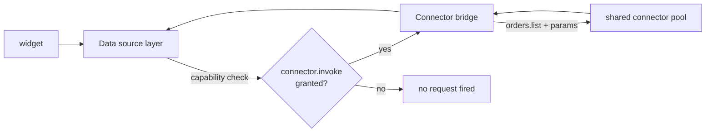

# Sources

`ui/sources.yaml` declares where widget data comes from. There are exactly
two source types: **runtime** (the tenant's own runtime data) and
**connector** (operations routed through the connector bridge). Solutions
have **no direct network access** — a source is the only data path.

## Definition

```yaml title="ui/sources.yaml"
- id: runtime_metrics
  type: runtime
  target: metrics

- id: orders
  type: connector
  target: orders.list
  params:
    limit: 25

- id: reservations
  type: connector
  target: reservations.list

- id: tables
  type: connector
  target: tables.list

- id: kitchen
  type: connector
  target: kitchen.tickets

- id: payments
  type: connector
  target: payments.summary

- id: revenue
  type: connector
  target: revenue.series
```

| Field | Type | Required | Description |
| --- | --- | --- | --- |
| `id` | string | Yes | Source id referenced by widget `source:` fields. |
| `type` | string | Yes | `runtime` or `connector`. |
| `target` | string | Yes | Runtime query name or connector operation. |
| `params` | map | No | Static parameters sent with every query. |

## Runtime sources

`type: runtime` sources are served from the runtime plane. Host-side
targets read the tenant's **own** runtime data:

| Target | Returns |
| --- | --- |
| `metrics` | Aggregate runtime metrics (e.g. `executions.active`) |
| `executions` | Workflow execution list for the tenant |
| `workflows` | Registered workflow definitions |

Runtime sources require the `runtime.query` capability (always granted).
`restaurant-pro` uses `runtime_metrics` for the `active_orders` metric
widget.

## Connector sources

`type: connector` sources are forwarded through the **connector bridge**
(`POST /v1/route` on the connector manager) — the bridge is never
bypassed:



Guards applied to every connector source:

1. `connector.invoke` must be in the granted capability set.
2. The connector must be declared in the manifest's `connectors` list.
3. The call is routed to the shared pool with the tenant context attached —
   connectors are stateless and never hold tenant data.

`params` are static per source; there is no per-render scripting. If a
page needs different slices of data, declare separate sources (as
`restaurant-pro` splits `orders`, `payments` and `revenue` on one
connector).

## Restaurant Pro source map

| Source | Type | Target | Feeds |
| --- | --- | --- | --- |
| `runtime_metrics` | runtime | `metrics` | `active_orders` metric |
| `orders` | connector | `orders.list` | `order_table`, `orders_timeline` |
| `reservations` | connector | `reservations.list` | Reservations calendar |
| `tables` | connector | `tables.list` | Tables status |
| `kitchen` | connector | `kitchen.tickets` | Kitchen kanban |
| `payments` | connector | `payments.summary` | Payments chart |
| `revenue` | connector | `revenue.series` | `revenue_chart` |

## Guidelines

- One source per **query shape**, not per widget — multiple widgets can
  share a source.
- Pre-aggregate on the connector side (`payments.summary`,
  `revenue.series`); keep payloads small.
- Use `params.limit` everywhere a list is unbounded.
- Never model a connector call as a runtime source or vice versa; the
  capability gates differ.

## Related topics

- [Capabilities](/docs/solutions/capabilities) — the gates on every fetch
- [Connectors](/docs/solutions/connectors) — the other side of the bridge
- [Widgets](/docs/solutions/widgets/metric) — consumers of source payloads
- [Backend SDK tools](/docs/business-tools/backend-sdk) — how connector operations map to tools
