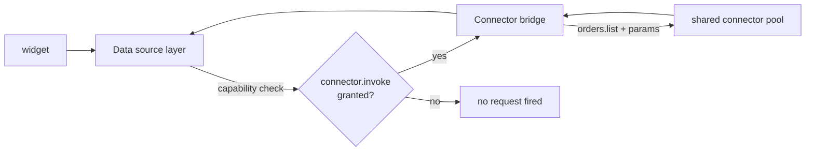

# Sources

`ui/sources.yaml` declares where widget data comes from. Solutions have
**no direct network access** — a source is the only data path for the
declarative UI.

In YAML there are two `type` values:

| `type` | Meaning |
| --- | --- |
| `runtime` | Tenant runtime plane (`metrics`, `executions`, `workflows`) |
| `connector` | Tool target — **own-app** `{solution}/{tool}`, a **pool connector** op, or (deprecated) platform `storage/*` |

## Definition

```yaml title="ui/sources.yaml"
- id: runtime_metrics
  type: runtime
  target: metrics

- id: takeaway
  type: connector
  target: restaurant-pro/restaurant.listOrders
  params:
    filter:
      channel: takeaway
    limit: 50
    sort:
      created_at: -1

- id: orders
  type: connector
  target: restaurant-pro/restaurant.listOrders
  params:
    limit: 25
```

| Field | Type | Required | Description |
| --- | --- | --- | --- |
| `id` | string | Yes | Source id referenced by widget `source:` fields. |
| `type` | string | Yes | `runtime` or `connector`. |
| `target` | string | Yes | Runtime name, `{solution}/{tool}`, or pool `{connector}/{op}`. |
| `params` | map | No | Static parameters sent with every query. |

## Runtime sources

`type: runtime` sources are served from the runtime plane:

| Target | Returns |
| --- | --- |
| `metrics` | Aggregate runtime metrics (e.g. `executions.active`) |
| `executions` | Workflow execution list for the tenant |
| `workflows` | Registered workflow definitions |

Runtime sources require the `runtime.query` capability (always granted).

## Own-app sources (ADR-003)

When `target` is `{solution}/{tool}` and `solution` is **this install**
(e.g. `restaurant-pro/restaurant.listOrders`), the host:

1. Gates on **`runtime.query`** (not `connector.invoke`).
2. Resolves the installation binding and calls the app’s signed `/qefro`.
3. Passes workspace-scoped `platform.storage` context so the tool’s
   `ctx.storage` hits the correct partition.

```yaml title="own-app source"
- id: takeaway
  type: connector
  target: restaurant-pro/restaurant.listOrders
  params:
    filter:
      channel: takeaway
    limit: 50
```

This is the **required** path for solution-owned lists. The app tool
implements filters, validation, and `ctx.storage.find`.

## External connector sources

For **declared pool** connectors (POS, Shopify, …), `type: connector`
sources are forwarded through the **connector bridge** and gated on
`connector.invoke`:



1. `connector.invoke` must be granted.
2. The connector must be listed in `manifest.connectors`.
3. Calls carry tenant context; connectors stay in the shared pool.

## Deprecated: `storage/*` UI sources

```yaml
# FORBIDDEN — do not ship
- id: orders
  type: connector
  target: storage/find
  params:
    collection: orders
```

Replace with an app list tool. Direct `storage/find` from the UI put
business shape on the platform path and skipped the SDK process.

## Restaurant Pro source map (1.10.7)

| Source | Target | Gate | Feeds |
| --- | --- | --- | --- |
| `runtime_metrics` | `metrics` | `runtime.query` | Dashboard metrics |
| `orders` | `restaurant-pro/restaurant.listOrders` | `runtime.query` | Orders / kitchen |
| `takeaway` | `restaurant-pro/restaurant.listOrders` + filter | `runtime.query` | Takeaway list |
| `takeaway_demand` | `restaurant-pro/restaurant.listTakeawayDemand` | `runtime.query` | Tomorrow’s cook list |
| `menu` | `restaurant-pro/restaurant.listMenu` | `runtime.query` | Menu |
| `payments` | `restaurant-pro/restaurant.listPayments` | `runtime.query` | Payments |
| `customers` | `restaurant-pro/restaurant.listCustomers` | `runtime.query` | CRM |

## Guidelines

- One source per **query shape**, not per widget — multiple widgets can
  share a source.
- Prefer **own-app tools** for solution-owned documents; use pool
  connectors for external systems of record.
- Use `params.limit` everywhere a list is unbounded.
- Match the capability gate to the target (`runtime.query` for own-app,
  `connector.invoke` for pool, `runtime.query` for runtime metrics).
- Always pass install `workspace_id` on UI data queries (portal host does
  this for workspace-scoped installs).

## Related topics

- [Managed apps](/docs/solutions/managed-apps)
- [Managed storage](/docs/solutions/managed-storage)
- [Capabilities](/docs/solutions/capabilities)
- [Connectors](/docs/solutions/connectors)
- [Widgets](/docs/solutions/widgets/metric)
- [restaurant-pro example](/docs/solutions/examples/restaurant-pro)
