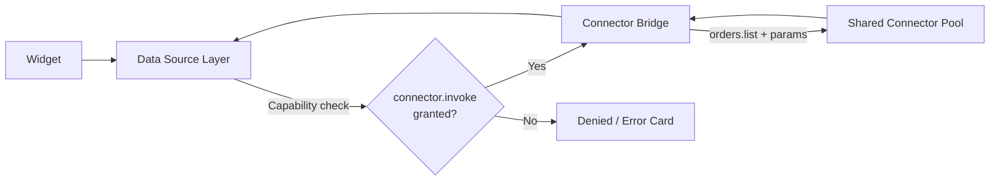

# Sources

`ui/sources.yaml` declares where widget data comes from. Marketplace Apps have **no direct network access** in the browser — a source is the only declarative data path for the staff UI.

In YAML there are three supported `type` values:

| `type` | Meaning |
| --- | --- |
| `entity` | Declared Marketplace App entity (`target` is an entity id). **Default for `hosting: runtime`.** |
| `runtime` | Tenant runtime plane (`metrics`, `executions`, `workflows`). |
| `connector` | Shared pool connector op (e.g. `shopify/orders.list`) or workspace integration. |

---

## 1. Entity Sources (Marketplace Apps)

For native domain applications, widgets query declared entities in runtime storage:

```yaml title="ui/sources.yaml"
- id: reservations
  type: entity
  target: reservation
- id: tables
  type: entity
  target: table
- id: menu
  type: entity
  target: menu_item
```

`target` matches the entity id from `entities/<id>.yaml`. Qefro Runtime serves documents from managed storage with triple-scoped isolation `(tenant_id, workspace_id, installation_id)`. No external application server is involved.

### Field Specification

| Field | Type | Required | Description |
| --- | --- | --- | --- |
| `id` | string | Yes | Unique source id referenced by widget `source:` fields. |
| `type` | string | Yes | `entity`, `runtime`, or `connector`. |
| `target` | string | Yes | Entity id, runtime target name, or connector op. |
| `params` | map | No | Static filter or pagination parameters sent with queries. |

Example with default filter parameters:

```yaml
- id: active_reservations
  type: entity
  target: reservation
  params:
    filter:
      status: confirmed
    sort:
      scheduled_at: asc
    limit: 50
```

---

## 2. Runtime Sources

`type: runtime` sources query platform operational telemetry:

| Target | Description |
| --- | --- |
| `metrics` | Aggregate workspace metrics (e.g. active conversations, tool executions). |
| `executions` | Workflow execution history and active flow state runs for the workspace. |
| `workflows` | Registered workflow definitions and status. |

Runtime sources require the `runtime.query` capability (granted automatically).

```yaml title="ui/sources.yaml (runtime metrics)"
- id: flow_metrics
  type: runtime
  target: metrics
  params:
    window: 24h
```

---

## 3. External Connector Sources

For integrations with external SaaS systems (Shopify, Stripe, Razorpay), `type: connector` sources are forwarded through the platform's **connector bridge** and gated on `connector.invoke`:


```mermaid
flowchart LR
    W[Widget] --> DS[Data Source Layer]
    DS -->|Capability check| CAP{connector.invoke<br/>granted?}
    CAP -->|Yes| B[Connector Bridge]
    CAP -->|No| X[Denied / Error Card]
    B -->|orders.list + params| POOL[Shared Connector Pool]
    POOL --> B --> DS
```

1. The package must declare `connector.invoke` in its permissions.
2. The target connector must be declared in `manifest.connectors`.
3. The bridge attaches tenant credentials and forwards requests to the shared connector pool.

```yaml title="ui/sources.yaml (connector source)"
- id: shopify_orders
  type: connector
  target: shopify/orders.list
  params:
    limit: 25
```

---

## Related Documentation

- [Widgets Specification](/docs/solutions/widgets/table)
- [Pages and Views](/docs/solutions/pages)
- [Entity Schema Guide](/docs/solutions/entity-schema)
- [Connectors Overview](/docs/solutions/connectors)
