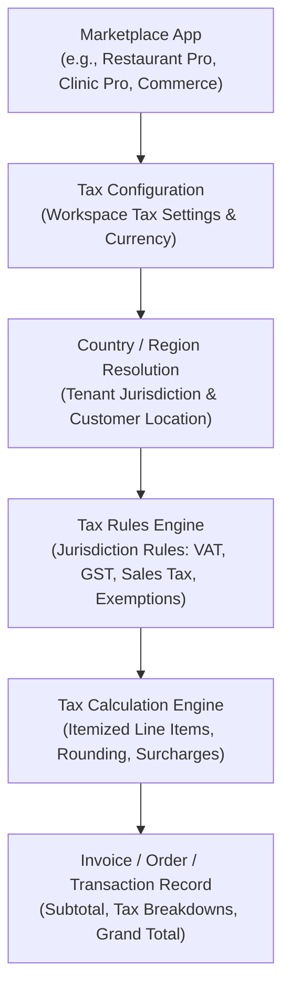
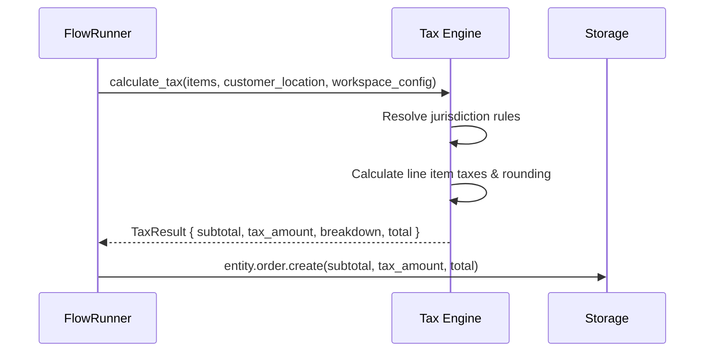

# Global Tax Engine

Qefro provides a **Global Tax Engine** to calculate taxes on transactions, invoices, bookings, and orders created by Marketplace Apps and Business Flows.

Tax calculation is **not hardcoded to any specific country or region** (such as Indian GST, US Sales Tax, or European VAT). Instead, tax is architectural platform behavior driven by configurable tax rules, regional jurisdiction definitions, and application settings.



---

## 1. Architectural Separation of Concerns

The Tax Engine strictly separates four architectural layers:

```text
┌────────────────────────────────────────────────────────────────────────┐
│                        TAX ENGINE ARCHITECTURE                         │
├──────────────────────────┬─────────────────────────────────────────────┤
│ Layer                    │ Role                                        │
├──────────────────────────┼─────────────────────────────────────────────┤
│ 1. Application Settings  │ The Marketplace App declares whether prices │
│    (`settings.tax`)      │ are tax-inclusive or exclusive, default tax │
│                          │ categories, and invoice numbering prefixes. │
│ 2. Tax Configuration     │ The tenant workspace configures its tax ID  │
│    (Workspace Config)    │ (e.g., VAT ID, GSTIN, EIN), home country,   │
│                          │ currency, and active tax jurisdictions.     │
│ 3. Tax Rules             │ Declarative rule sets matching transaction  │
│    (Jurisdiction Rules)  │ attributes (product type, customer location)│
│                          │ to applicable tax rates and exemptions.     │
│ 4. Tax Calculation       │ The deterministic mathematical engine that  │
│    (Calculation Engine)  │ computes base amounts, brackets, compound   │
│                          │ rates, and rounding to output grand totals. │
└──────────────────────────┴─────────────────────────────────────────────┘
```

---

## 2. Declaring Tax in Marketplace Apps

Entities that represent financial transactions (such as `order.yaml`, `invoice.yaml`, `service.yaml`) declare tax attributes in their metadata:

```yaml title="entities/order.yaml (excerpt)"
id: order
name: Order
fields:
  - name: subtotal
    type: float
    required: true

  - name: tax_amount
    type: float
    required: true
    description: "Calculated tax amount"

  - name: tax_breakdown
    type: json
    description: "Detailed breakdown of applied tax components"

  - name: total_amount
    type: float
    required: true

  - name: tax_inclusive
    type: boolean
    default: false
```

In `manifest.yaml`, the app declares configurable tax settings:

```yaml title="manifest.yaml (tax settings)"
settings:
  - key: tax_enabled
    type: boolean
    default: true
    description: "Enable automatic tax calculation on orders"

  - key: tax_inclusive_pricing
    type: boolean
    default: false
    description: "Whether menu/catalog prices include tax"

  - key: default_tax_category
    type: string
    default: "standard"
    description: "Default category for line items (standard, reduced, zero)"
```

---

## 3. Jurisdiction Tax Rules

Tax rules define the rates and logic applied within specific legal jurisdictions. Rules support common international tax models:

### Model A: Value-Added Tax (VAT) — Europe, UK, GCC
Single headline rate with reduced categories (e.g. standard 20%, reduced 5%, zero-rated 0%):
- Applied based on the destination or place of supply.
- B2B reverse charge exemptions supported when a validated VAT ID is present on the Person record.

### Model B: Goods and Services Tax (GST) — India, Australia, Canada, Singapore
Multi-tier rates with regional splitting:
- **Intrastate vs Interstate:** Automatically splits between central and state components (e.g. CGST + SGST vs IGST in India) based on customer state vs business location.
- **Harmonized Codes:** Supports HSN / SAC codes mapped on product catalog entities.

### Model C: Destination Sales Tax — United States
State, county, and municipal composite sales taxes:
- Calculated based on delivery zip/postal code.
- Exemptions for non-profit entities or resale certificates.

---

## 4. Calculation Pipeline

When an order is created or updated in FlowRunner:



1. **Base Amount Determination:** If prices are tax-inclusive, the base is back-calculated: `Base = Price / (1 + Rate)`.
2. **Line Item Summation:** Taxes are computed per line item to handle mixed categories (e.g., standard items alongside zero-rated food items).
3. **Rounding Rules:** Supports standard banker's rounding (`half_even`) or arithmetic rounding (`half_up`) according to jurisdiction regulations.
4. **Audit Trail:** The exact tax breakdown (rate names, percentages, basis, and amounts) is stored alongside the transaction to maintain regulatory compliance across tax years.

---

## 5. Global Best Practices

- **Never Hardcode Tax Percentages in Flows:** Workflows should never execute `amount * 0.18`. Always invoke the native calculation capability or pass tax category references.
- **Cross-Border Flexibility:** If a tenant operates in multiple regions, configure separate workspaces or assign region-specific tax rule profiles.
- **Invoice Immutability:** Once an invoice is marked `status: issued` or `status: paid`, its tax calculation and totals are frozen.

---

## Related Documentation

- [Entity Schema Guide](/docs/solutions/entity-schema)
- [Manifest Settings](/docs/solutions/manifest#settings)
- [Managed Runtime Storage](/docs/solutions/managed-storage)
- [Run Business Flows](/docs/guides/run-business-flows)
