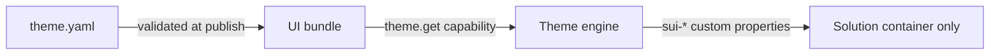

# Themes

`ui/theme.yaml` brands a solution UI. The theme engine translates it into
CSS custom properties on the **solution UI container only** — portal chrome
is never affected, and the platform guards against CSS injection.

## Token reference

| Token | Type | Description |
| --- | --- | --- |
| `primary` | color | Primary brand color (buttons, active states) |
| `secondary` | color | Secondary brand color |
| `accent` | color | Highlights, badges, chart accents |
| `background` | color | Page background of the solution container |
| `surface` | color | Card / widget surfaces |
| `text` | color | Default text color |
| `font_family` | string | Font stack, quoted |
| `font_size_base` | number | Base font size in px |
| `radius` | CSS length | Corner radius for cards and controls |
| `spacing` | map | `xs`, `sm`, `md`, `lg`, `xl` spacing scale |

All tokens are optional; omitted tokens fall back to the host defaults.

## Restaurant Pro theme

```yaml title="ui/theme.yaml"
primary: "#ea580c"
secondary: "#1c1917"
accent: "#f59e0b"
background: "#fffbf5"
surface: "#ffffff"
text: "#1c1917"
font_family: "'Inter', system-ui, sans-serif"
font_size_base: 14
radius: 14px
spacing:
  xs: 4px
  sm: 8px
  md: 16px
  lg: 24px
  xl: 40px
```

## How themes are applied



1. The theme is validated at publish time (parseable colors, length units).
2. At render time, the theme engine emits `--sui-*` custom properties
   (`--sui-primary`, `--sui-radius`, …) scoped to the solution container.
3. Widgets read the tokens; they never hardcode colors, so a theme change
   restyles every page at once.
4. Reading theme tokens uses the `theme.get` capability, which is always
   granted.

## Rules

- **Scoped by construction.** Tokens apply inside the solution UI
  container; there is no selector that escapes it.
- **No CSS files.** The package ships token data, not stylesheets — no
  arbitrary CSS is accepted, mirroring the platform's no-code rule.
- **No font files.** `font_family` references fonts available to the
  portal; custom font binaries are rejected as assets.
- **Dark mode.** The portal derives dark variants from your tokens; pick
  mid-tone accents that survive inversion.

## Tips

- Keep `primary` and `accent` distinct — charts use `accent` for series
  highlights.
- A `font_size_base` between 13 and 15 keeps tables legible.
- Test the full page list after a theme change; contrast issues usually
  show up on `status` badges and `metric` labels first.

## Related topics

- [Assets](/docs/solutions/assets) — logo and icon files referenced by the manifest
- [Navigation](/docs/solutions/navigation) — the sidebar that inherits the theme
- [Capabilities](/docs/solutions/capabilities) — `theme.get`
