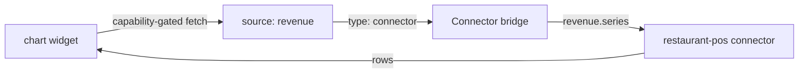

# Chart widget

The `chart` widget renders a bar or line series from row data — revenue
trends, orders per hour, occupancy by day. Series axes are declared, not
scripted: you point at a row array and name the x and y fields.

## Definition

```yaml title="ui/widgets.yaml (excerpt)"
- id: revenue_chart
  type: chart
  title: Revenue trend
  source: revenue
  options:
    rows_path: items
    kind: line
    x_key: day
    y_key: total
```

| Field | Type | Required | Description |
| --- | --- | --- | --- |
| `id` | string | Yes | Widget id referenced by page placements. |
| `type` | string | Yes | `chart`. |
| `title` | string | Yes | Card header. |
| `source` | string | Yes | Source id from `sources.yaml`. |
| `options.rows_path` | string | Yes | Path to the row array in the payload. |
| `options.kind` | string | Yes | `bar` or `line` — the only supported series kinds. |
| `options.x_key` | string | Yes | Row field for the x axis. |
| `options.y_key` | string | Yes | Row field for the y axis (numeric). |

## Series kinds

| Kind | Use it for | Avoid for |
| --- | --- | --- |
| `line` | Continuous trends (revenue per day) | Categorical comparisons |
| `bar` | Categorical comparison (orders per table) | Dense time series (> 30 points) |

## Data flow



`restaurant-pro`'s revenue chart is fed by the `revenue` connector source
(`revenue.series`). Rows are grouped per day by the connector; the chart
only plots what the source returns.

## Restaurant Pro usage

```yaml title="ui/pages.yaml (excerpt)"
- id: dashboard
  layout: dashboard-grid
  widgets:
    - { widget: active_orders, span: 3 }
    - { widget: revenue_chart, span: 9 }
```

The span-9 placement gives the trend room to breathe while the metric
keeps the headline visible.

## Guidelines

- Pre-aggregate in the connector (`revenue.series`) rather than shipping
  raw transactions to the widget.
- Keep `x_key` values ordered in the payload; the chart plots rows in
  array order.
- One series per chart; compare metrics with separate placements instead
  of overlapping series.
- Series colors come from the theme's `accent` token — never hardcode
  colors. See [Themes](/docs/solutions/themes).

## Related topics

- [Table](/docs/solutions/widgets/table) — the rows behind the trend
- [Sources](/docs/solutions/sources)
- [restaurant-pro example](/docs/solutions/examples/restaurant-pro)
