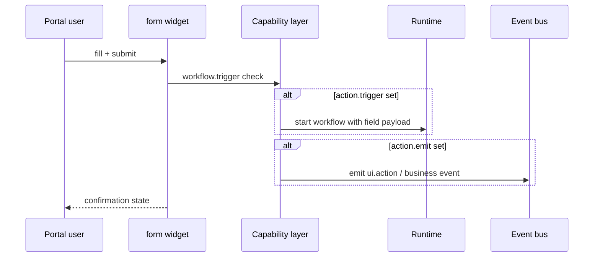

# Form widget

The `form` widget collects structured input — a new reservation, a stock
adjustment, a ticket note — and hands it to the platform as an **event or
workflow trigger**. Forms never call a network endpoint themselves:
submission rides the capability layer, exactly like every other host
interaction.

## Definition

```yaml title="ui/widgets.yaml (excerpt)"
- id: reservation_form
  type: form
  title: New reservation
  options:
    fields:
      - { name: guest_name, label: Guest name, type: text, required: true }
      - { name: covers, label: Covers, type: number, required: true }
      - { name: date, label: Date, type: date, required: true }
      - { name: time, label: Time, type: time, required: true }
      - name: occasion
        label: Occasion
        type: select
        options: [birthday, anniversary, business, other]
    submit_label: Reserve table
    action:
      trigger: reservation-reminder
      emit: reservation.confirmed
```

| Field | Type | Required | Description |
| --- | --- | --- | --- |
| `id` | string | Yes | Widget id referenced by page placements. |
| `type` | string | Yes | `form`. |
| `title` | string | Yes | Card header. |
| `options.fields` | list | Yes | Ordered field declarations. |
| `options.submit_label` | string | No | Submit button text. |
| `options.action.trigger` | string | No | Workflow id to start on submit. |
| `options.action.emit` | string | No | Event name emitted on the bus on submit. |

### Field types

| Type | Renders | Notes |
| --- | --- | --- |
| `text` | Single-line input | Default type |
| `number` | Numeric input | Values submitted as numbers |
| `date` | Date picker | ISO date |
| `time` | Time picker | 24 h `HH:MM` |
| `select` | Dropdown | Requires `options: []` on the field |

Each field takes `name`, `label`, `type`, optional `required` and
(select only) `options`.

## Submission model



Rules enforced on every submit:

1. **Capability check first.** Triggering a workflow requires the
   `workflow.trigger` capability, which itself requires the manifest
   permission `workflow.execute`. A form without it renders but refuses
   submission. See [Capabilities](/docs/solutions/capabilities).
2. **Event-driven by contract.** The submission is an event on the bus —
   audited like any other `ui.action`. Nothing is posted directly to a
   connector or database.
3. **Workflows do the work.** Persisting the reservation, notifying the
   kitchen or messaging the guest is the triggered workflow's job,
   executed by the runtime. See [Workflows](/docs/solutions/workflows).

## Restaurant Pro usage

The Reservations page pairs the form with the reservation calendar:

```yaml title="ui/pages.yaml (excerpt)"
- id: reservations
  layout: split-grid
  widgets:
    - { widget: reservation_form, span: 5 }
    - { widget: reservations_calendar, span: 7 }
```

Submitting starts the `reservation-reminder` workflow, which delays, then
sends the confirmation through the POS connector — the full chain is in
the [restaurant-pro example](/docs/solutions/examples/restaurant-pro).

## Guidelines

- Keep forms under 6 fields; split multi-step captures across pages.
- Validate declaratively (`required`) — the platform enforces it; you
  cannot ship custom validation code.
- One `action` per form; for branching outcomes, trigger a workflow that
  contains the condition steps.
- Never ask for secrets or credentials in form fields.

## Related topics

- [Events](/docs/solutions/events) — `ui.action` audit trail
- [Workflows](/docs/solutions/workflows) — what happens after submit
- [Capabilities](/docs/solutions/capabilities) — `workflow.trigger`
