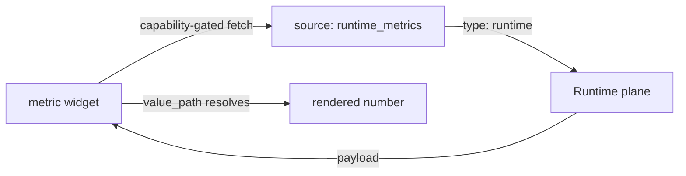

# Metric widget

The `metric` widget renders a single headline number — active orders,
occupancy, open tickets. It is the fastest way to give a dashboard a pulse.

## Widget kinds

Widgets come from a closed catalogue; unknown types are rejected at
publish and render as a graceful placeholder at runtime.

| Kind | Purpose | Reference |
| --- | --- | --- |
| `metric` | Single headline number | this page |
| `table` | Row data | [Table](/docs/solutions/widgets/table) |
| `chart` | Bar / line series | [Chart](/docs/solutions/widgets/chart) |
| `markdown` | Static narrative | [Markdown](/docs/solutions/widgets/markdown) |
| `form` | Structured input | [Form](/docs/solutions/widgets/form) |
| `timeline` | Time-ordered activity | [Timeline](/docs/solutions/widgets/timeline) |
| `kanban` | Column-grouped cards | see [Pages](/docs/solutions/pages) |
| `calendar` | Day-grouped entries | see [Pages](/docs/solutions/pages) |
| `status` | Badge per row | see [Pages](/docs/solutions/pages) |
| `map` | Location list | see [Pages](/docs/solutions/pages) |
| `activity` | Activity feed | see [Pages](/docs/solutions/pages) |

## Definition

```yaml title="ui/widgets.yaml (excerpt)"
- id: active_orders
  type: metric
  title: Active orders
  source: runtime_metrics
  options:
    value_path: executions.active
    label: currently running workflows
    suffix: ""
```

| Field | Type | Required | Description |
| --- | --- | --- | --- |
| `id` | string | Yes | Widget id referenced by page placements. |
| `type` | string | Yes | `metric`. |
| `title` | string | Yes | Card header. |
| `source` | string | Yes | Source id from `sources.yaml`. |
| `options.value_path` | string | Yes | Dot path into the source payload, e.g. `executions.active`. |
| `options.label` | string | No | Caption under the number. |
| `options.suffix` | string | No | Unit rendered after the number (`%`, `₹`, …). |

## Data flow



- The fetch fires only if the installation was granted the source's
  capability (`runtime.query` for runtime sources, `connector.invoke` for
  connector sources). See [Sources](/docs/solutions/sources).
- `value_path` navigates nested payloads: `executions.active` reads
  `payload.executions.active`. A missing path renders an em-dash, never an
  error card.

## Restaurant Pro usage

Dashboard placement — a compact span-3 card beside the revenue chart:

```yaml title="ui/pages.yaml (excerpt)"
- id: dashboard
  layout: dashboard-grid
  widgets:
    - { widget: active_orders, span: 3 }
```

## Guidelines

- One number per metric; pair related numbers as separate placements.
- Use `suffix` for units instead of embedding them in `label`.
- Prefer runtime sources for platform counts and connector sources for
  business counts — do not duplicate one through the other.

## Related topics

- [Sources](/docs/solutions/sources)
- [Pages](/docs/solutions/pages)
- [restaurant-pro example](/docs/solutions/examples/restaurant-pro)
