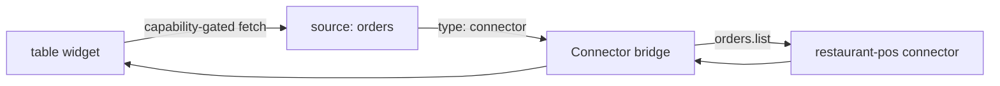

# Table widget

The `table` widget renders row data — orders, reservations, invoices —
with declared columns. Columns are data, not code: you declare keys and
headers; the portal renders sorting-safe, themed tables.

## Definition

```yaml title="ui/widgets.yaml (excerpt)"
- id: order_table
  type: table
  title: Orders
  source: orders
  options:
    rows_path: items
    limit: 25
    columns:
      - { key: id, header: Order }
      - { key: table, header: Table }
      - { key: items, header: Items }
      - { key: status, header: Status }
      - { key: total, header: Total }
      - { key: created_at, header: Placed }
```

| Field | Type | Required | Description |
| --- | --- | --- | --- |
| `id` | string | Yes | Widget id referenced by page placements. |
| `type` | string | Yes | `table`. |
| `title` | string | Yes | Card header. |
| `source` | string | Yes | Source id from `sources.yaml`. |
| `options.rows_path` | string | Yes | Path to the row array in the payload (`items`). |
| `options.columns` | list | Yes | Ordered `{key, header}` pairs. |
| `options.limit` | number | No | Maximum rows rendered (default 25). |

## Column semantics

- `key` reads a field from each row object; dot paths are supported
  (`customer.name`).
- Missing fields render as an em-dash — a sparse connector payload never
  breaks the table.
- Column order is declaration order; keep the identifying column first
  (`Order`) and the temporal column last (`Placed`).

## Data flow



`restaurant-pro`'s order table is fed by the `orders` connector source,
which routes `orders.list` through the bridge with `limit: 25`. The fetch
only fires when `connector.invoke` is granted and `restaurant-pos` was
declared in the manifest. See [Sources](/docs/solutions/sources) and
[Connectors](/docs/solutions/connectors).

## Restaurant Pro usage

Placed twice with different spans — full width on Dashboard, primary pane
on Orders:

```yaml title="ui/pages.yaml (excerpt)"
- { widget: order_table, span: 12 }   # dashboard
- { widget: order_table, span: 8 }    # orders page
```

## Guidelines

- Cap columns at 6–7 for span-8 placements; wide tables belong in
  full-width placements.
- Keep `limit` modest (≤ 50): tables are operational views, not exports.
  Deep analysis belongs in connector-side reporting.
- Do not put secrets in row payloads — every field you declare becomes
  visible to portal users with page access.

## Related topics

- [Chart](/docs/solutions/widgets/chart) — same rows, trended
- [Timeline](/docs/solutions/widgets/timeline) — same rows, time-ordered
- [Sources](/docs/solutions/sources)
