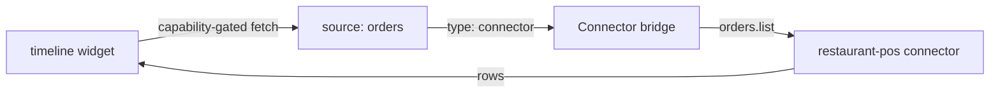

# Timeline widget

The `timeline` widget renders time-ordered activity — order lifecycle,
payment events, audit trails — as a vertical feed. It reuses any row
source and needs three field mappings: when, headline and detail.

## Definition

```yaml title="ui/widgets.yaml (excerpt)"
- id: orders_timeline
  type: timeline
  title: Recent order activity
  source: orders
  options:
    rows_path: items
    time_field: created_at
    title_field: id
    desc_field: status
```

| Field | Type | Required | Description |
| --- | --- | --- | --- |
| `id` | string | Yes | Widget id referenced by page placements. |
| `type` | string | Yes | `timeline`. |
| `title` | string | Yes | Card header. |
| `source` | string | Yes | Source id from `sources.yaml`. |
| `options.rows_path` | string | Yes | Path to the row array in the payload. |
| `options.time_field` | string | Yes | Row field with the timestamp. |
| `options.title_field` | string | Yes | Row field rendered as the entry headline. |
| `options.desc_field` | string | No | Row field rendered as the entry detail line. |

## Rendering rules

- Entries render newest-first regardless of payload order; the widget
  sorts by `time_field`.
- Timestamps render in the portal user's locale and timezone — packages
  never format dates.
- Rows missing `time_field` are skipped silently; a fully unparseable
  payload degrades to an empty state, not an error.

## Data flow



The timeline shares its source with other widgets — `restaurant-pro` feeds
both `order_table` and `orders_timeline` from the single `orders` source,
so one fetch serves both placements on the Orders page.

## Restaurant Pro usage

Companion pane next to the order table:

```yaml title="ui/pages.yaml (excerpt)"
- id: orders
  layout: split-grid
  widgets:
    - { widget: order_table, span: 8 }
    - { widget: orders_timeline, span: 4 }
```

## Timeline vs activity

Both kinds show recent events. Choose:

- `timeline` when each entry carries meaningful detail (`desc_field`) and
  exact times matter — order lifecycles, settlement runs.
- `activity` for compact feeds where headline + time is enough —
  see the widget catalogue on the [Metric page](/docs/solutions/widgets/metric).

## Guidelines

- Keep `title_field` short (ids, statuses); put context in `desc_field`.
- Pair timelines with the table of the same source so users can jump from
  "what happened" to "what exists".
- For audit-style feeds, emit dedicated events and surface them here
  rather than overloading business sources. See [Events](/docs/solutions/events).

## Related topics

- [Table](/docs/solutions/widgets/table)
- [Sources](/docs/solutions/sources)
- [restaurant-pro example](/docs/solutions/examples/restaurant-pro)
