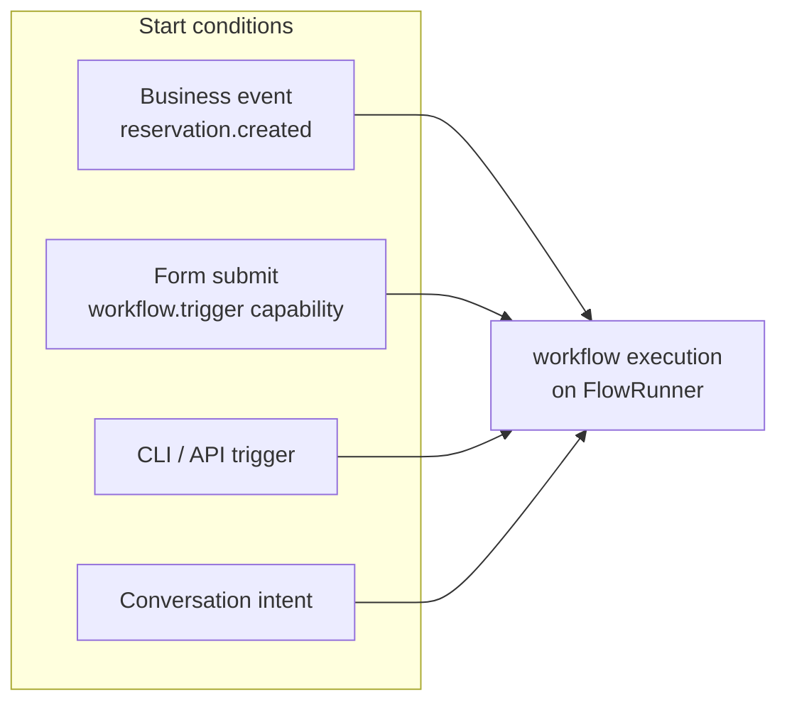
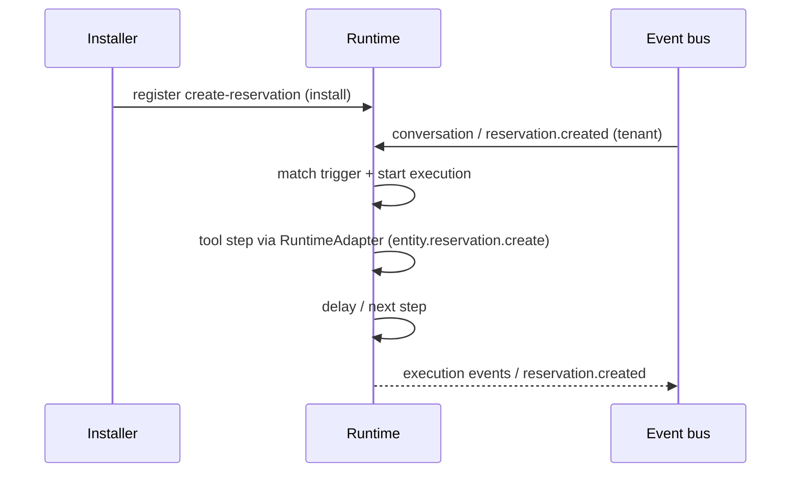

# Workflows

Workflows are the automation layer of a Marketplace App. Each definition
under `workflows/` is declarative YAML: at install time it is registered
with the **runtime**, which compiles it into the same **BusinessFlow /
FlowRunner** used by SDK-advertised flows. The package never executes
anything itself.

Steps: **ask → tool → condition → approval / challenge → complete**.

## Definition (Marketplace App)

From `restaurant-pro-runtime`:

```yaml title="workflows/create-reservation.yaml"
id: create-reservation
name: Create reservation
description: Book a table through Qefro Runtime (FlowRunner → RuntimeAdapter)
trigger:
  type: conversation
steps:
  - id: ask_covers
    type: ask
    field: covers
    message: How many guests?
  - id: ask_date
    type: ask
    field: date
    message: Which date should we book?
  - id: ask_name
    type: ask
    field: guest_name
    message: What name should the reservation be under?
  - id: create
    type: tool
    tool: entity.reservation.create
    execution: runtime
    input_map:
      guest_name: guest_name
      covers: covers
      date: date
      time: time
      table_id: table_id
  - id: confirm
    type: message
    message: Reservation booked for {{covers}} guests on {{date}}.
  - id: done
    type: complete
```

| Field | Type | Required | Description |
| --- | --- | --- | --- |
| `id` | string | Yes | Workflow id; must appear in the manifest's `flows` list. |
| `name` | string | Yes | Human-readable label shown in the portal. |
| `trigger` | object | Yes | Start condition: a business `event` name. |
| `steps` | list | Yes | Ordered steps executed by the runtime. |

## Step types

Step types map onto the runtime's flow engine — the same model as
[Business Flows](/docs/developer/concepts/flows):

| Step | Purpose |
| --- | --- |
| `ask` | Collect input from a user on a channel |
| `tool` | Call a Runtime entity capability (`entity.<id>.create`, `execution: runtime`) or, for SDK-hosted / pool apps, a connector / `/qefro` tool |
| `condition` | Branch on payload values |
| `delay` | Wait a declared duration |
| `approval` | Pause for an explicit portal approval |
| `challenge` | Require identity verification before continuing |
| `message` | Send a channel message |
| `complete` | Finish the execution |

On **Marketplace Apps**, `tool` steps use Runtime capabilities
(`entity.reservation.create`). `execution: runtime` selects the
RuntimeAdapter — not an SDK process.

On **external integrations**, the same FlowRunner uses an **SDKAdapter**
to invoke `/qefro` tools. See [Runtime vs SDK](/docs/solutions/runtime-vs-sdk).

Parameters interpolate fields (`{{ covers }}`, `{{ event.payload.* }}`);
there is no scripting beyond interpolation.

## Triggers



1. **Business events** — the `trigger.event` name is matched on the
   platform event bus. `ui.*` lifecycle events never trigger workflows;
   only business events do. See [Events](/docs/solutions/events).
2. **UI triggers** — a [form widget](/docs/solutions/widgets/form) can
   start the workflow directly (`action.trigger`), gated by the
   `workflow.trigger` capability and the `workflow.execute` permission.
3. **Manual / CLI** — tenants can trigger installed workflows:

```bash
qefro workflow trigger --solution restaurant-pro-runtime --workflow create-reservation
```

## Registration and execution



- Executions appear in the tenant's runtime data — the `executions` and
  `metrics` runtime sources can display them.
- Failures are runtime failures: retries, observability and flow-run
  history behave exactly like any Business Flow.
- Upgrading the solution replaces the workflow definition; in-flight
  executions of the old version run to completion.

## Restaurant Pro Runtime workflows

| Workflow | Trigger | Steps |
| --- | --- | --- |
| `create-reservation` | conversation (`book a table`) | ask covers/date/name → `entity.reservation.create` → message → complete |

Real Estate uses the same engine: `create-viewing` → `entity.viewing.create`.
See [real-estate-runtime](/docs/solutions/examples/real-estate-runtime).

## Guidelines

- One workflow per business outcome; compose with `condition` steps
  instead of overlapping triggers.
- Use `approval` for irreversible actions (refunds, voiding bills) — the
  platform enforces who can approve. See [Approvals](/docs/developer/concepts/approvals).
- Keep `delay` durations business-meaningful; a reminder sent too early
  is noise, too late is useless.
- Never encode tenant-specific values (URLs, phone numbers) in steps —
  use [settings](/docs/solutions/manifest) and connector configuration.

## Related topics

- [Business Flows](/docs/developer/concepts/flows)
- [Run Business Flows](/docs/guides/run-business-flows)
- [Events](/docs/solutions/events)
- [Runtime vs SDK](/docs/solutions/runtime-vs-sdk)
