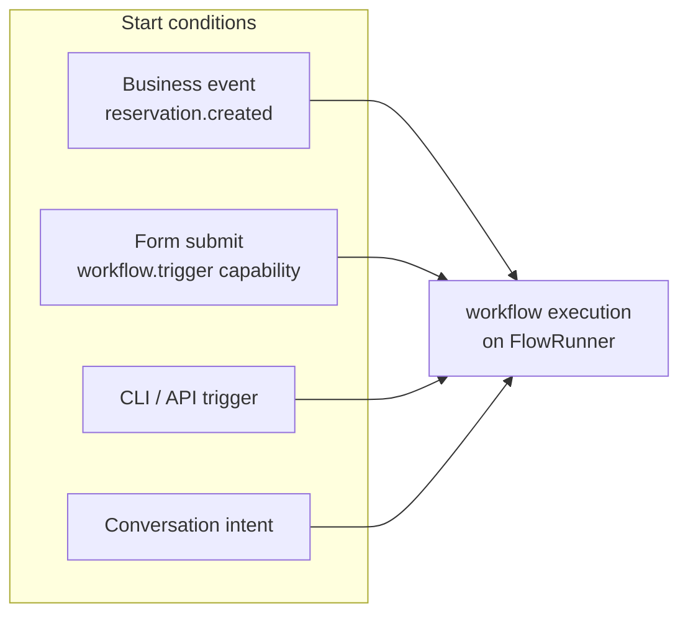
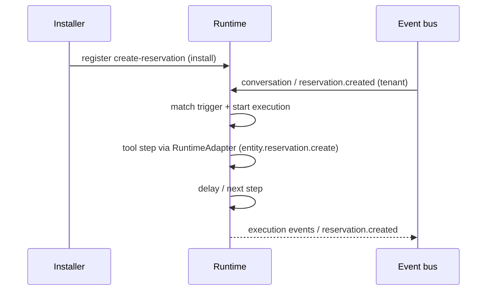

# Workflows

Workflows are the automation layer of a Marketplace App. Each definition
under `workflows/` is declarative YAML: at install time it is registered
with the **runtime**, which compiles it into the same **BusinessFlow /
FlowRunner** used by SDK-advertised flows. The package never executes
anything itself.

Steps: **ask → tool → condition → approval / challenge → complete**.

## Definition (Marketplace App)

From `restaurant-pro-runtime`:

```yaml title="workflows/create-reservation.yaml"
id: create-reservation
name: Create reservation
description: Book a table through Qefro Runtime (FlowRunner → RuntimeAdapter)
trigger:
  type: conversation
steps:
  - id: ask_covers
    type: ask
    field: covers
    message: How many guests?
  - id: ask_date
    type: ask
    field: date
    message: Which date should we book?
  - id: ask_name
    type: ask
    field: guest_name
    message: What name should the reservation be under?
  - id: create
    type: tool
    tool: entity.reservation.create
    execution: runtime
    input_map:
      guest_name: guest_name
      covers: covers
      date: date
      time: time
      table_id: table_id
  - id: confirm
    type: message
    message: Reservation booked for {{covers}} guests on {{date}}.
  - id: done
    type: complete
```

| Field | Type | Required | Description |
| --- | --- | --- | --- |
| `id` | string | Yes | Workflow id; must appear in the manifest's `flows` list. |
| `name` | string | Yes | Human-readable label shown in the portal. |
| `trigger` | object | Yes | Start condition: a business `event` name. |
| `steps` | list | Yes | Ordered steps executed by the runtime. |

## Step types

Step types map onto the runtime's flow engine — the same model as
[Business Flows](/docs/developer/concepts/flows):

| Step | Purpose |
| --- | --- |
| `ask` | Collect input from a user on a channel |
| `tool` | Call a Runtime entity capability (`entity.<id>.create`, `execution: runtime`) or, for SDK-hosted / pool apps, a connector / `/qefro` tool |
| `condition` | Branch on payload values |
| `delay` | Wait a declared duration |
| `approval` | Pause for an explicit portal approval |
| `challenge` | Require identity verification before continuing |
| `message` | Send a channel message |
| `complete` | Finish the execution |

On **Marketplace Apps**, `tool` steps use Runtime capabilities
(`entity.reservation.create`). `execution: runtime` selects the
RuntimeAdapter — not an SDK process.

On **external integrations**, the same FlowRunner uses an **SDKAdapter**
to invoke `/qefro` tools. See [Runtime vs SDK](/docs/solutions/runtime-vs-sdk).

Parameters interpolate fields (`{{ covers }}`, `{{ event.payload.* }}`);
there is no scripting beyond interpolation.

## Step reference

### ask — collect user input

Collects a value from the user on a channel (WhatsApp, widget). If the
flow's variable context already has a usable value, the step is
auto-skipped.

```yaml
- id: ask_city
  type: ask
  field: city
  message: Which city or area should I search in?
```

| Field | Type | Required | Description |
| --- | --- | --- | --- |
| `id` | string | Yes | Unique step identifier. |
| `type` | `ask` | Yes | Step type. |
| `field` | string | Yes | Conversation slot id to collect. Must match a `conversation_slots` entry or a flow variable name. |
| `message` | string | Yes | Prompt shown to the user. |
| `choices` | string[] | No | Static choice list rendered as buttons. |
| `choices_from` | string | No | Dynamic choices from a previous tool step's `output`. |
| `title_field` | string | No | Field name for display text in dynamic choices. |
| `value_field` | string | No | Field name for the stored value in dynamic choices. |
| `chip_prefix` | string | No | Prefix for chip UI elements (e.g., `time:10:00`). |

**Static choices** (from search-properties):

```yaml
- id: ask_type
  type: ask
  field: property_type
  message: What type of property are you looking for?
  choices:
    - Apartment
    - Villa
    - Plot / Land
    - Commercial
```

**Dynamic choices** (from book-appointment — choices from a tool step):

```yaml
# First, fetch the data
- id: list_practitioners
  type: tool
  tool: entity.practitioner.list
  execution: runtime
  output: practitioners            # store for next step
  input_map:
    limit: $literal:20

# Then, present as choices
- id: ask_doctor
  type: ask
  field: practitioner_name
  message: Which doctor would you like?
  choices_from: practitioners      # reference to tool output
  title_field: name                # display field
  value_field: name                # stored value
  chip_prefix: doctor
```

### tool — execute an operation

Calls an entity operation or HTTP tool. This is how flows read and write
data.

```yaml
- id: run
  type: tool
  tool: entity.viewing.create
  execution: runtime
  input_map:
    property_title: property_title
    date: date
    time: time
```

| Field | Type | Required | Description |
| --- | --- | --- | --- |
| `id` | string | Yes | Unique step identifier. |
| `type` | `tool` | Yes | Step type. |
| `tool` | string | Yes | Operation reference: `entity.<name>.<op>` for runtime, or tool name for HTTP. |
| `execution` | string | Yes | `runtime` (EntityService) or `http` (ConnectorBridge). |
| `input_map` | object | No | Maps tool parameters to flow variables. See [Flow Parameters](/docs/solutions/flow-parameters). |
| `output` | string | No | Variable name to store the tool's result for later steps. |
| `constants` | object | No | Step-level trusted constants (e.g., `expand`). |

**List with filters** (from search-properties):

```yaml
- id: run
  type: tool
  tool: entity.property.list
  execution: runtime
  input_map:
    filter.property_type: property_type    # dotted key → nested object
    filter.city: city
```

**Create with auto-injected identity** (from request-viewing):

```yaml
- id: run
  type: tool
  tool: entity.viewing.create
  execution: runtime
  input_map:
    property_title: property_title
    date: date
    time: time
  # person_id is auto-injected by runtime (scope: customer)
```

**Capture output for later steps**:

```yaml
- id: search
  type: tool
  tool: entity.travel_package.list
  execution: runtime
  input_map:
    filter.status: $literal:active
    limit: $literal:20
  output: packages               # store result

- id: show_results
  type: message
  message: |
    Here are available packages:
    {{packages}}                 # reference stored output
```

### message — send a response

Sends a text message to the user. Supports `{{ variable }}`
interpolation from the flow's variable context.

```yaml
- id: confirm
  type: message
  message: Viewing scheduled for {{property_title}} on {{date}}.
```

| Field | Type | Required | Description |
| --- | --- | --- | --- |
| `id` | string | Yes | Unique step identifier. |
| `type` | `message` | Yes | Step type. |
| `message` | string | Yes | Message template with `{{ variable }}` interpolation. |

**Template variables**:

```yaml
# Simple variable interpolation
message: "Appointment booked for {{patient_name}} on {{date}}."

# List results from a tool step
message: |
  Here are matching properties:
  {{items_text}}

# Dotted path into entity objects
message: "Order {{order.code}} status: {{order.status}}"
```

**Image delivery**: When a message step follows a tool step that
returned records with `type: image` fields, the runtime automatically
extracts and delivers images via the channel (WhatsApp media message or
widget inline image).

### complete — end the flow

Terminal step that marks the flow execution as complete.

```yaml
- id: done
  type: complete
```

| Field | Type | Required | Description |
| --- | --- | --- | --- |
| `id` | string | Yes | Unique step identifier. |
| `type` | `complete` | Yes | Step type. |
| `message` | string | No | Optional final message to the user. |

```yaml
# With a final message
- id: done
  type: complete
  message: "Thank you! Your request has been submitted."

# Without a message (silent completion)
- id: done
  type: complete
  message: ""
```

### condition — branch on values

Evaluates a `when` expression and jumps to `then` or `else` steps.

```yaml
- id: check_status
  type: condition
  when: "status == confirmed"
  then: send_confirmation
  else: send_pending
```

| Field | Type | Required | Description |
| --- | --- | --- | --- |
| `id` | string | Yes | Unique step identifier. |
| `type` | `condition` | Yes | Step type. |
| `when` | string | Yes | Expression to evaluate. |
| `then` | string | Yes | Step id to jump to if true. |
| `else` | string | No | Step id to jump to if false. |

### delay — wait a duration

Pauses the flow for a specified duration before continuing.

```yaml
- id: wait_before_reminder
  type: delay
  duration_seconds: 3600         # wait 1 hour
```

| Field | Type | Required | Description |
| --- | --- | --- | --- |
| `id` | string | Yes | Unique step identifier. |
| `type` | `delay` | Yes | Step type. |
| `duration_seconds` | integer | No | Wait duration in seconds. |
| `seconds` | integer | No | Alternative to `duration_seconds`. |
| `until` | string | No | ISO 8601 datetime to wait until. |

### approval — require portal approval

Pauses the flow until an authorized user approves or rejects in the
portal. Only Owner/Admin roles can approve.

```yaml
- id: request_approval
  type: approval
  message: "Refund of ${{amount}} requires manager approval."
```

### challenge — identity verification

Requires the user to verify their identity before continuing. Used for
sensitive operations.

```yaml
- id: verify_identity
  type: challenge
  message: "Please verify your email to continue."
```

## Triggers



1. **Business events** — the `trigger.event` name is matched on the
   platform event bus. `ui.*` lifecycle events never trigger workflows;
   only business events do. See [Events](/docs/solutions/events).
2. **UI triggers** — a [form widget](/docs/solutions/widgets/form) can
   start the workflow directly (`action.trigger`), gated by the
   `workflow.trigger` capability and the `workflow.execute` permission.
3. **Manual / CLI** — tenants can trigger installed workflows:

```bash
qefro workflow trigger --solution restaurant-pro-runtime --workflow create-reservation
```

## Registration and execution



- Executions appear in the tenant's runtime data — the `executions` and
  `metrics` runtime sources can display them.
- Failures are runtime failures: retries, observability and flow-run
  history behave exactly like any Business Flow.
- Upgrading the solution replaces the workflow definition; in-flight
  executions of the old version run to completion.

## Restaurant Pro Runtime workflows

| Workflow | Trigger | Steps |
| --- | --- | --- |
| `create-reservation` | conversation (`book a table`) | ask covers/date/name → `entity.reservation.create` → message → complete |

Real Estate uses the same engine: `create-viewing` → `entity.viewing.create`.
See [real-estate-runtime](/docs/solutions/examples/real-estate-runtime).

## Guidelines

- One workflow per business outcome; compose with `condition` steps
  instead of overlapping triggers.
- Use `approval` for irreversible actions (refunds, voiding bills) — the
  platform enforces who can approve. See [Approvals](/docs/developer/concepts/approvals).
- Keep `delay` durations business-meaningful; a reminder sent too early
  is noise, too late is useless.
- Never encode tenant-specific values (URLs, phone numbers) in steps —
  use [settings](/docs/solutions/manifest) and connector configuration.

## Related topics

- [Business Flows](/docs/developer/concepts/flows)
- [Run Business Flows](/docs/guides/run-business-flows)
- [Events](/docs/solutions/events)
- [Runtime vs SDK](/docs/solutions/runtime-vs-sdk)
