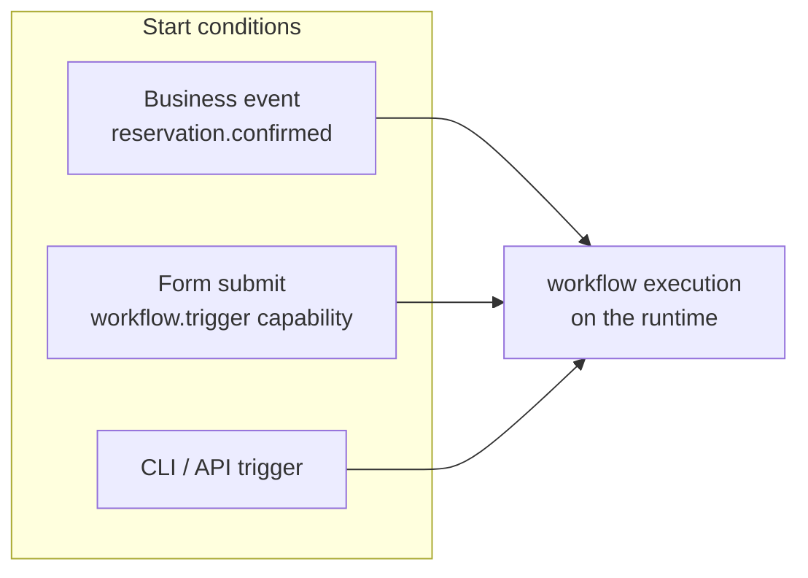
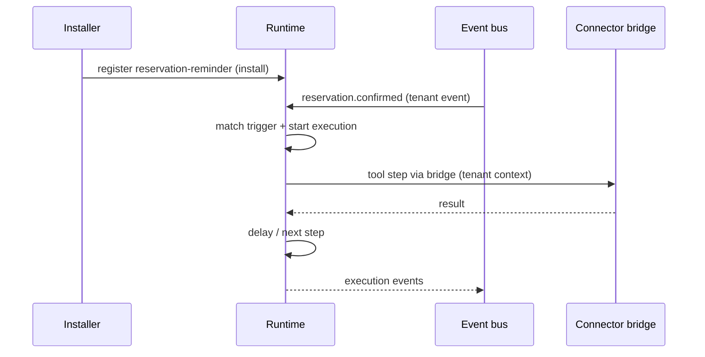

# Workflows

Workflows are the automation layer of a solution. Each definition under
`workflows/` is declarative YAML: at install time it is registered with
the **runtime**, which owns execution. The package never executes anything
itself — this is the no-code rule applied to automation.

## Definition

```yaml title="workflows/reservation-reminder.yaml"
id: reservation-reminder
name: Reservation reminder
trigger:
  event: reservation.confirmed
steps:
  - type: tool
    tool: restaurant-pos/reservations.create
    params:
      guest: "{{ event.payload.guest_name }}"
      covers: "{{ event.payload.covers }}"
      date: "{{ event.payload.date }}"
      time: "{{ event.payload.time }}"
  - type: tool
    tool: restaurant-pos/notify
    params:
      message: "Your table is confirmed — see you soon!"
  - type: delay
    duration: 2h
  - type: tool
    tool: restaurant-pos/notify
    params:
      message: "Reminder: your table is ready in 2 hours."
  - type: complete
```

| Field | Type | Required | Description |
| --- | --- | --- | --- |
| `id` | string | Yes | Workflow id; must appear in the manifest's `flows` list. |
| `name` | string | Yes | Human-readable label shown in the portal. |
| `trigger` | object | Yes | Start condition: a business `event` name. |
| `steps` | list | Yes | Ordered steps executed by the runtime. |

## Step types

Step types map onto the runtime's flow engine — the same model as
[Business Flows](/docs/developer/concepts/flows):

| Step | Purpose |
| --- | --- |
| `ask` | Collect input from a user on a channel |
| `tool` | Call a declared connector operation through the bridge |
| `condition` | Branch on payload values |
| `delay` | Wait a declared duration |
| `approval` | Pause for an explicit portal approval |
| `challenge` | Require identity verification before continuing |
| `complete` | Finish the execution |

`tool` steps reference `connector/operation` pairs that must be declared
in `connectors/` — undeclared operations fail validation. Parameters
interpolate event payload fields (`{{ event.payload.* }}`); there is no
scripting beyond interpolation.

## Triggers



1. **Business events** — the `trigger.event` name is matched on the
   platform event bus. `ui.*` lifecycle events never trigger workflows;
   only business events do. See [Events](/docs/solutions/events).
2. **UI triggers** — a [form widget](/docs/solutions/widgets/form) can
   start the workflow directly (`action.trigger`), gated by the
   `workflow.trigger` capability and the `workflow.execute` permission.
3. **Manual / CLI** — tenants can trigger installed workflows:

```bash
qefro workflow trigger --solution restaurant-pro --workflow reservation-reminder
```

## Registration and execution



- Executions appear in the tenant's runtime data — the `executions` and
  `metrics` runtime sources can display them.
- Failures are runtime failures: retries, observability and flow-run
  history behave exactly like any Business Flow.
- Upgrading the solution replaces the workflow definition; in-flight
  executions of the old version run to completion.

## Restaurant Pro workflows

| Workflow | Trigger | Steps |
| --- | --- | --- |
| `reservation-reminder` | `reservation.confirmed` | create reservation → confirm message → 2 h delay → reminder → complete |

## Guidelines

- One workflow per business outcome; compose with `condition` steps
  instead of overlapping triggers.
- Use `approval` for irreversible actions (refunds, voiding bills) — the
  platform enforces who can approve. See [Approvals](/docs/developer/concepts/approvals).
- Keep `delay` durations business-meaningful; a reminder sent too early
  is noise, too late is useless.
- Never encode tenant-specific values (URLs, phone numbers) in steps —
  use [settings](/docs/solutions/manifest) and connector configuration.

## Related topics

- [Business Flows](/docs/developer/concepts/flows)
- [Run Business Flows](/docs/guides/run-business-flows)
- [Connectors](/docs/solutions/connectors)
- [Events](/docs/solutions/events)
