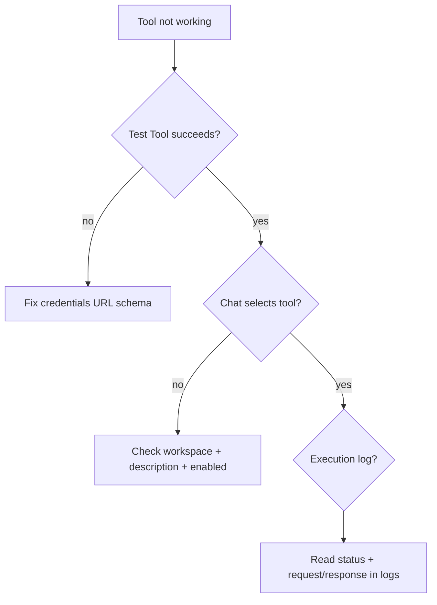

import { RelatedTopics } from '@site/src/components';

# Troubleshooting

## Business Tools

| Symptom | Likely cause | Fix |
| --- | --- | --- |
| AI cites knowledge base only | No `workspaceId` on widget | Set `data-workspace-id` / `workspaceId` |
| Tool never offered | `enabled: false` or wrong workspace | Enable tool; verify integration workspace |
| `customer_not_found` | Email not in SDK directory | Fix lookup mapping; test directory |
| `invalid_signature` (SDK) | Secret mismatch | Align Admin secret + `QEFRO_SIGNING_SECRET` |
| REST 401 | Wrong API key/bearer | Test Tool; rotate secret |
| `END_USER_IDENTITY requires...` | No `identify()` | Call identify before account tools |
| OTP loop | Wrong resume handling | Verify authorize on `ctx.response` |
| Portal can't run tool | `END_USER_IDENTITY` on Portal | Test on Widget |
| Sync lists 0 tools | Webhook down / wrong path | Test Connection; check `/qefro` |
| SSRF blocked | Private URL | Use public HTTPS |
| Playground works, widget doesn't | Missing identify or workspace | Match playground workspace + widget config |

### Debug workflow



```bash
curl -sS -H "Authorization: Bearer $ADMIN_JWT" \
  https://api.qefro.com/api/v1/tools/$TOOL_ID/logs
```

Canonical runtime reference: [Business Tool Runtime](/docs/business-tools/runtime).

## SDK connections

| Symptom | Fix |
| --- | --- |
| Webhook unreachable | Verify HTTPS, firewall, and `/qefro` path |
| Signature mismatch | Confirm secret parity; check `v1:{timestamp}:{body}` format |
| Tool discovery empty | Register handlers before `listen()`; run Sync Tools with `workspace_id` |

Use framework `app.listen()` — it handles `ping`, `tools.list`, `tool.invoke`, and `tool.resume`.

## Widget identity

- Widget token ≠ admin JWT
- Global constructor: `AIWidget.Widget`
- REST `END_USER_IDENTITY` needs `widget.identify()` with JWT or session

Demo: [rest-order-api widget-identity-demo](https://github.com/qefro-ai/qefro-js-backend-sdk/tree/main/examples/rest-order-api).

## Related topics

<RelatedTopics
  topics={[
    {label: 'FAQ', to: '/docs/faq'},
    {label: 'Business Tools overview', to: '/docs/business-tools'},
    {label: 'Authentication', to: '/docs/business-tools/authentication'},
    {label: 'Challenge / Resume', to: '/docs/business-tools/challenge-resume'},
  ]}
/>
